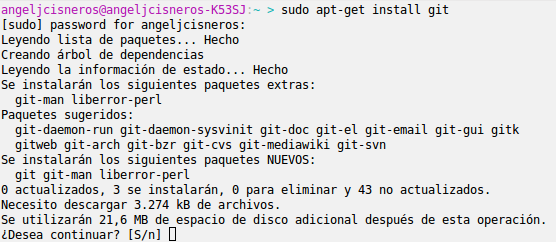
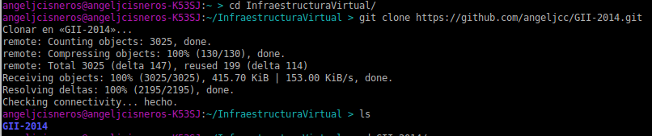
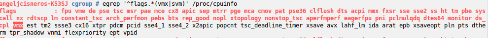

####Ejercicio 1:
######_Consultar en el catálogo de alguna tienda de informática el precio de un ordenador tipo servidor y calcular su coste de amortización a cuatro y siete años. Consultar este artículo en Infoautónomos sobre el tema._

[servidor]:http://www.dynos.es/servidor-hp-proliant-ml350p-g8-xeon-e5-2609-2.4-ghz-4gb-disco-duro-hdd-2.5-sff-p420i-512mb-fbwc-460w-cs-gold--887111139054__470065-666.html

[imagen servidor]:http://img.megasur.es/234/470065-666-0.jpg

Este [servidor] que cuesta 1744 € podriamos amortizarlo de la siguiente manera:
![imagen servidor]
  
  Primero tenemos que calcular el servidor sin IVA:  
  Le quitamos el 21% a 1744€ -> 1744/1,21=1441,32€   
  
**En cuatro años seria cada año 360,33€ al año de amortización.**  
_Al 25% los 4 años_
* 2014->360,33€
* 2015->360,33€
* 2016->360,33€
* 2017->360,33€
 

**En siete años seria cada año unos 216,19€ los 6 primeros años, y el ultimo a 144,13€ de amortización.**  
Al 15% los primeros 6 años y al 10% el ultimo:  
* 2014->216,19€
* 2015->216,19€
* 2016->216,19€
* 2017->216,19€
* 2018->216,19€
* 2019->216,19€
* 2020->144.13€
  
  
***
####Ejercicio 2:  
######_Usando las tablas de precios de servicios de alojamiento en Internet y de proveedores de servicios en la nube, Comparar el coste durante un año de un ordenador con un procesador estándar (escogerlo de forma que sea el mismo tipo de procesador en los dos vendedores) y con el resto de las características similares (tamaño de disco duro equivalente a transferencia de disco duro) si la infraestructura comprada se usa sólo el 1% o el 10% del tiempo._  

Para la comparación utilizaremos [Windows Azure](http://azure.microsoft.com/es-es/pricing/details/cloud-services/)
y [Hostinger](http://www.hostinger.es/hosting-vps).  


En Azure nos proponen lo siguiente:
  
A 0.0149€ la hora. Al mes nos sale por 11.18€ x 12 = 134.16€ al año.
En Hostinger nos proponen lo siguiente:   
  
6.99€ al mes x 12 meses= 83.88€ al año.  

Calculamos todo en funcion de las horas que se utilizaria en un 1% y en un 10%.

* **Azure**
  + 134.16*0.01=1.342€ al año si sólo se usa un 1% al año.
  + 134.16*0.1=13.42€ al año si sólo se usa un 10% al año.
* **Hostinger**
  + Aquí tenemos el problema de que no se paga por lo que se usa si no que es una cuota mensual se utilice o no el servicio, nos alquilan el servicio. Entonces ya utilicemos el 10 o el 1% pagaremos 83.88€ al año.  


Azure nos sale mas rentable como podemos ver.

***

####Ejercicio 5
######_Instala el sistema de gestión de fuentes git_


Para ello sólo hay que ejecutar en el terminal "sudo apt-get install git"  

***
####Ejercicio 6
######_Crear un proyecto y descargárselo con git. Al crearlo se marca la opción de incluir el fichero README. Modificar el readme y subir el fichero modificado._

Utilizamos para clonar un proyecto en github, en este caso no lo he creado porque he utilizado el de la asignatura para tenerlo en el pc.

```sh
git clone https://github.com/angeljcc/GII-2014.git
```


Añadimos al repo local el archivo README:
```sh
git add README.md 
```
Fijamos los cambios añadiendo un mensaje 
```sh
git commit -m "Primer cambio"
```

Subimos los cambios al repositorio remoto
```sh
git push origin master
```
***
####Ejercicio 7
######_Crear diferentes grupos de control sobre un sistema operativo Linux. Ejecutar en uno de ellos el navegador, en otro un procesador de textos y en uno último cualquier otro proceso. Comparar el uso de recursos de unos y otros durante un tiempo determinado._

He creado tres grupos: buenos, malos y regular, y les he asignado los procesos chrome, kate y bash respectivamente.

Tras unos minutos de uso, mostramos los resultados:  
```sh
cat buenos/cpuacct.usage
1219132667
``` 
 
```sh
cat malos/cpuacct.usage
112038054
``` 
```sh
cat regulares/cpuacct.usage
111929791
```   


El navegador es el que más a consumido.


***
####Ejercicio 9

######_Comprobar si el procesador o procesadores instalados lo tienen. ¿Qué modelo de procesador es? ¿Qué aparece como salida de esa orden?_

- El modelo del procesador es un Intel(R) Core(TM) i7-2630QM CPU @ 2.00GHz  

Comprobamos que la tecnologia que utiliza intel para la virtualización está activada:  

  
***
####Ejercicio 10
######_Comprobar si el núcleo instalado en tu ordenador contiene este módulo del kernel usando la orden kvm-ok._


```sh
kvm-op

```
No estaba instalado en el SO, y me sugeria que lo instalase con la siguiente orden:
```sh
apt-get install cpu-checker
```
Una vez instalado esto es lo que nos muestra:
  
Por lo tanto el módulo **KMV** esta activado en el kernel de mi SO.
***


