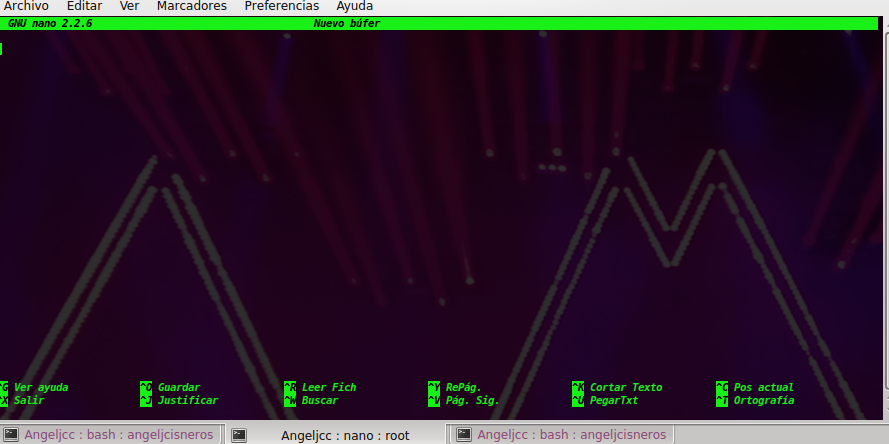
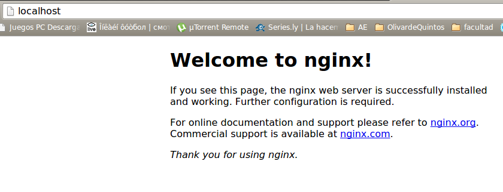

####Ejercicio 1
######_rear un espacio de nombres y montar en él una imagen ISO de un CD de forma que no se pueda leer más que desde él. Pista: en [ServerFault](http://serverfault.com/questions/198135/how-to-mount-an-iso-file-in-linux) nos explican como hacerlo, usando el dispositivo loopback_

```sh
mount -o loop disk.iso /mnt/disk
```
Con esta orden, podremos montar el archivo .iso (en este caso es disk.iso) 


- - -


####Ejercicio 2
######_1. Mostrar los puentes configurados en el sistema operativo._
######_2. Crear un interfaz virtual y asignarlo al interfaz de la tarjeta wifi, si se tiene, o del fijo, si no se tiene._

+ Nos creamos un puente nuevo con la siguiente orden:
```sh
sudo brctl addbr nuevo_puente
```
+ Mostramos todas los puentes que tenemos, en el cual vemos como **nuevo_puente** es una:
[Pequeña demonstración.](http://showterm.io/c4d71fcafbaf55287b5fd)

+ Y con esto añadimos el puente creado a la tarjeta de red
+ ```sh
sudo brctl addif nuevo_puente eth0
```


- - -

####Ejercicio 3
######_1. Usar debootstrap (o herramienta similar en otra distro) para crear un sistema mínimo que se pueda ejecutar más adelante._

######_2. Experimentar con la creación de un sistema Fedora dentro de Debian usando Rinse._

Instalamos debootstrap:
```sh
sudo apt-get install debootstrap
```

Usando debootstrap:
```sh
sudo debootstrap --arch=amd64 saucy /home/jaulas/saucy/	http://archive.ubuntu.com/ubuntu
```
Al acabar nos saldrá una linea diciendo lo siguiente: `I:Base system installed successfully.` Quiere decir que no ha habido errores al instalar.

Instalamos Rinse para un sistema fedora:
```sh
sudo apt-get install rinse
```
Procedemos al igual que antes:
```sh
sudo rinse --arch=amd64 --distribution fedora-core-6 --directory /home/jaulas/fedora/
```


- - -

####Ejercicio 4
######_Instalar alguna sistema debianita y configurarlo para su uso. Trabajando desde terminal, probar a ejecutar alguna aplicación o instalar las herramientas necesarias para compilar una y ejecutarla._

+ Entramos con el siguiente comando en unas de las jaulas ccreadas en el ejercicio 3:
```sh
sudo chroot /home/jaulas/saucy
```

* Una vez dentro, seremos el usuario "root", y  montamos  "/proc" como nos dice en los apuntes del tema:
```sh
mount -t proc proc /proc
```

+ Instalamos el paquete en español:
```sh
apt-get install language-pack-es
```
+ Instalo como aplicación a probar un editor de texto como nano que no esta instalado:
```sh
apt-get install nano
```


- - -

####Ejercicio 5  
######_Instalar una jaula chroot para ejecutar el servidor web de altas prestaciones nginx._


+ Tras estar dentro de una jaula instalamos nginx, en el caso de que no podamos porque no esten los paquetes a mano, tendremos que añadirlos manualmente en el archivo `sources.list` para bajar después nginx. Para más detalle podemos encontrarlo [aquí.](https://github.com/JJ/GII-2014/blob/master/ejercicios/IsraelBlancas/tema3.md#ejercicio-5)
+ Echamos el servicio a andar con `service nginx start` y lo comprobamos en el navegador:


- - -

####Ejercicio 6
######_Crear una jaula y enjaular un usuario usando `jailkit`, que previamente se habrá tenido que instalar._


