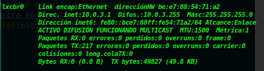
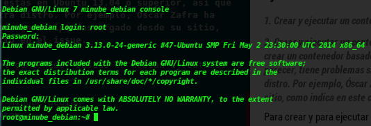
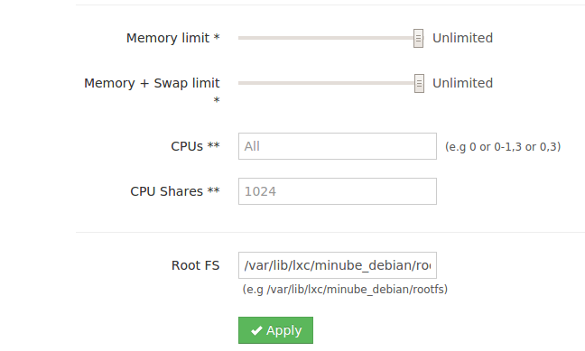
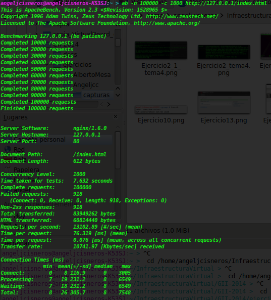
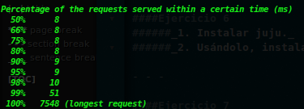
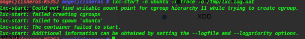
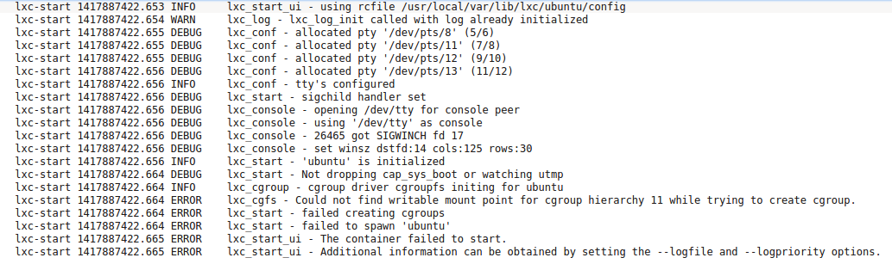
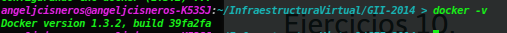

#TEMA 4: Virtualización ligera usando contenedores

- - -

####Ejercicio 1
######_Instala LXC en tu versión de Linux favorita. Normalmente la versión en desarrollo, disponible tanto en GitHub como en el sitio web está bastante más avanzada; para evitar problemas sobre todo con las herramientas que vamos a ver más adelante, conviene que te instales la última versión y si es posible una igual o mayor a la 1.0._

Instalamos lxc con:
```sh
sudo apt-get install lxc lxc-templates
```
A continuación miramos qué modulos son compatibles con nuestro SO:
[Podemos ver una muestra en directo](http://showterm.io/f0f1b5b8249b014430f68 "Enlace a Showterm, demo en directo")

- - -

####Ejercicio 2  
######_Comprobar qué interfaces puente se han creado y explicarlos._
  
El siguiente interface se ha creado tras la instalación de lxc:


con el comando `bcrl show` veriamos que también está y el contenedor tiene acceso a la red.
- - -

####Ejercicio 3
######_1. Crear y ejecutar un contenedor basado en Debian._
######_2. Crear y ejecutar un contenedor basado en otra distribución, tal como Fedora. Nota En general, crear un contenedor basado en tu distribución y otro basado en otra que no sea la tuya. Fedora, al parecer, tiene problemas si estás en Ubuntu 13.04 o superior, así que en tal caso usa cualquier otra distro. Por ejemplo, Óscar Zafra ha logrado instalar Gentoo usando un script descargado desde su sitio, como indica en este comentario en el issue._

Para crear y para ejecutar el contenedor basado en debian ejecutamos la siguiente orden:
```sh
sudo lxc-create -t debian -n minube_debian
sudo lxc-start -n minube_debian
```


- - -

####Ejercicio 4
######_1. Instalar lxc-webpanel y usarlo para arrancar, parar y visualizar las máquinas virtuales que se tengan instaladas._

######_2. Desde el panel restringir los recursos que pueden usar: CPU shares, CPUs que se pueden usar (en sistemas multinúcleo) o cantidad de memoria._

Instalamos con (en administrador):
```sh
wget http://lxc-webpanel.github.io/tools/install.sh -O - | bash
```
Una vez instalado podemos acceder a él desde el navegador en <http://localhost:5000> accedemos al panel con el usuario y contraseña predeterminado.
Se elige la maquina virtual y en la siguiente pantalla podemos restringir los recursos de cada maquina virtual.


- - -

####Ejercicio 5
######_Comparar las prestaciones de un servidor web en una jaula y el mismo servidor en un contenedor. Usar nginx._

| Jaula | Táper |
|--------|-------|
|   |        |
>Despues del suficiente tiempo hasta aburrirme, me sale un error al iniciar un tàper creado, con el consiguiente de que tampoco me deja entrar en lxc-web para poder ver las maquinas configuradas. Este es el error que me da sin a ver podido resolverlo:
Y a continuación podemos ver el error que nos da el archivo de registro:
  
######como consecuencia de lo anterior no puedo realizar los ejercicios 6 y 7.

- - -

####Ejercicio 6
######_1. Instalar juju._
######_2. Usándolo, instalar MySQL en un táper._

- - -

####Ejercicio 7
######_1. Destruir toda la configuración creada anteriormente_
######_2. Volver a crear la máquina anterior y añadirle mediawiki y una relación entre ellos._
######_3. Crear un script en shell para reproducir la configuración usada en las máquinas que hagan falta._

- - -

####Ejercicio 8
######_Instalar libvirt. Te puede ayudar [esta guía para Ubuntu.](https://help.ubuntu.com/12.04/serverguide/libvirt.html)_


Instalamos:

```sh
sudo apt-get install kvm libvirt-bin
sudo apt-get install virtinst

```
- - -

####Ejercicio 9
######_Instalar un contenedor usando virt-install._


- - -

####Ejercicio 10
######_Instalar docker._
Instalamos con:
```sh
sudo apt-get install docker.io
```
Tras la instalación comprobamos la version de docker:

- - -

####Ejercicio 11
######_1. Instalar a partir de docker una imagen alternativa de Ubuntu y alguna adicional, por ejemplo de CentOS._

######_2. Buscar e instalar una imagen que incluya MongoDB._

+ CentOs
```bash
sudo docker pull centos
```
+ Para MongoDB podemos utilizar la siguiente imagen basada en Gentoo:
```sh
sudo docker pull hairmare/mongodb
```
- - -

####Ejercicio 12
######_Crear un usuario propio e instalar nginx en el contenedor creado de esta forma._

sudo docker run -i -t ubuntu /bin/bash

Esto nos baja la imagen ubuntu si no la tuviesemos instalada.
Añadimos usuario y le añadimos la contraseña. Lo añadimos a los sudoers.
```sh
useradd -d /home/prueba -m prueba
passwd prueba
adduser prueba sudo
```
Logeamos con login prueba.

Instalamos nginx:

`sudo apt-get install nginx`


- - -

####Ejercicio 13
######_Crear a partir del contenedor anterior una imagen persistente con commit._
```sh
sudo docker commit prueba IV
```
- - -

####Ejercicio 14
######_Crear una imagen con las herramientas necesarias para el proyecto de la asignatura sobre un sistema operativo de tu elección._
- - -

