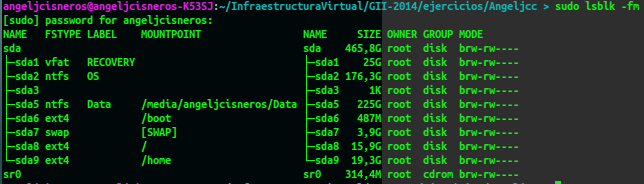

# Tema 5: Virtualización de almacenamiento

- - -


#### Ejercicio 1:
######_¿Cómo tienes instalado tu disco duro? ¿Usas particiones? ¿Volúmenes lógicos?_ 
###### _Si tienes acceso en tu escuela o facultad a un ordenador común para las prácticas, ¿qué almacenamiento físico utiliza?_

###### _Buscar ofertas SAN comerciales y comparar su precio con ofertas locales (en el propio ordenador) equivalentes._

Podemos ver mis particiones a continuación, sin usar volumens lógicos:  



No tengo VLM.
+ Boot.
+ Windows.
+ RECOVERY de windows.
+ Una particion para datos en general llamada DATA
+ Y los respectivos para Linx:
 + home
 + /
 + swap (intercambio)


[Oferta Local](http://www.macnificos.com/product/9311/0/0/1/OWC-ThunderBay-IV-Thunderbolt--16TB.htm)
	

[Oferta comercial](http://www.ebuyer.com/344258-drobo-dr-b800i-2a31-b800i-16tb-8-x-2tb-wd-red-8-bay-san-dr-b800i-2a31-16tb)


-----


#### Ejercicio 2
###### _Usar FUSE para acceder a recursos remotos como si fueran ficheros locales. Por ejemplo, sshfs para acceder a ficheros de una máquina virtual invitada o de la invitada al anfitrión._

Instalamos en las dos máquinas sshfs.

`sudo apt-get install sshfs`

En la máquina cliente, creamos una carpeta donde vayamos a montar la carpeta remota y ejecutamos lo siguiente como en el ejemplo:
``` sh 
sshfs usuario@IP_remota:carpeta_remota punto_montaje


sshfs angel@192.168.56.101:/home/angel/CarpetaCompartir /home/angeljcisneros/carpeta
```

- - -

#### Ejercicio  3
###### _Crear imágenes con estos formatos (y otros que se encuentren tales como VMDK) y manipularlas a base de montarlas o con cualquier otra utilidad que se encuentre_


-----

#### Ejercicio 4
######_Crear uno o varios sistema de ficheros en bucle usando un formato que no sea habitual (xfs o btrfs) y comparar las prestaciones de entrada/salida entre sí y entre ellos y el sistema de ficheros en el que se encuentra, para comprobar el overhead que se añade mediante este sistema_


- - -

#### Ejercicio 5
###### _Instalar ceph en tu sistema operativo._

- - -


#### Ejercicio 6
######_Crear un dispositivo ceph usando BTRFS o XFS_

- - -


#### Ejercicio 7
###### _Almacenar objetos y ver la forma de almacenar directorios completos usando ceph y rados._

- - -

#### Ejercicio 8

######_Tras crear la cuenta de Azure, instalar las herramientas de línea de órdenes (Command line interface, cli) del mismo y configurarlas con la cuenta Azure correspondiente_

- - -


#### Ejercicio 9
######_Crear varios contenedores en la cuenta usando la línea de órdenes para ficheros de diferente tipo y almacenar en ellos las imágenes en las que capturéis las pantallas donde se muestre lo que habéis hecho._

- - -


####Ejerccio 10
######_Desde un programa en Ruby o en algún otro lenguaje, listar los blobs que hay en un contenedor, crear un fichero con la lista de los mismos y subirla al propio contenedor. Muy meta todo._