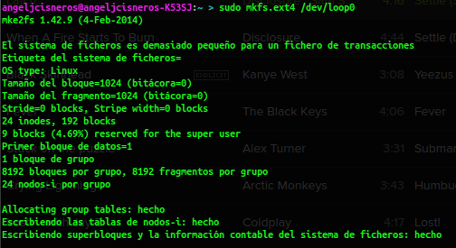
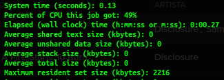
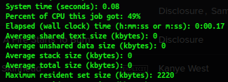

# Tema 5: Virtualización de almacenamiento

- - -


#### Ejercicio 1:
######_¿Cómo tienes instalado tu disco duro? ¿Usas particiones? ¿Volúmenes lógicos?_ 
###### _Si tienes acceso en tu escuela o facultad a un ordenador común para las prácticas, ¿qué almacenamiento físico utiliza?_

###### _Buscar ofertas SAN comerciales y comparar su precio con ofertas locales (en el propio ordenador) equivalentes._

Podemos ver mis particiones a continuación, sin usar volumens lógicos:  


No tengo VLM.
+ Boot.
+ Windows.
+ RECOVERY de windows.
+ Una particion para datos en general llamada DATA
+ Y los respectivos para Linux:
 + home
 + /
 + swap (intercambio)


[Oferta Local](http://www.macnificos.com/product/9311/0/0/1/OWC-ThunderBay-IV-Thunderbolt--16TB.htm)
	

[Oferta comercial](http://www.ebuyer.com/344258-drobo-dr-b800i-2a31-b800i-16tb-8-x-2tb-wd-red-8-bay-san-dr-b800i-2a31-16tb)


-----


#### Ejercicio 2
###### _Usar FUSE para acceder a recursos remotos como si fueran ficheros locales. Por ejemplo, sshfs para acceder a ficheros de una máquina virtual invitada o de la invitada al anfitrión._

Instalamos en las dos máquinas sshfs.

`sudo apt-get install sshfs`

En la máquina cliente, creamos una carpeta donde vayamos a montar la carpeta remota y ejecutamos lo siguiente como en el ejemplo:
``` sh 
sshfs usuario@IP_remota:carpeta_remota punto_montaje


sshfs angel@192.168.56.101:/home/angel/CarpetaCompartir /home/angeljcisneros/carpeta
```

- - -

#### Ejercicio  3
###### _Crear imágenes con estos formatos (y otros que se encuentren tales como VMDK) y manipularlas a base de montarlas o con cualquier otra utilidad que se encuentre_

Instalamos qemu:
`sudo apt-get install qemu-system`

Creamos y montamos el almacenamiento:
``` sh
sudo qemu-img create -f qcow2 cow.qcow2 5M
sudo losetup -v -f cow.qcow2
sudo mkfs.ext4 /dev/loop0
```
y la ultima orden nos muestra que todo se ha montadocorrectamente.


-----

#### Ejercicio 4
######_Crear uno o varios sistema de ficheros en bucle usando un formato que no sea habitual (xfs o btrfs) y comparar las prestaciones de entrada/salida entre sí y entre ellos y el sistema de ficheros en el que se encuentra, para comprobar el overhead que se añade mediante este sistema_

Instalamos los paquetes necesarios:

>`sudo apt-get install btrfs-tools xfsprogs`  

Ahora creamos las dos imagenes y las montamos:
>``` sh
sudo qemu-img create -f raw  primera.img 300M
sudo qemu-img create -f raw  segunda.img 300M
sudo losetup -v -f primera.img
sudo losetup -v -f segunda.img
sudo mkfs.xfs /dev/loop2
sudo mkfs.btrfs /dev/loop3
mkdir primera segunda
sudo mount -t xfs /dev/loop2 primera
sudo mount -t btrfs /dev/loop3 segunda
```

Tras las pruebas al copiar un fichero a cada imagen:  

Primera Imagen (xfs):
>  

Segunda imagen (btrfs):
>

- - -

#### Ejercicio 5
###### _Instalar ceph en tu sistema operativo._

`sudo apt-get install ceph-mds`
- - -


#### Ejercicio 6
######_Crear un dispositivo ceph usando BTRFS o XFS_
Creamos los directorios:

`mkdir -p /srv/ceph/{osd,mon,mds}`

A continuación el fichero de configuración en /etc/ceph.conf
```
[global]
log file = /var/log/ceph/$name.log
pid file = /var/run/ceph/$name.pid
[mon]
mon data = /srv/ceph/mon/$name
[mon.mio]
host = angeljcisneros
mon addr = 127.0.0.1:6789
[mds]
[mds.mio]
host = angeljcisneros
[osd]
osd data = /srv/ceph/osd/$name
osd journal = /srv/ceph/osd/$name/journal
osd journal size = 1000 ; journal size, in megabytes
[osd.0]
host = angeljcisneros
devs = /dev/loop4

```
Creamos la imagen:
```sh 
qemu-img create -f raw ceph.img 100M
sudo losetup -v -f ceph.img
sudo mkfs.xfs /dev/loop4

```
Creamos el sistema de archivos:

`sudo /sbin/mkcephfs -a -c /etc/ceph/ceph.conf`

Iniciamos el servicio:
`sudo /etc/init.d/ceph -a start`

Y finalmente lo montamos:
`sudo mkdir /mnt/ceph sudo mount -t ceph angeljcisneros:/ /mnt/ceph`
- - -


#### Ejercicio 7
###### _Almacenar objetos y ver la forma de almacenar directorios completos usando ceph y rados._
>``` sh
sudo rados mkpool piscina
sudo rados put -p piscina objeto fichero.txt
```

- - -

#### Ejercicio 8

######_Tras crear la cuenta de Azure, instalar las herramientas de línea de órdenes (Command line interface, cli) del mismo y configurarlas con la cuenta Azure correspondiente_

- - -


#### Ejercicio 9
######_Crear varios contenedores en la cuenta usando la línea de órdenes para ficheros de diferente tipo y almacenar en ellos las imágenes en las que capturéis las pantallas donde se muestre lo que habéis hecho._

- - -


####Ejerccio 10
######_Desde un programa en Ruby o en algún otro lenguaje, listar los blobs que hay en un contenedor, crear un fichero con la lista de los mismos y subirla al propio contenedor. Muy meta todo._
