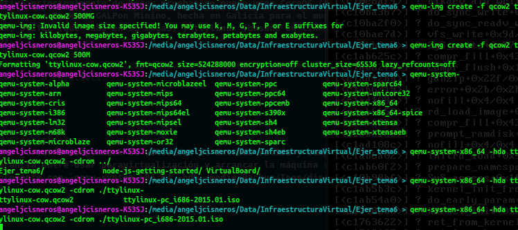
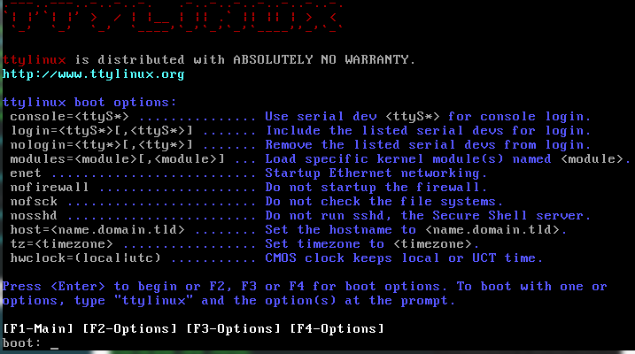
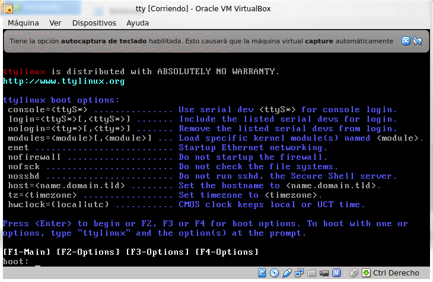
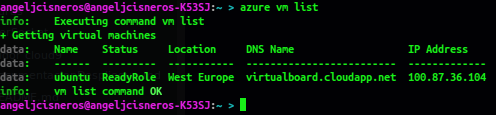
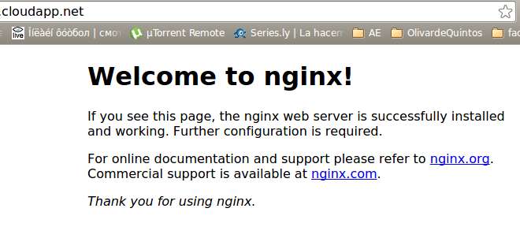
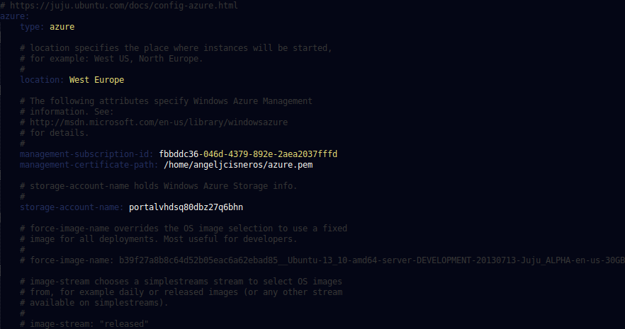

# Tema Virtualización completa: uso de maquinas virtuales.

- - -


#### Ejercicio 1:
######_Instalar los paquetes necesarios para usar KVM. Se pueden seguir estas instrucciones. Ya lo hicimos en el primer tema, pero volver a comprobar si nuestro sistema está preparado para ejecutarlo o hay que conformarse con la paravirtualización._ 

Ya lo tenia instalado del tema 1.


-----


#### Ejercicio 2
###### _1.Crear varias máquinas virtuales con algún sistema operativo libre tal como Linux o BSD. Si se quieren distribuciones que ocupen poco espacio con el objetivo principalmente de hacer pruebas se puede usar CoreOS (que sirve como soporte para Docker) GALPon Minino, hecha en Galicia para el mundo, Damn Small Linux, SliTaz (que cabe en 35 megas) y ttylinux (basado en línea de órdenes solo)._

###### _ 2. Hacer un ejercicio equivalente usando otro hipervisor como Xen, VirtualBox o Parallels._
Creamos la imagen y acontinuación añadimos la imagen descargada, tty-linux en este caso:
  

Y aqui tenemos la maquina funcionando:  



Ahora lo instalamos en VirtualBox:

- - -

#### Ejercicio 3
###### _Crear un benchmark de velocidad de entrada salida y comprobar la diferencia entre usar paravirtualización y arrancar la máquina virtual simplemente con `qemu-system-x86_64 -hda /media/Backup/Isos/discovirtual.img`_


- - -

#### Ejercicio 4
###### _Crear una máquina virtual Linux con 512 megas de RAM y entorno gráfico LXDE a la que se pueda acceder mediante VNC y ssh._

Para crear la MV con 512 MB de RAM hacemos los siguientes comandos:
+ Creamos la imagen con `qemu-img create -f qcow2 linux.img 5G`  
+ Luego creamos la maquina: `qemu-system-x86_64 -hda linux.img -cdrom lubuntu-14.10-desktop-i386.iso -m 512M`


Salimos de la máquina y ejecuto `qemu-system-x86_64 -boot order=c -drive file=linux.img,if=virtio -m 512M -name debian -vnc :1`.  
Miramos la dirección de la interfaz a la que tenemos que conectarnos y nos conectamos mediante vinagre 192.168.122.1:5901


QUEMU no permite más conexión que la procede de Internet así que redirigimos el puerto que queramos con la opcion  `-redir tcp:4664::22`

Instalamos ssh:

>`apt-get update && apt-get install ssh`

Y en la máquina anfitriona:
>`ssh -p 4664 angeljcisneros@localhost`  

- - -

#### Ejercicio 5
###### _Crear una máquina virtual ubuntu e instalar en ella un servidor nginx para poder acceder mediante web._

Tras crear la maquina virtual en modo grafico porque no atinaba a que el comando azure funcionase, podemos ver las MV que están funcionando

Para crearlas utilizariamos el siguiente comando: `azure vm create NOMBRE_VM NOMBRE_IMAGEN usuario [pass] --location "zona" --ssh`

instalamos nginx y comprobamos que esta andando:


- - -

#### Ejercicio 6
###### _Usar juju para hacer el ejercicio anterior._

Cambiamos los parámetros de azure en el archivo de configuracion de juju situado en /home/usuario/.juju/enviroments.yaml

A continuación ejecutaremos juju:
``` bash
sudo juju switch azure
sudo juju bootstrap
sudo juju deploy --to 0 juju-gui
sudo juju expose juju-gui
```
Despues de seguir las instrucciones, a través de la interface grafica seleccionamos nginx y lo dejamos puesto. Esperamos a que esté en marcha y ya tenemos el servidor nginx funcionando en juju en azure.


