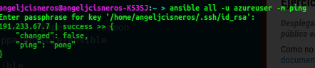

#Ejercicios Tema 7: Gestión de configuraciones  
---------------------------------------------


####Ejercicio 1
######_Instalar chef en la máquina virtual que vayamos a usar_

Procedemos a instalar Chef, en este caso la instalaré en una maquina virtual creada en Azure.


Tras intentar varias veces instalar sin éxito la version de chef que hay en los apuntes, procedo a instalar rubi de forma manual desde la pagina web de ruby, y chef desde la web tambien:
``` bash
curl -L https://www.opscode.com/chef/install.sh | sudo bash

```


- - -

#### Ejercicio 2
######_Crear una receta para instalar nginx, tu editor favorito y algún directorio y fichero que uses de forma habitual._
Este es el árbol como ha quedado estructurado para la cnfiguracion de las recetas con chef.

* chef
	+ cookbooks
		+ emacs
			+ metadata.rb
			+ recipes
 				+ default.rb
		+ fichero
            + metadata.rb
            + recipes
	            + default.rb
		+ nginx
            + metadata.rb
            + recipes
	            + default.rb
    + node.json
    + solo.rb  

``` chef 
default.rb
directory '/home/azureuser/Documentos/fichero'
file "/home/azureuser/Documentos/LEEME.md" do
	owner "azureuser"
	group "azureuser"
	mode 00777
	action :create
	content "Directorio para documentos diversos"
end

```

Ejecutamos el comando siguiente:

` sudo chef-solo -c chef/solo.rb`

- - -

#### Ejercicio 3
###### _Escribir en YAML la siguiente estructura de datos en JSON_
######_{ uno: "dos", tres: [ 4, 5, "Seis", { siete: 8, nueve: [ 10, 11 ] } ] }_

``` json
---
- uno: "dos"
  tres:
    - 4
    - 5
    - "Seis"
    -
      - siete: 8
        nueve:
          - 10
          - 11
```

- - -

#### Ejercicio 4
###### _Desplegar los fuentes de la aplicación de DAI o cualquier otra aplicación que se encuentre en un servidor git público en la máquina virtual Azure (o una máquina virtual local) usando ansible._

Como no habia manera de instalar ansible como en los apuntes, decidí probar por la manera de la [documentación de Ansible](http://docs.ansible.com/intro_installation.html#latest-releases-via-apt-ubuntu):
```bash
$ sudo apt-get install software-properties-common
$ sudo apt-add-repository ppa:ansible/ansible
$ sudo apt-get update
$ sudo apt-get install ansible
```
y con esto configura todos los paquetes, ahora podemos conectar. pero antes tenemos que añadir el host al siguiente archivo: `/etc/ansible/hosts`
Añadimos el host donde queremos que Ansible se conecte, en este caso a nuestra MV de azure.

Y vemos que se ha conectado. Ahora procedemos a instalar una aplicación, en este caso me decido por instalar python para la practica de DAI, procedemos con:
``` bash
ansible all -u azureuser -m command -a "sudo apt-get install git python"
ansible all -u azureuser -m command -a "sudo apt-get install python-pip -y"
ansible all -u azureuser -m command -a "sudo pip install web.py"
ansible all -u azureuser -m git -a "repo=https://github.com/IV-2014/VirtualBoard.git dest=~/VirtualBoard version=HEAD"
ansible all -u azureuser -m command -a "npm install /home/azureuser/VirtualBoard/ServerConfiguration/serverSocket"
ansible all -u azureuser -m command -a "node /home/azureuser/VirtualBoard/ServerConfiguration/serverSocket"
azure vm endpoint create -n http angeljcc 80 8080

```

- - -

#### Ejercicio 5
###### _Desplegar la aplicación de DAI con todos los módulos necesarios usando un playbook de Ansible._

######_¿Ansible o Chef? ¿O cualquier otro que no hemos usado aquí?._


Despues de hacer un par de ejercicios con los dos, veo mas sencillo ansible y chef me ha dado mas problemas.

```yaml
- hosts: azure
  sudo: yes
  tasks:
  - name: Instalar paquetes necesarios
    apt: name=nodejs state=present
    apt: name=git state=present
    apt: name=npm state=present
  - name: Clonando Repositorio desde git
    command: git clone  https://github.com/IV-2014/VirtualBoard.git
  - name: Iniciar
    command: node /home/VirtualBoard/ServerConfiguration/serverSocket/server.js
```
lanzamos el fichero con:
``` bash
ansible-playbook fichero.yml -u azureuser

```
- - -

#### Ejercicio 6
###### _Instalar una máquina virtual Debian usando Vagrant y conectar con ella._

Lo instalamos utilizando: 
```bash
sudo apt-get install vagrant
```
Descargamos una Imagen:
En [vagrantbox.es](http://www.vagrantbox.es/) podemos descargarnos las imagenes que queramos, en este caso será una debian.

```bash
vagrant box add debian https://dl.dropboxusercontent.com/u/29173892/vagrant-boxes/debian7.3.0-vbox4.3.6-puppet3.4.1.box
``` 
Con la orden `vagrant box list` podemos ver la lista de imágenes descargadas.

Para poder usar la imagen, crearemos un fichero Vagrant, mediante la siguiente orden `vagrant init debian`. Y ejecutamos:

``` bash
vagrant up
vagrant ssh
```

- - -

#### Ejercicio 7
######_Crear un script para provisionar `nginx` o cualquier otro servidor web que pueda ser útil para alguna otra práctica_


- - -

#### Ejercicio 8
###### _Configurar tu máquina virtual usando vagrant con el provisionador ansible_

