##Ejercicio 1

**Consultar en el catálogo de alguna tienda de informática el precio de un ordenador tipo servidor y calcular su coste de amortización a cuatro y siete años. Consultar este artículo en Infoautónomos sobre el tema.**

[comentario]:http://www.tinkertry.com/superguide-home-virtualization-server-enthusiasts-colorful-variety-of-esxi-whiteboxes/
[página]:http://www.amazon.com/gp/registry/wishlist/1S6RGAOHWS4BL/ref=cm_wl_rlist_go_o
[img-serv]:http://ecx.images-amazon.com/images/I/41eG4jk2arL.jpg
[enlace]:http://www.amazon.com/gp/registry/wishlist/1S6RGAOHWS4BL/ref=cm_wl_rlist_go_o
[tabla]:http://www.infoautonomos.com/informacion-al-dia/fiscalidad/gastos-deducibles-autonomos-irpf-estimacion-directa/

Tras buscar recomendaciones en varios foros sobre un buen servidor para virtualización me decanté por la elección que hacía un usuario en un [comentario] de una [página] dedicada a guiar a entusiastas de la virtualización.

![img-serv]

Dicho [enlace] redirecciona a una página de Amazon dando un precio total de 2238.9$, unos 1766.24€. Considerando que hemos comprado a principios de año el servidor, podremos deducir el 100% del IVA sobre el producto, que sería de un 21% en España, teniendo un precio final de **1571.95€** sobre el que calcular los costes de amortización correspondientes.

Como sabemos que por ley como máximo podemos amortizar el 26% de equipos informáticos por una [tabla] que se da en una respuesta dentro del artículo del enunciado, en un máximo de 10 años, tenemos que, al amortizarlo en **4 años** (100/4 = 25 ) nos encontramos dentro del límite:

1571.95 * 0.25 = 392.9875€ que se aplicará durante **4 años**:

* 2014 - 392.9875
* 2015 - 392.9875
* 2016 - 392.9875
* 2017 - 392.9875

Y para el caso de **7 años** tenemos una operación similar ( 100/7 = ~14,29 ):

1571.95 * 0.1429 = 224.63€ por año

* 2014 - 224.63
* 2015 - 224.63
* 2016 - 224.63
* 2017 - 224.63
* 2018 - 224.63
* 2019 - 224.63
* 2020 - 224.63

***

##Ejercicio 2

**Usando las tablas de precios de servicios de alojamiento en Internet y de proveedores de servicios en la nube, Comparar el coste durante un año de un ordenador con un procesador estándar (escogerlo de forma que sea el mismo tipo de procesador en los dos vendedores) y con el resto de las características similares (tamaño de disco duro equivalente a transferencia de disco duro) si la infraestructura comprada se usa sólo el 1% o el 10% del tiempo.**

[página de comparación]:http://cloud-hosting-review.toptenreviews.com/
[Heroku]:https://www.heroku.com/
[Amazon EC2]:http://aws.amazon.com/es/ec2/
[documentación]:https://devcenter.heroku.com/articles/dyno-size
[igual]:http://aws.amazon.com/es/ec2/pricing/
[base de datos gratuita]:https://addons.heroku.com/heroku-postgresql#dev

En primer lugar añadir que en ninguna de las páginas de información sobre los servidores hay constancia del tipo de procesador que usan. Guiándome por una [página de comparación] de servicios de alojamiento en la nube, me he decantado por comparar [Heroku] con [Amazon EC2] pese a ser servicios ligeramente distintos, Heroku es una Plataforma de servicio mientras que Amazon EC2 es una Infraestructura de servicio. La diferencia principal es que Heroku ofrece un entorno "preestablecido" para poner aplicaciones en funcionamiento de forma instantánea permitiendo solo personalización al añadir add-ons mientras que Amazon EC2 ofrece la posibilidad de poder construir tu propio entorno con las especificaciones que te ofrezcan al precio de tu tiempo.

En cuanto a precios, en Heroku nos encontramos en su [documentación] con la siguiente tabla:

Y para Amazon EC2 [igual]:

Si para ambas tomamos el modelo más económico puede parecer que hay una diferencia a priori, que es el tema de la cantidad de RAM, la cual es superior en Amazon, pero si consideramos que Heroku oferta también una [base de datos gratuita] y la posibilidad de los múltiples add-ons y muchos gratuitos, más o menos se nivela la balanza.

Ahora, haciendo matemáticas, tenemos que Amazon EC2 tiene un precio de 0.013$ la hora mientras que el de Heroku es de 0.05$ la hora. Con estos datos ya sabemos que en cualquier caso, Amazon gana en cuanto a precio. Pero haciendo los cálculos:
Estimando el uso por un año tenemos 365 días -> 8760 horas, un **1%** serían  87.6 horas al año y para el **10%** 876 horas luego:
* Para el **1%** de uso, en *Amazon* es 87.6 * 0.013 = 1.1388$ mientras que en *Heroku* es 87.6 * 0.05 = 4.38$
* Para el **10%** de uso, en *Amazon* es 876 * 0.013 = 11.338$ mientras que en *Heroku* es 87.6 * 0.05 = 43.8$

Pese a que económicamente Amazon siempre salga mejor, yo personalmente para un uso del 1% usaría Heroku por la facilidad y rapidez a la hora de puesta en marcha ya que, como antes he comentado, no hay que configurar casi nada además de poseer unos comandos para la terminal muy intuitivos y poderosos. Por otro lado, para un uso más prolongado, se entiende que el tiempo que se ha empleado en la configuración de Amazon EC2 empieza a ser rentable a nivel de dispositivo como económico.

***
##Ejercicio 4

**Hacer el tutorial de línea de órdenes de docker para comprender cómo funciona.**

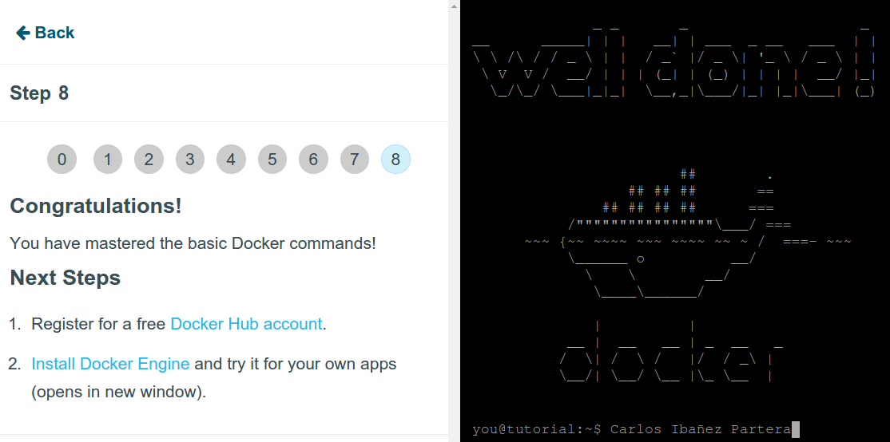

***
##Ejercicio 5

**Instala el sistema de gestión de fuentes git**

[ayuda]:https://help.github.com/articles/set-up-git/

El sistema lo instalé a partir del segundo ejercicio. Para ello usé el comando:
*sudo apt-get install git* y seguí el apartado de [ayuda] de github para su configuración.

Ejemplo de uso:

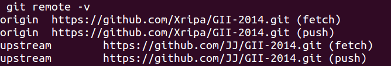

***

##Ejercicio 6

1. **Crear un proyecto y descargárselo con git. Al crearlo se marca la opción de incluir el fichero README.**
2. **Modificar el readme y subir el fichero modificado.**

En primer lugar creamos un nuevo repositorio incluyendo el Readme:

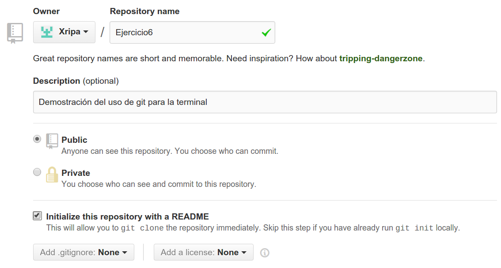

Accedemos a nuestro nuevo repositorio:

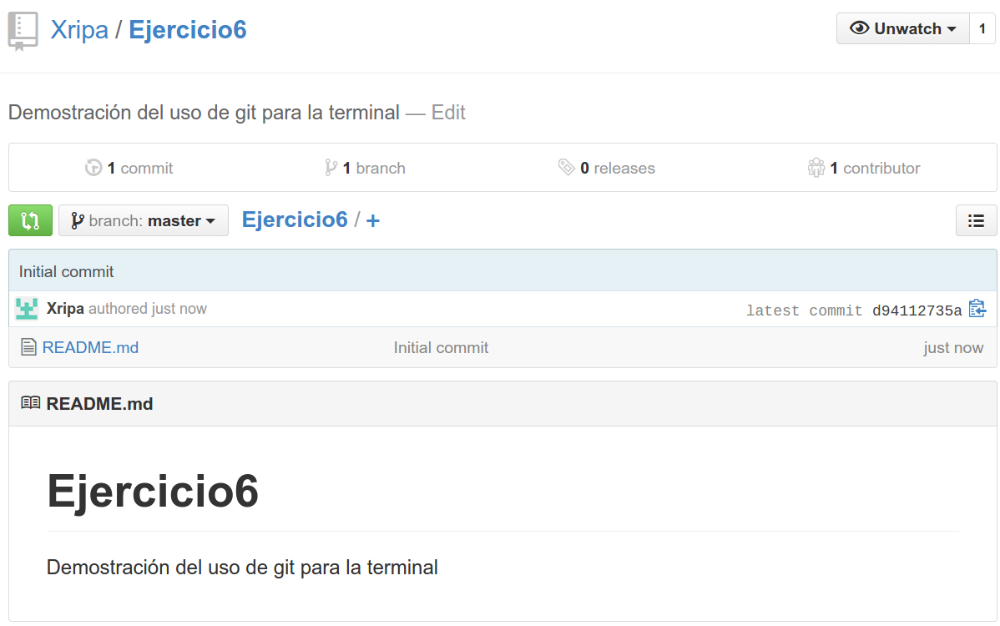

Copiamos la URL de dicho repositorio pulsando el botón de la flechita:

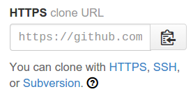

Ahora, en nuestra terminal, clonamos el nuevo repositorio en nuestro equipo mediante dicha URL:

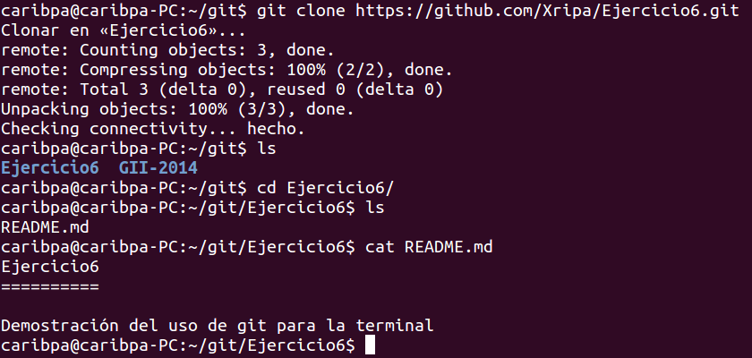

Editamos el archivo Readme.md con nuestro editor favorito para hacer constancia de nuestro cambio:

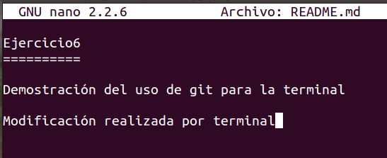

Ahora debemos crear un commit con el archivo modificado ( yo he usado "." para que tomase todos los del directorio ) y le agregamos una información del cambio que hemos realizado.

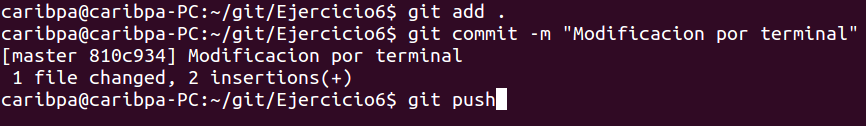

Introducimos nuestros datos de usuario de git tras el push:

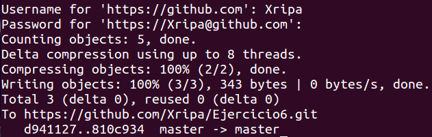

Y finalmente comprobamos que nuestros cambios por terminal realmente han sido almacenados en git:

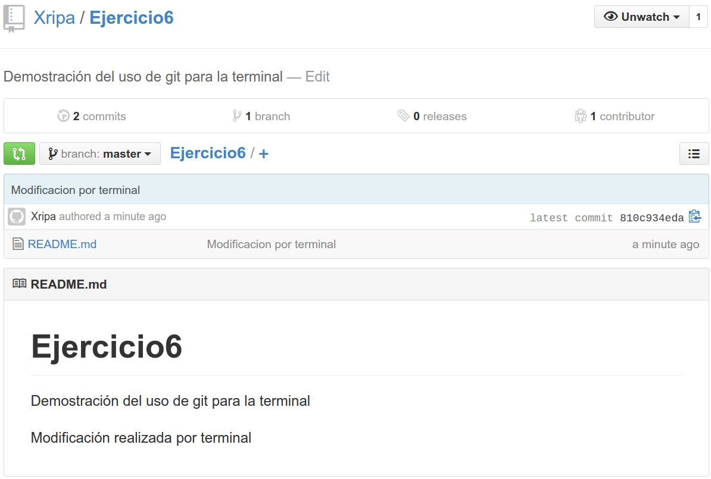

***

##Ejercicio 7

 **Crear diferentes grupos de control sobre un sistema operativo Linux. Ejecutar en uno de ellos el navegador, en otro un procesador de textos y en uno último cualquier otro proceso. Comparar el uso de recursos de unos y otros durante un tiempo determinado.**
 
[esta página]:http://tarifasgasluz.com/faq/precio-kwh/espana
 
He creado tres grupos con los nombres de los procesos sobre los que van a realizar la contabilidad de su uso en el sistema. Chromium, gedit y clementine que, respectivamente monitorizan el navegador de internet, un procesador de textos y un reproductor de música. A cada proceso se les ha asignado un nucleo distinto dentro del mismo procesador. Los resultados son los siguientes:

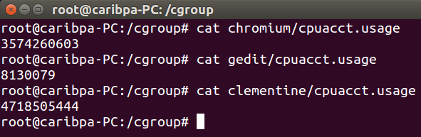

Clementine es el que más recursos usa puesto que estaba en funcionamiento mientras tomaba las medidas.

***

##Ejercicio 9

**Comprobar si el procesador o procesadores instalados tienen estos flags. ¿Qué modelo de procesador es? ¿Qué aparece como salida de esa orden?**

Poseo un procesador de 8 nucleos, he aquí la salida de uno de los nucleos a partir de *cat /proc/cpuinfo*:

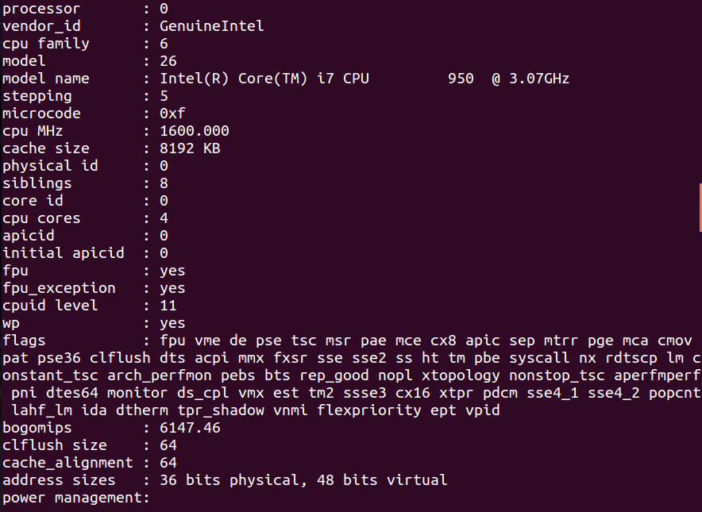

Y la correspondiente salida para *egrep '^flags.*(vmx|svm)' /proc/cpuinfo* :

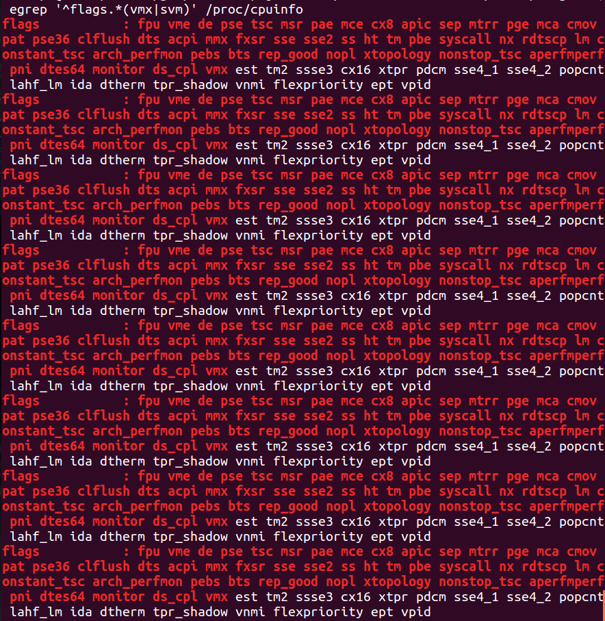

***

##Ejercicio 10

**Comprobar si el núcleo instalado en tu ordenador contiene este módulo del kernel usando la orden *kvm-ok*.**

La orden no está instalada: 

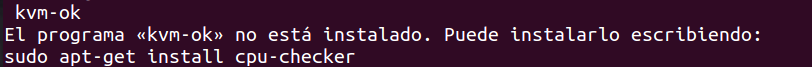

Tras la instalación de *cpu-checker*, la orden produce la siguiente salida:

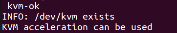

Demostrando que la tecnología está disponible.

***

##Ejercicio 12

**Instalar un entorno virtual para tu lenguaje de programación favorito (uno de los mencionados arriba, obviamente).**

[nodeenv para node.js]:https://pypi.python.org/pypi/nodeenv/
[guía]:https://pypi.python.org/pypi/nodeenv/
[virtualenv]:https://github.com/pypa/virtualenv

Voy a instalar [nodeenv para node.js] para ello primero instalo *python-pip*: **sudo apt-get install python-pip**
Ahora, siguiendo la [guía], instalamos *nodeenv*: **sudo pip install nodeenv**
Ahora, ejecutamos **nodeenv**: 

Creamos un nuevo entorno: *nodeenv env* 

Activamos el nuevo entorno: *. env/bin/activate*

En un entorno podemos instalar paquetes. Ver la [guía].

Para desactivar el entorno tan solo hacemos: *deactivate_node*

***

##Ejercicio 13

**Darse de alta en algún servicio PaaS tal como Heroku, Nodejitsu u OpenShift.**

Me di de alta en Heroku en el ejercicio 2. Muestro una captura en la interfaz tras crear una aplicación:

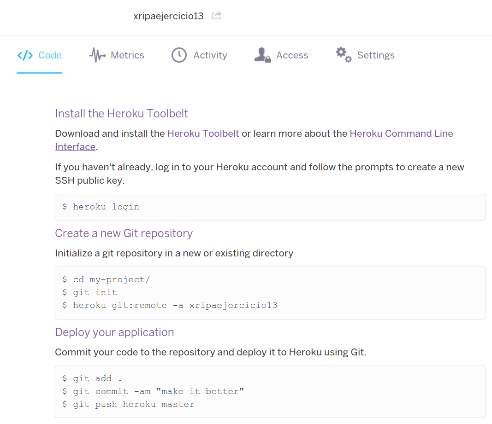

***

##Ejercicio 14

**Crear una aplicación en OpenShift y dentro de ella instalar WordPress.**

[esta dirección]:https://wordpress-xripa.rhcloud.com/

En primer lugar nos registramos en OpenShift:

Elegimos la opción de WordPress:

Indicamos nuestro nombre de aplicación y de sitio wordpress:

Seleccionamos la región:

Una vez creado WordPress a través de Openshift nos encontramos con:

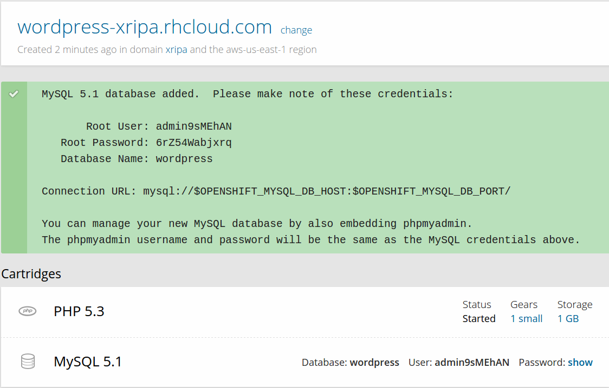

Accedemos desde esa página de creación a nuestro WordPress para empezar a configurarlo:

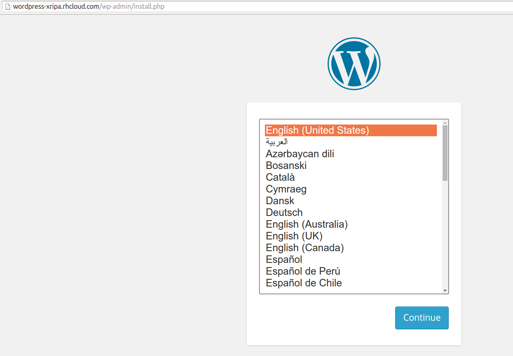

Introducimos datos del sitio y de administrador:

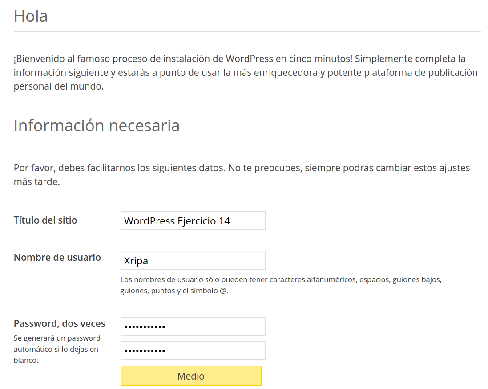

Y terminamos con su creación:

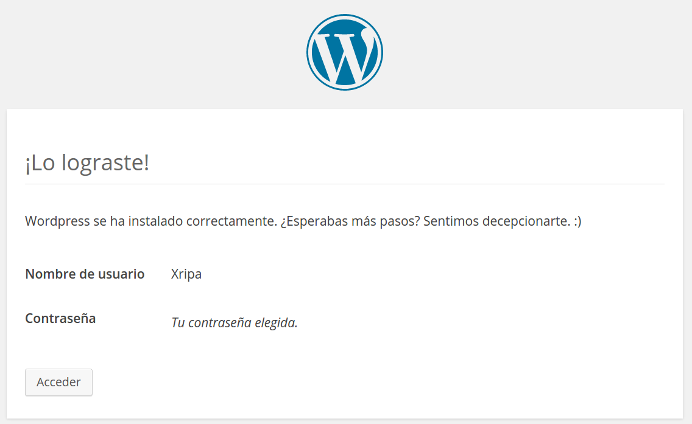

Tras ésta, recibiremos un mensaje confirmando la creación:

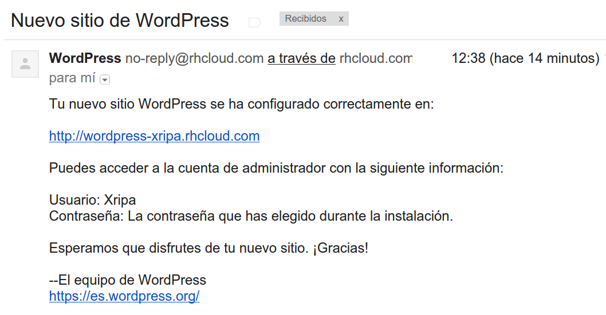

Y, en mi caso he realizado una entrada nueva con una imagen para comprobar su uso:

Al sitio se puede acceder a través de [esta dirección].

***
