##Ejercicios Tema 2
###Ejercicio 1
######Instalar un entorno virtual para tu lenguaje de programación favorito (uno de los mencionados arriba, obviamente).

**Nota**: *Este ejercicio pertenece a la relación de ejercicios anterior, por eso lo copiaré tal cual*

[nodeenv para node.js]:https://pypi.python.org/pypi/nodeenv/
[guía]:https://pypi.python.org/pypi/nodeenv/
[virtualenv]:https://github.com/pypa/virtualenv

Voy a instalar [nodeenv para node.js] para ello primero instalo *python-pip*:
```
sudo apt-get install python-pip
```
Ahora, siguiendo la [guía], instalamos *nodeenv*:
```
sudo pip install nodeenv
```
Ahora, ejecutamos **nodeenv**: 

Creamos un nuevo entorno:
```
nodeenv env
```

Activamos el nuevo entorno: 
```
. env/bin/activate
```

En un entorno podemos instalar paquetes. Ver la [guía].

Para desactivar el entorno tan solo hacemos:
```
deactivate_node
```

***
###Ejercicio 2
######Darse de alta en algún servicio PaaS tal como Heroku, Nodejitsu u OpenShift.

**Nota**: *Este ejercicio pertenece a la relación de ejercicios anterior, por eso lo copiaré tal cual*

Me di de alta en Heroku en el ejercicio 2 del Tema 1. Muestro una captura en la interfaz tras crear una aplicación:

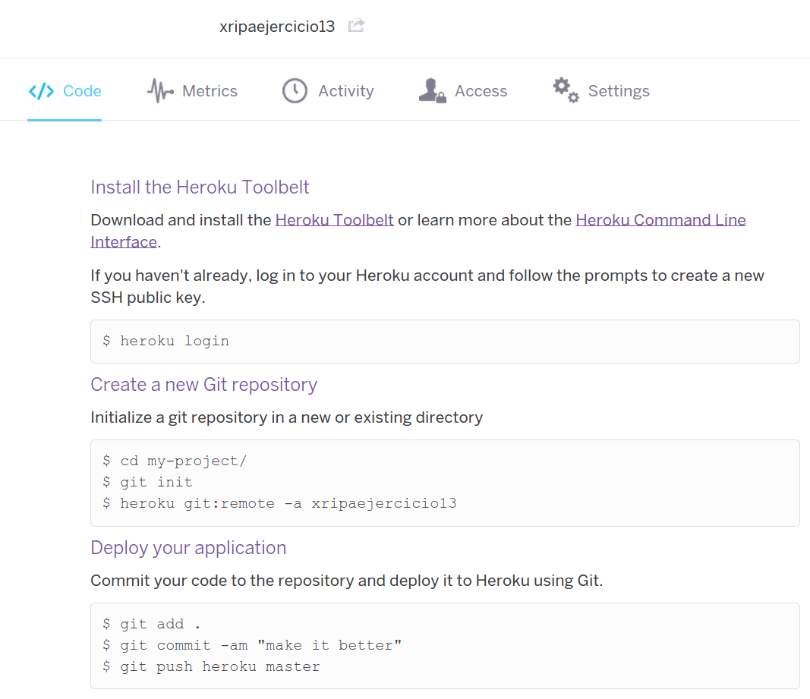

***

###Ejercicio 3
######Crear una aplicación en OpenShift y dentro de ella instalar WordPress.

**Nota**: *Este ejercicio pertenece a la relación de ejercicios anterior, por eso lo copiaré tal cual*

[esta dirección]:https://wordpress-xripa.rhcloud.com/

En primer lugar nos registramos en OpenShift:

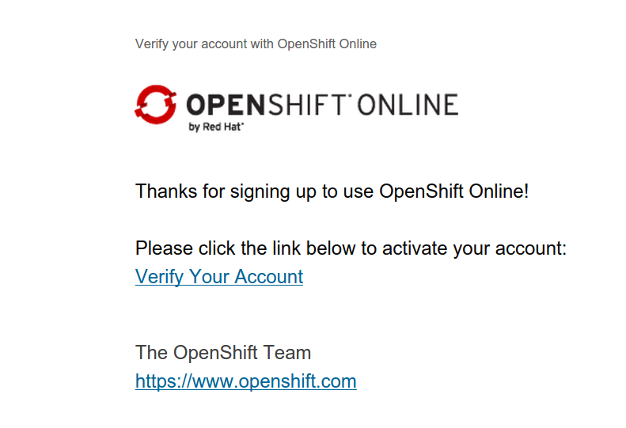

Elegimos la opción de WordPress:


Indicamos nuestro nombre de aplicación y de sitio wordpress:

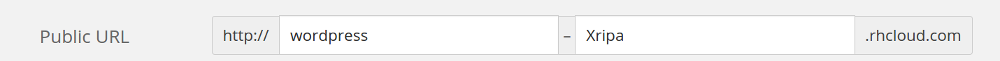

Seleccionamos la región:

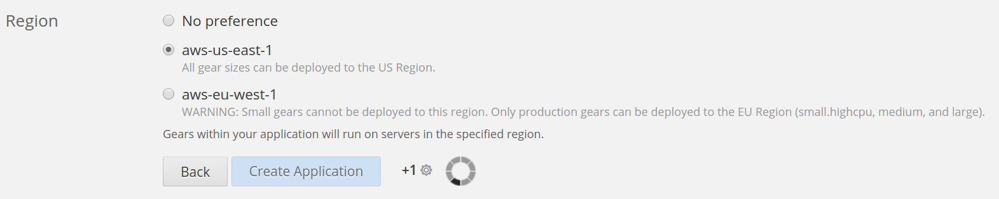

Una vez creado WordPress a través de Openshift nos encontramos con:

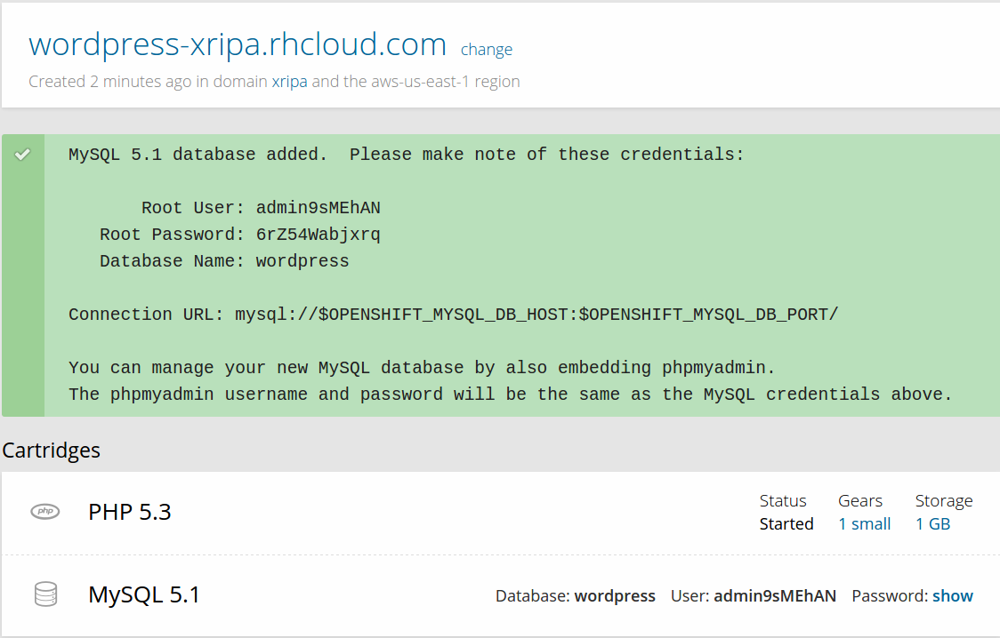

Accedemos desde esa página de creación a nuestro WordPress para empezar a configurarlo:

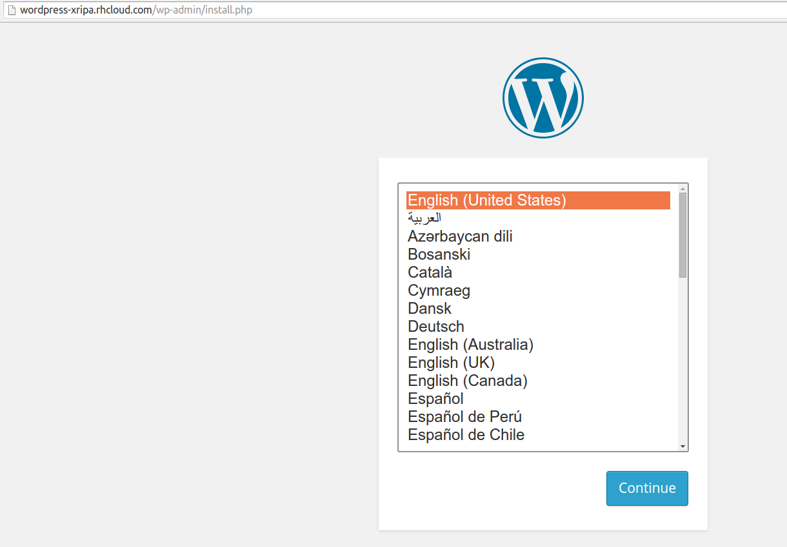

Introducimos datos del sitio y de administrador:

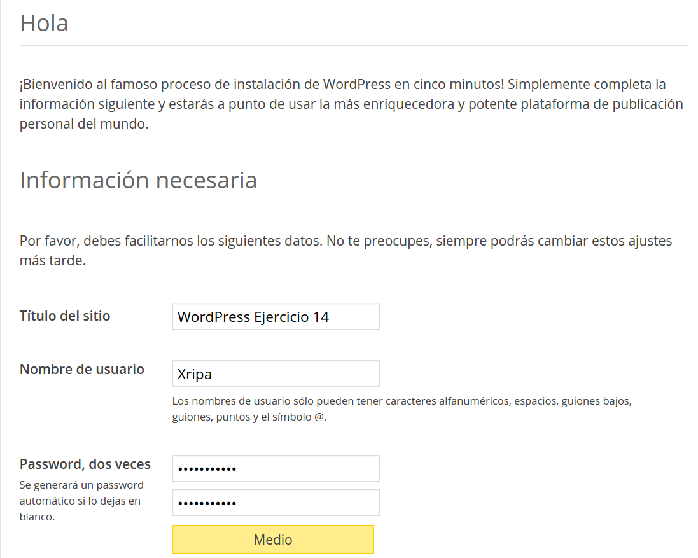

Y terminamos con su creación:

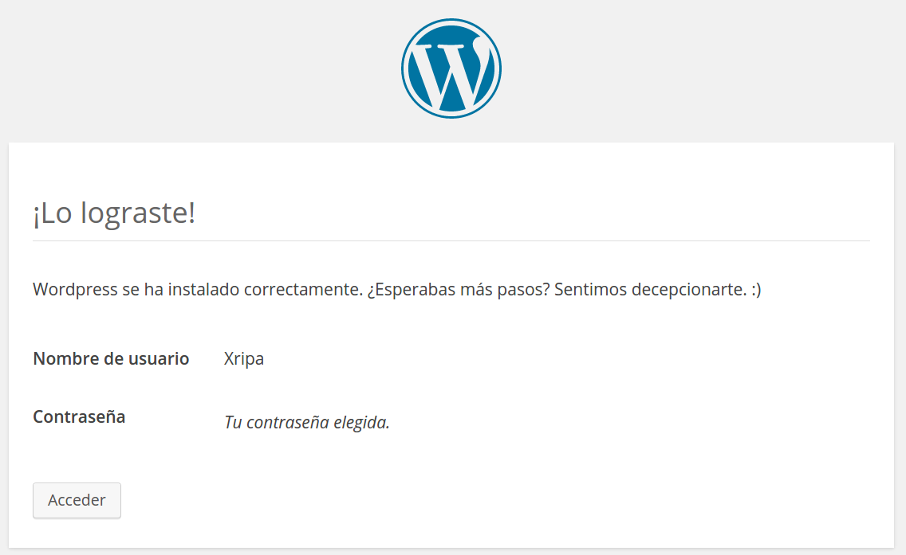

Tras ésta, recibiremos un mensaje confirmando la creación:

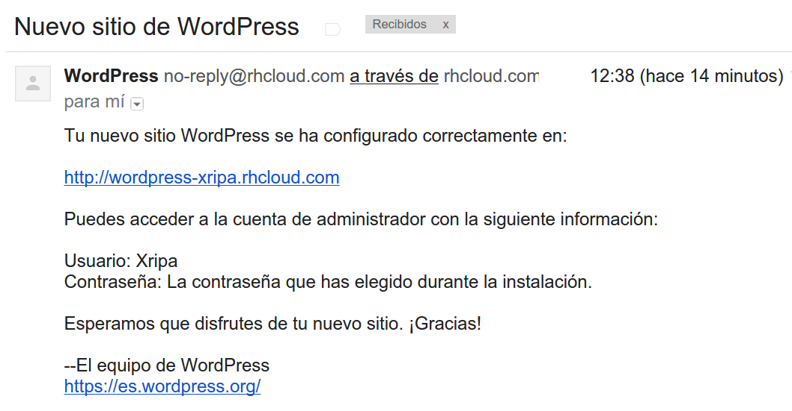

Y, en mi caso he realizado una entrada nueva con una imagen para comprobar su uso:

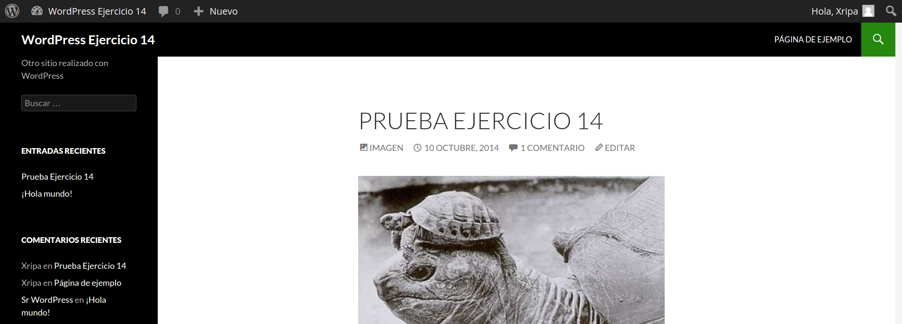

Al sitio se puede acceder a través de [esta dirección].

***
###Ejercicio 4
######Crear un script para un documento Google y cambiarle el nombre con el que aparece en el menú, así como la función a la que llama.

[tutorial de google]:https://developers.google.com/apps-script/overview#your_first_script

En primer lugar he seguido el [tutorial de google] para poner en marcha el script. Por eso lo que he hecho ha sido acceder a [script.google.com](https://script.google.com/) y copiar el código del [tutorial de google] que viene a ser un elaborado *Hello World*:
```javascript
function createAndSendDocument() {
  // Create a new Google Doc named 'Hello, world!'
  var doc = DocumentApp.create('Hello, world!');

  // Access the body of the document, then add a paragraph.
  doc.getBody().appendParagraph('This document was created by Google Apps Script.');

  // Get the URL of the document.
  var url = doc.getUrl();

  // Get the email address of the active user - that's you.
  var email = Session.getActiveUser().getEmail();

  // Get the name of the document to use as an email subject line.
  var subject = doc.getName();

  // Append a new string to the "url" variable to use as an email body.
  var body = 'Link to your doc: ' + url;

  // Send yourself an email with a link to the document.
  GmailApp.sendEmail(email, subject, body);
}
```

Pinchamos en el botón de *play* para poner en marcha el script y nos saldrá un aviso de guardado:

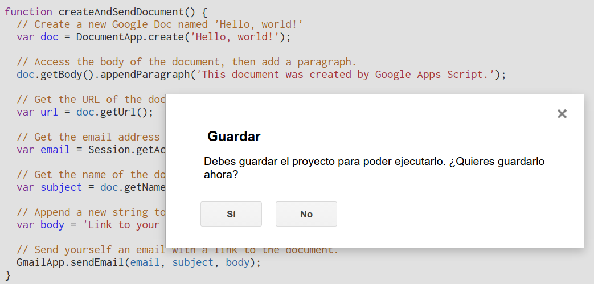

Le ponemos un nombre al proyecto:

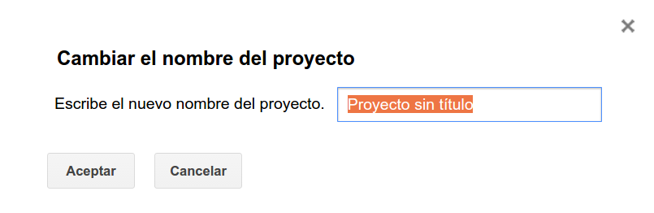

Y, ahora nos pedirá autorización:

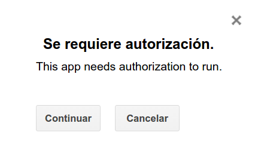

Le damos autorización:

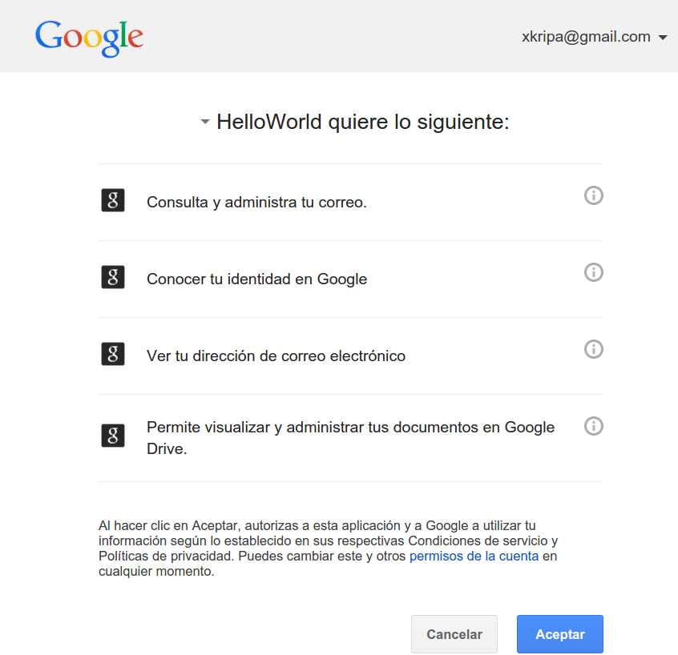

Y finalmente podremos ejecutar el script.

Nuestro resultado lo tendremos en [gmail](https://mail.google.com/) tal y como dice el [tutorial de google]:

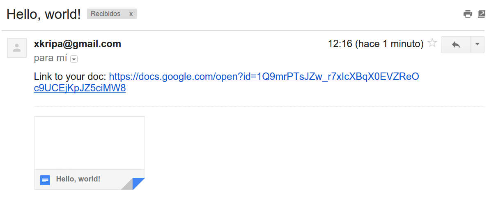

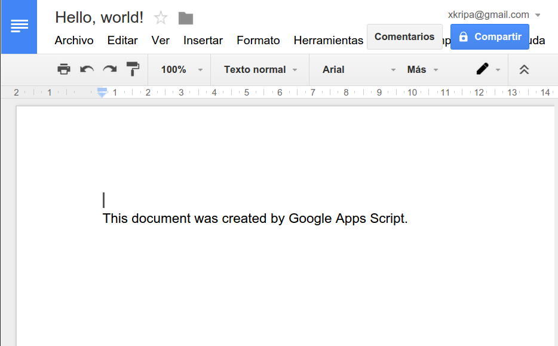

Ahora, si queremos cambiarle el nombre al script, o bien desde [script.google.com](https://script.google.com/) clicamos en el título o bien en la derecha, en la flechita:

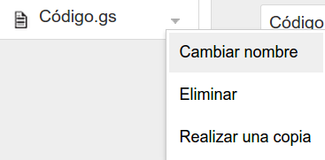

Y para cambiarle el nombre a la función, podemos usar la herramienta de buscar y reemplazar:

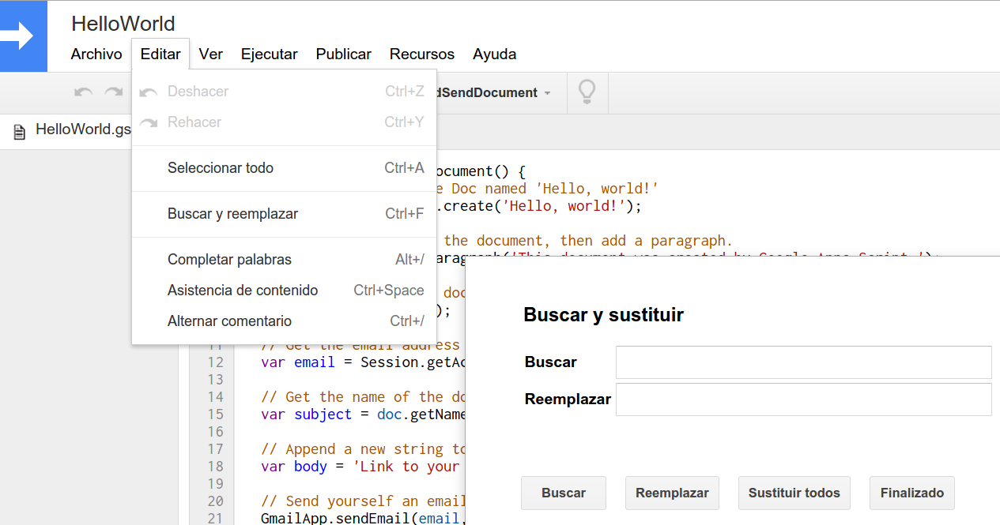

***

