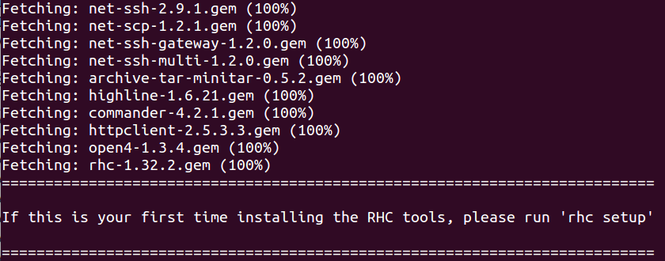
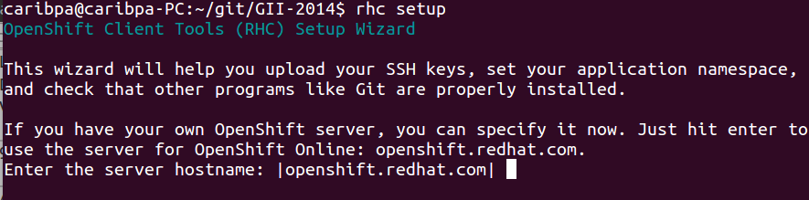
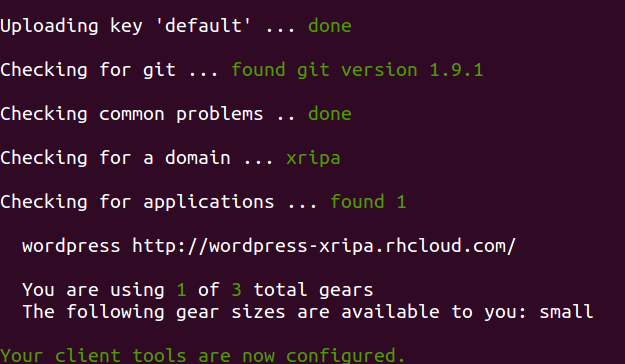
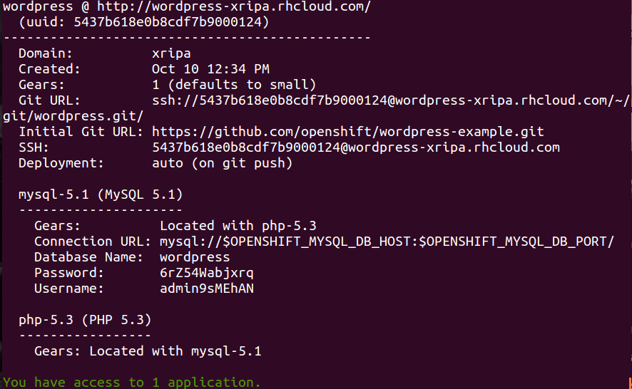
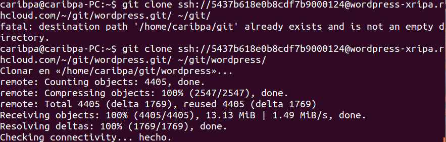
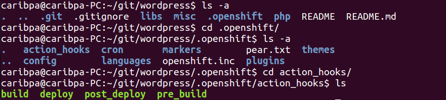
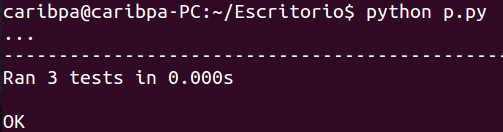

##Ejercicios Tema 2
###Ejercicio 1
######Instalar un entorno virtual para tu lenguaje de programación favorito (uno de los mencionados arriba, obviamente).

**Nota**: *Este ejercicio pertenece a la relación de ejercicios anterior, por eso lo copiaré tal cual*

[nodeenv para node.js]:https://pypi.python.org/pypi/nodeenv/
[guía]:https://pypi.python.org/pypi/nodeenv/
[virtualenv]:https://github.com/pypa/virtualenv

Voy a instalar [nodeenv para node.js] para ello primero instalo *python-pip*:
```
sudo apt-get install python-pip
```
Ahora, siguiendo la [guía], instalamos *nodeenv*:
```
sudo pip install nodeenv
```
Ahora, ejecutamos **nodeenv**: 

Creamos un nuevo entorno:
```
nodeenv env
```

Activamos el nuevo entorno: 
```
. env/bin/activate
```

En un entorno podemos instalar paquetes. Ver la [guía].

Para desactivar el entorno tan solo hacemos:
```
deactivate_node
```

***
###Ejercicio 2
######Darse de alta en algún servicio PaaS tal como Heroku, Nodejitsu u OpenShift.

**Nota**: *Este ejercicio pertenece a la relación de ejercicios anterior, por eso lo copiaré tal cual*

Me di de alta en Heroku en el ejercicio 2 del Tema 1. Muestro una captura en la interfaz tras crear una aplicación:


***

###Ejercicio 3
######Crear una aplicación en OpenShift y dentro de ella instalar WordPress.

**Nota**: *Este ejercicio pertenece a la relación de ejercicios anterior, por eso lo copiaré tal cual*

[esta dirección]:https://wordpress-xripa.rhcloud.com/

En primer lugar nos registramos en OpenShift:


Elegimos la opción de WordPress:


Indicamos nuestro nombre de aplicación y de sitio wordpress:


Seleccionamos la región:


Una vez creado WordPress a través de Openshift nos encontramos con:


Accedemos desde esa página de creación a nuestro WordPress para empezar a configurarlo:


Introducimos datos del sitio y de administrador:


Y terminamos con su creación:


Tras ésta, recibiremos un mensaje confirmando la creación:


Y, en mi caso he realizado una entrada nueva con una imagen para comprobar su uso:


Al sitio se puede acceder a través de [esta dirección].

***
###Ejercicio 4
######Crear un script para un documento Google y cambiarle el nombre con el que aparece en el menú, así como la función a la que llama.

[tutorial de google]:https://developers.google.com/apps-script/overview#your_first_script

En primer lugar he seguido el [tutorial de google] para poner en marcha el script. Por eso lo que he hecho ha sido acceder a [script.google.com](https://script.google.com/) y copiar el código del [tutorial de google] que viene a ser un elaborado *Hello World*:
```javascript
function createAndSendDocument() {
  // Create a new Google Doc named 'Hello, world!'
  var doc = DocumentApp.create('Hello, world!');

  // Access the body of the document, then add a paragraph.
  doc.getBody().appendParagraph('This document was created by Google Apps Script.');

  // Get the URL of the document.
  var url = doc.getUrl();

  // Get the email address of the active user - that's you.
  var email = Session.getActiveUser().getEmail();

  // Get the name of the document to use as an email subject line.
  var subject = doc.getName();

  // Append a new string to the "url" variable to use as an email body.
  var body = 'Link to your doc: ' + url;

  // Send yourself an email with a link to the document.
  GmailApp.sendEmail(email, subject, body);
}
```

Pinchamos en el botón de *play* para poner en marcha el script y nos saldrá un aviso de guardado:


Le ponemos un nombre al proyecto:


Y, ahora nos pedirá autorización:


Le damos autorización:


Y finalmente podremos ejecutar el script.

Nuestro resultado lo tendremos en [gmail](https://mail.google.com/) tal y como dice el [tutorial de google]:


Ahora, si queremos cambiarle el nombre al script, o bien desde [script.google.com](https://script.google.com/) clicamos en el título o bien en la derecha, en la flechita:


Y para cambiarle el nombre a la función, podemos usar la herramienta de buscar y reemplazar:


***

###Ejercicio 5
######Buscar un sistema de automatización de la construcción para el lenguaje de programación y entorno de desarrollo que usemos habitualmente.

En [wikipedia](http://en.wikipedia.org/wiki/List_of_build_automation_software) tenemos una lista con algunos de los sistemas de automatización más "famosos" para diversos lenguajes, pero, si ahondamos en internet, podemos ver que existen muchos más. En cuanto al lenguaje que principalmente utilizamos en la asignatura, Python, sabemos que es un lenguaje de programación interpretado, entonces un **make** nos serviría para ejecutar una lista de funciones o tareas en un orden determiando para dar un servicio. En Python, lo más utilizado son los llamados *[módulos](https://docs.python.org/2/tutorial/modules.html)* que vienen a ser paquetes con una lista de funciones que realizan servicios. Para crear un módulo podemos usar un archivo .py o podemos crear un archivo de desarrollador con *[distutils](https://docs.python.org/2/distutils/introduction.html)* para que cualquiera pueda [instalar](https://docs.python.org/2/install/index.html#install-index) tus módulos.

***

###Ejercicio 6
######Identificar, dentro del PaaS elegido o cualquier otro en el que se dé uno de alta, cuál es el fichero de automatización de construcción e indicar qué herramienta usa para la construcción y el proceso que sigue en la misma.

Como estamos trabajando con **OpenShift**, voy a usar las herramientas que proporciona junto con su [guía](https://developers.openshift.com/en/getting-started-client-tools.html#ubuntu) para la instalación de las mismas.

En primer lugar tenemos que instalar tanto github como ruby:

```sudo apt-get install ruby-full ruby git-core```

Una vez instalados y correctamente configurados. Usando el gestor de paquetes de ruby, **gem**, instalamos las herramientas de OpenShift:
```sudo gem install rhc```

Al ser la primera vez que lo instalamos, nos saldrá en mitad de la instalación un mensaje:


Así que ejecutamos el comando ```rhc setup```



Y tras configurarlo, tendremos algo como:



En mi caso ya tengo instalada una aplicación, el wordpress, pero se puede seguir un [tutorial](https://developers.openshift.com/en/getting-started-creating-applications.html) para instalar aplicaciones.

Curiosamente no he encontrado en ninguna documentación la forma de listar las apps que el usuario posee, pero tras la ejecución del comando ```rhc --help```, en el listado de ayuda, nos sale al principio:
```
Getting started:
  setup              Connects to OpenShift and sets up your keys and domain
  create-app         Create an application
->apps               List all your applications
  cartridges         List available cartridges
  add-cartridge      Add a cartridge to your application
  set-env            Set one or more environment variable(s) to your application
  logout             End the current session

```

Así que ejecutando el comando ```rhc apps``` obtenemos un listado de las apps que tenemos:




Ahora, siguendo el [tutorial](https://developers.openshift.com/en/getting-started-modifying-applications.html) para la modificación de aplicaciones, podemos ver que vamos a usar *git* bajo el comando que ya conocemos:
``` git clone <git_url> <directory to create> ```



Ahora, para ver el fichero de automatización de construcción, podemos seguir la información del [tutorial](https://developers.openshift.com/en/getting-started-modifying-applications.html#customizing-openshift-build-process): desde el directorio en donde hemos clonado mediante git el repositorio, accedemos a la ruta **.openshift/action_hook/build**



Y abriendo dicho archivo veremos como automatiza la construcción:

``` bash
#!/bin/bash

# To update the version shipped in this quickstart, bump this variable:
#
install_version="4.0"

# Download and install WordPress

install_dir=${OPENSHIFT_BUILD_DEPENDENCIES_DIR}${install_version}

# Used in this script only
current_version_dir=${OPENSHIFT_DATA_DIR}current

#
# If WordPress is already installed in the current gear, there
# is nothing to build :-)
#
[ -d "${current_version_dir}" ] && exit 0

mkdir -p $install_dir

pushd ${install_dir} >/dev/null
curl -Ls http://wordpress.org/wordpress-${install_version}.tar.gz > wordpress-${install_version}.tar.gz

# Verify the sources
#
tarball_md5=$(md5sum wordpress-${install_version}.tar.gz | cut -d ' ' -f 1)
wordpress_md5=$(curl -Ls http://wordpress.org/wordpress-${install_version}.tar.gz.md5)

if [ "${tarball_md5}" != "${wordpress_md5}" ]; then
  echo "ERROR: WordPress ${install_version} MD5 checksum mismatch."
  exit 1;
fi

# Install WordPress
#
tar --strip-components=1 -xzf wordpress-${install_version}.tar.gz
rm -rf wordpress-${install_version}.tar.gz
echo $install_version > ${OPENSHIFT_BUILD_DEPENDENCIES_DIR}.current_version

popd >/dev/null
```

***

###Ejercicio 7
######Buscar un entorno de pruebas para el lenguaje de programación y entorno de desarrollo que usemos habitualmente.

En internet, bajo la búsqueda de **python test environment** podemos encontrar muchísimos resultados desde la  [documentación oficial de python](http://docs.python-guide.org/en/latest/writing/tests/) a [módulos de cloud computing de Google](https://cloud.google.com/appengine/docs/python/tools/localunittesting) para test locales.

Buscando entre las herramientas listadas en la documentación de python, me he decantado por [*unittest*](https://docs.python.org/2/library/unittest.html) por estar incluida de forma estándar en las librerías de python.

Usando el [ejemplo](https://docs.python.org/2/library/unittest.html#basic-example) expuesto en la documentación:

``` python

import random
import unittest

class TestSequenceFunctions(unittest.TestCase):

    def setUp(self):
        self.seq = range(10)

    def test_shuffle(self):
        # make sure the shuffled sequence does not lose any elements
        random.shuffle(self.seq)
        self.seq.sort()
        self.assertEqual(self.seq, range(10))

        # should raise an exception for an immutable sequence
        self.assertRaises(TypeError, random.shuffle, (1,2,3))

    def test_choice(self):
        element = random.choice(self.seq)
        self.assertTrue(element in self.seq)

    def test_sample(self):
        with self.assertRaises(ValueError):
            random.sample(self.seq, 20)
        for element in random.sample(self.seq, 5):
            self.assertTrue(element in self.seq)

if __name__ == '__main__':
    unittest.main()

```

Obtenemos como resultado a los tres test de carácter aleatorio el mismo resultado que presenta la documentación:



