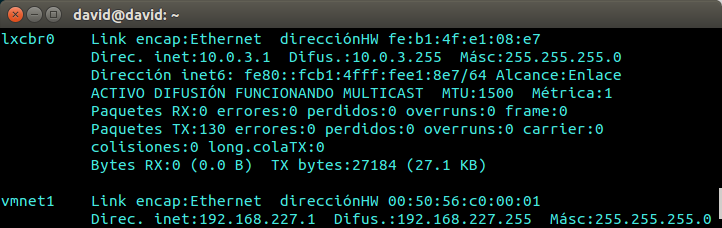
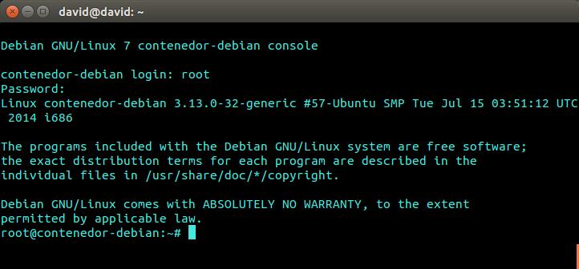
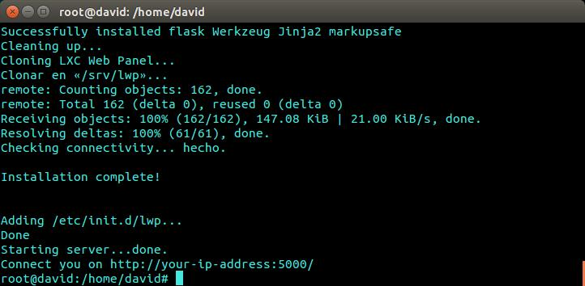
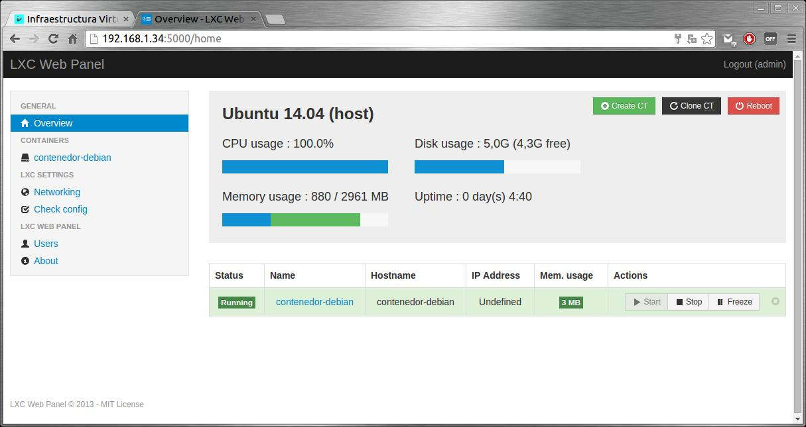

#Ejercicio 1

###### Instala LXC en tu versión de Linux favorita. 

`sudo apt-get install lxc lxc-templates`

#Ejercicio 2

###### Comprobar qué interfaces puente se han creado y explicarlos.

Interface puente creado:



#Ejercicio 3

######Crear y ejecutar un contenedor basado en Debian.


`sudo lxc-create -t debian -n contenedor-debian`

`sudo lxc-start -n contenedor-debian`



#Ejercicio 4

######Instalar lxc-webpanel y usarlo para arrancar, parar y visualizar las máquinas virtuales que se tengan instaladas.

######Desde el panel restringir los recursos que pueden usar: CPU shares, CPUs que se pueden usar (en sistemas multinúcleo) o cantidad de memoria.

Podemos instalar directamente con el siguiente comando:

`wget http://lxc-webpanel.github.io/tools/install.sh -O - | bash`



Vemos que tras la instalación nos indica la dirección donde podemos entrar para acceder al panel donde podremos cambiar los recursos de cada máquina virtual.



#Ejercicio 5

######Comparar las prestaciones de un servidor web en una jaula y el mismo servidor en un contenedor. Usar nginx.


#Ejercicio 6

######1. Instalar juju.

Instalamos con el archiconocido comando apt-get install

`sudo apt-get install juju-core`

######2. Usándolo, instalar MySQL en un táper.


[Referencia](https://juju.ubuntu.com/docs/charms-deploying.html)

#Ejercicio 7

######1. Destruir toda la configuración creada anteriormente

```
juju destroy-service msql
juju destroy-service mediawiki
sudo juju destoy-enviroment local
```

######2. Volver a crear la máquina anterior y añadirle mediawiki y una relación entre ellos.
```
juju deploy mediawiki
juju deploy msql
juju add-relation mediawiki msql
juju expose mediawiki```

######3. Crear un script en shell para reproducir la configuración usada en las máquinas que hagan falta.

```
sudo juju switch local
juju bootstrap
juju deploy mediawiki
juju deploy msql
juju add-relation mediawiki msql
juju expose mediawiki```


#Ejercicio 8

######Instalar libvirt:

```
sudo apt-get install kvm libvirt-bin
sudo apt-get install virtinst```

#Ejercicio 9

######Instalar un contenedor usando virt-install.

`sudo apt-get install virtinst`

Por falta de espacio en mi máquina virtual de ubuntu no puedo instalar ninguna distribución mediante un contenedor usando virt


#Ejercicio 10

######Instalar docker.

```
sudo apt-get update
sudo apt-get install docker.io
```

[Referencia](https://docs.docker.com/installation/ubuntulinux/)

#Ejercicio 11

######1. Instalar a partir de docker una imagen alternativa de Ubuntu y alguna adicional, por ejemplo de CentOS.

`sudo docker pull centos`

######2. Buscar e instalar una imagen que incluya MongoDB.

`docker pull dockerfile/mongodb`

[Referencia](https://github.com/dockerfile/mongodb)

#Ejercicio 12

######Crear un usuario propio e instalar nginx en el contenedor creado de esta forma.

`sudo docker run -i -t ubuntu /bin/bash`

```
useradd -d /home/divad -m divad
passwd divad111
adduser divad sudo
```

Instalación: `sudo apt-get install nginx`


#Ejercicio 13

######Crear a partir del contenedor anterior una imagen persistente con commit.

En primer lugar obtenemos el id del contenedor mediante `docker ps` y hacemos `docker commit IDdelContenedor david/nginx`

No consigo que funcione :(

#Ejercicio 14

######Crear una imagen con las herramientas necesarias para el proyecto de la asignatura sobre un sistema operativo de tu elección.


