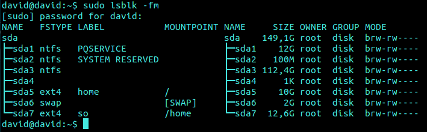

#TEMA 5 Virtualización del almacenamiento

#####Ejercicio 1:

######¿Cómo tienes instalado tu disco duro? ¿Usas particiones? ¿Volúmenes lógicos?

######Si tienes acceso en tu escuela o facultad a un ordenador común para las prácticas, ¿qué almacenamiento físico utiliza?

######Buscar ofertas SAN comerciales y comparar su precio con ofertas locales (en el propio ordenador) equivalentes.

Aquí podemos ver las particiones del disco duro:



En [este enlace](http://www.jazdtech.com/techdirect/leaf/Data-Storage/Storage-Area-Networks-SAN.htm) podemos ver un TOP de SAN.

---
#####Ejercicio 2:

######Usar FUSE para acceder a recursos remotos como si fueran ficheros locales. Por ejemplo, sshfs para acceder a ficheros de una máquina virtual invitada o de la invitada al anfitrión.


Para instalar sshfs simplemente tenemos que ejecutar el siguiente comando:

`sudo apt-get install sshfs`

Debe ser ejecutado en ambas máquinas. Tras esto, en la máquina que queremos tener los ficheros de la carpeta remota, ejecutamos el siguiente comando:

`sshfs user@IP:remote_folder folder`

Ejemplo: `sshfs david@192.168.11.247:/home/david/remote_folder /home/david/folder`

[Referencia](http://fuse.sourceforge.net/)

---

#####Ejercicio 3:

######Crear imágenes con estos formatos (y otros que se encuentren tales como VMDK) y manipularlas a base de montarlas o con cualquier otra utilidad que se encuentre.

En primero instalamos quemu, para posteriormente crear y montar el almacenamiento:

`sudo apt-get install qemu-system`

```
sudo qemu-img create -f qcow2 cow.qcow2 2M
sudo losetup -v -f cow.qcow2
sudo mkfs.ext4 /dev/loop
```

---

#####Ejercicio 4:

######Crear uno o varios sistema de ficheros en bucle usando un formato que no sea habitual (xfs o btrfs) y comparar las prestaciones de entrada/salida entre sí y entre ellos y el sistema de ficheros en el que se encuentra, para comprobar el overhead que se añade mediante este sistema

Como siempre, comenzamos instalando aquellos paquetes necesarios:

`sudo apt-get install btrfs-tools xfsprogs`

Tras esto creamos y montamos las imágenes

```
sudo qemu-img create -f raw imagen1.img 5M
sudo qemu-img create -f raw  imagen2.img 5M
sudo losetup -v -f imagen1.img
sudo losetup -v -f imagen2.img
sudo mkfs.xfs /dev/loop2
sudo mkfs.btrfs /dev/loop3
mkdir imagen1 imagen2
sudo mount -t xfs /dev/loop2 imagen1
sudo mount -t btrfs /dev/loop3 imagen2
```

Falta probar

---

#####Ejercicio 5:

######Instalar ceph en tu sistema operativo.

`sudo apt-get install ceph`

---

#####Ejercicio 6:

######Crear un dispositivo ceph usando BTRFS o XFS

La instalación ya la hemos realizado en el ejercicio anterior así que pasamos directamente a crear los directorios:

`mkdir -p /srv/ceph/{osh,mon,mds}`

Creamos el fichero de configuración en /etc/ceph.conf
```
[global]
log file = /var/log/ceph/$name.log
pid file = /var/run/ceph/$name.pid
[mon]
mon data = /srv/ceph/mon/$name
[mon.mio]
host = david
mon addr = 127.0.0.1
[mds]
[mds.mio]
host = david
[osd]
osd data = /srv/ceph/osd/$name
osd journal = /srv/ceph/osd/$name/journal
osd journal size = 500 ; journal size, in megabytes
[osd.0]
host = david
devs = /dev/loop4
```

Creamos la imagen:
```
qemu-img create -f raw ceph.img 50M
sudo losetup -v -f ceph.img
sudo mkfs.xfs /dev/loop4
```

Creamos el sistema de archivos:

`sudo /sbin/mkcephfs -a -c /etc/ceph/ceph.conf`

Iniciamos el servicio: 
`sudo /etc/init.d/ceph -a start`

Y finalmente lo montamos: 
```
sudo mkdir /mnt/ceph 
sudo mount -t ceph david:/ /mnt/ceph
```

---
#####Ejercicio 7

######Almacenar objetos y ver la forma de almacenar directorios completos usando ceph y rados.

- Rados

`sudo rados mkpool pool`

y añadimos un fichero de prueba

`rados put -p pool obj test.txt`

---
¿Datos bancarios obligatorios para solicitar prueba en Azure?
#Ejercicio 8
#Ejercicio 9========
#Ejercicio 10


