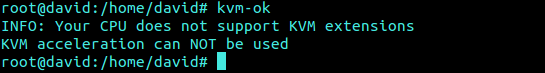

#Tema 6: Virtualización completa: uso de máquinas virtuales

#####Ejercicio 1:

######Instalar los paquetes necesarios para usar KVM. Se pueden seguir estas instrucciones. Ya lo hicimos en el primer tema, pero volver a comprobar si nuestro sistema está preparado para ejecutarlo o hay que conformarse con la paravirtualización.

Mi ordenador no soporta la aceleración KVM.

#####Ejercicio 2:

######1. Crear varias máquinas virtuales con algún sistema operativo libre tal como Linux o BSD. Si se quieren distribuciones que ocupen poco espacio con el objetivo principalmente de hacer pruebas se puede usar CoreOS (que sirve como soporte para Docker) GALPon Minino, hecha en Galicia para el mundo, Damn Small Linux, SliTaz (que cabe en 35 megas) y ttylinux (basado en línea de órdenes solo).

Hacer cuando pueda descargar las distribuciones

######2. Hacer un ejercicio equivalente usando otro hipervisor como Xen, VirtualBox o Parallels.

Igual

#####Ejercicio 3:

######Crear un benchmark de velocidad de entrada salida y comprobar la diferencia entre usar paravirtualización y arrancar la máquina virtual simplemente con

`qemu-system-x86_64 -hda /media/Backup/Isos/discovirtual.img`

#####Ejercicio 4:

######Crear una máquina virtual Linux con 512 megas de RAM y entorno gráfico LXDE a la que se pueda acceder mediante VNC y ssh.

Para ĺa creación de la MV con 512 MB de RAM seguimos lo siguientes pasos:

- Creamos la imagen: `qemu-img create -f qcow2 linux.img 5G`
- Creamos la maquina: `qemu-system-x86_64 -hda linux.img -cdrom lubuntu-14.10-desktop-i386.iso -m 512M`
- Para conectar a través de VNC en primer lugar lanzamos la máquina:`qemu-system-x86_64 -boot order=c -drive file=linux.img,if=virtio -m 512M -name debian -vnc :1.`
Tras esto nos conectamos mediante 'vinagre': vinagre 192.168.X.X:XXXX

- Para conectar a través de SSH, tras instalarlo, ejecutamos y a funcionar:
`ssh -p 4664 XXXX@localhost`

De nuevo se requiere usar Azure con datos bancarios
#####Ejercicio 5:

######Crear una máquina virtual ubuntu e instalar en ella un servidor nginx para poder acceder mediante web.

#####Ejercicio 6:

######Usar juju para hacer el ejercicio anterior.

#####Ejercicio 7:

######Instalar una máquina virtual con Linux Mint para el hipervisor que tengas instalado.