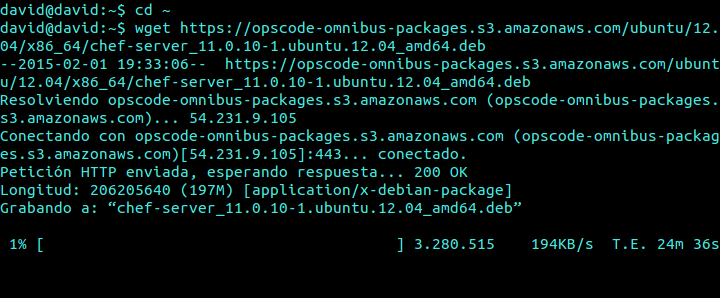
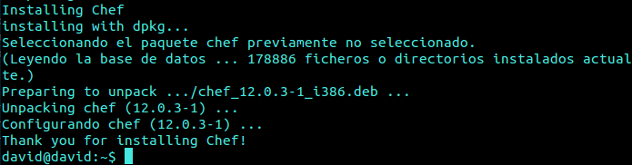
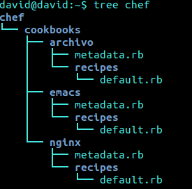

#Tema 7: Gestión de infraestructuras virtuales

#####Ejercicio 1
######Instalar chef en la máquina virtual que vayamos a usar

Ejecutamos:

```
cd ~
wget https://opscode-omnibus-packages.s3.amazonaws.com/ubuntu/12.04/x86_64/chef-server_11.0.10-1.ubuntu.12.04_amd64.deb
```

y comenzará la descarga de chef:



y para su instalación ejecutamos:

`sudo dpkg -i chef-server*`

Por último lanzamos el configurador automático:

`sudo chef-server-ctl reconfigure`

[Referencia](https://www.digitalocean.com/community/tutorials/how-to-install-a-chef-server-workstation-and-client-on-ubuntu-vps-instances)

Segunda opción:

`sudo curl -L https://www.opscode.com/chef/install.sh | sudo bash`



#####Ejercicio 2
######Crear una receta para instalar nginx, tu editor favorito y algún directorio y fichero que uses de forma habitual.



#####Ejercicio 3
######Escribir en YAML la siguiente estructura de datos en JSON
`{ uno: "dos",  tres: [ 4, 5, "Seis", { siete: 8, nueve: [ 10, 11 ] } ] }`

        ---
        - uno: "dos"
          tres:
            - 4
            - 5
            - "Seis"
            -
              - siete: 8
                nueve:
                  - 10
                  - 11

#####Ejercicio 4
######Desplegar los fuentes de la aplicación de DAI o cualquier otra aplicación que se encuentre en un servidor git público en la máquina virtual Azure (o una máquina virtual local) usando ansible.

Realizado en la práctica en grupo -> [VirtualBoard](https://github.com/IV-2014/VirtualBoard/)

#####Ejercicio 5
######Desplegar la aplicación de DAI con todos los módulos necesarios usando un playbook de Ansible. ¿Ansible o Chef? ¿O cualquier otro que no hemos usado aquí?.

Hemos empleado Ansible, tuvimos que echarle unas horas para entender bien el funcionamiento y tras esto y consultar algunos ejemplos de la documentación nos pareció Ansible la mejor opción.

#####Ejercicio 6
######Instalar una máquina virtual Debian usando Vagrant y conectar con ella.

`sudo apt-get install vagrant`

Tras instalar vagrant añadieros un box, en este caso el de Debian con el comando vagrant box add.

Para iniciar vagrant init NombreDistro

Para acceder a la máquina empleamos ssh: `vagran ssh` 