#Ejercicios tema 1 Eduardo J. Polo González.#

####Ejercicio 1:
####_Consultar en el catálogo de alguna tienda de informática el precio de un ordenador tipo servidor y calcular su coste de amortización a cuatro y siete años._

El servidor que he escogido para realizar este ejercicio es el siguiente [servidor](http://www.pixmania.es/ordenador-de-sobremesa/hewlett-packard-hp-proliant-ml350p-gen8/21900649-a.html?ectrans=1&utm_campaign=kelkooclick&utm_medium=cpc&utm_source=kelkooes#srcid=8139&merch=19815).

  Precio con iva: 2200,50€.
  Precio sin iva: 1818,6€.
  21% iva: 381,90€

**-A cuatro años: 25% cada año.**
	 Cada año se pagaría 454.65€ 
**-A siete años: los tres primeros años al 20 % y los cuatro siguientes al 10%.**
	Los tres primeros años se pagaría 363,72€ y los cuatro años siguientes 181,86€

####Ejercicio 2:
####_Usando las tablas de precios de servicios de alojamiento en Internet y de proveedores de servicios en la nube, Comparar el coste durante un año de un ordenador con un procesador estándar (escogerlo de forma que sea el mismo tipo de procesador en los dos vendedores) y con el resto de las características similares (tamaño de disco duro equivalente a transferencia de disco duro) si la infraestructura comprada se usa sólo el 1% o el 10% del tiempo._

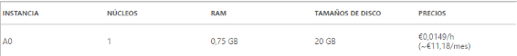

http://azure.microsoft.com/es-es/pricing/details/virtual-machines/
Microsoft Azure: el precio al año sería de 134,16€.

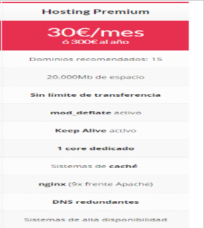
En Vadavo: el precio al año sería de 300€.
https://www.vadavo.com/hosting-para-empresas/
**Tiempo de uso**
**Azure:**
-134,16€*0,01 = 1,3416€ al año usándolo 1% del tiempo.
-134,16€*0,10 = 13,416€ al año usándolo 10 % del tiempo.
**Vadavo:**
-300€*0,01 = 3€ al año usándolo 1% del tiempo.
-300€*0,10 = 30€ al año usándolo 10% del tiempo.

####Ejercicio 3:
####_1. 1. ¿Qué tipo de virtualización usarías en cada caso? Comentar en el foro_
Mi respuesta en el foro:
-Para alojar varios clientes en un servidor: utilizaría la virtualización a nivel de sistema operativo, debido a que pueden aislar las cuentas invitadas instaladas en el mismo. El sistema no se sobrecarga, debido a que cada usuario no ejecuta un sistema operativo completamente instalado.
Solo hay un sistema operativo que se encargue de los avisos del hardware, mejorando el rendimiento. 
-Para crear un sistema eficiente de web + middleware + base de datos: utilizaría la virtualización completa, debido a que  virtualiza  un sistema completo y otros programas sin necesidad de modificar.
-Y para un sistema de prueba de software e integración continua: utilizaría la virtualización de entornos de desarrollo porque podemos reproducir entornos de producción de forma más rápida y sencilla.

####_2. 2. Crear un programa simple en cualquier lenguaje interpretado para Linux, empaquetarlo con CDE y probarlo en diferentes distribuciones._
El programa que yo he realizado es el siguiente:
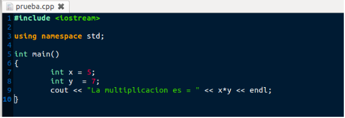
-Lo siguiente que se va hacer es una vez descargado CDE darle permisos de ejecución chmod +x.
-Empaquetamos el programa realizado con CDE:
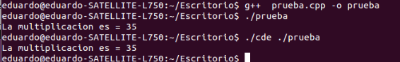
Por último comprobar que funciona: 
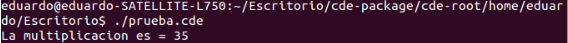

####Ejercicio 4:
####_Hacer el tutorial de línea de órdenes de docker para comprender cómo funciona.Avanzado Instalarlo y crear una aplicación contenedorizada.Alguna imagen del tutorial:_
Paso 1:
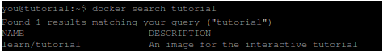
Paso 2:
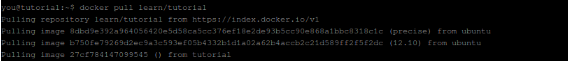
Paso 3:
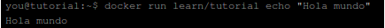
Paso 4:
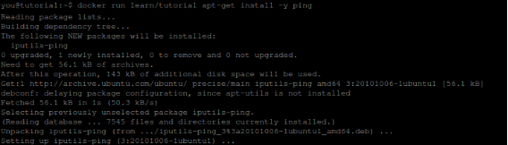
Paso 5:
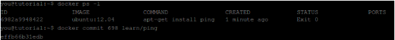
Paso 6:
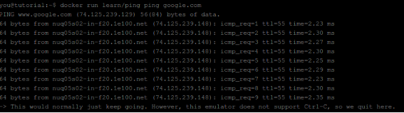
Paso 8:
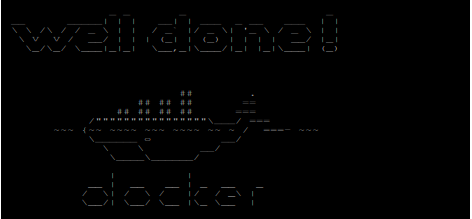

####Ejercicio 5:
####_Instala el sistema de gestión de fuentes git_

El programa se instala con el siguiente comando:
sudo apt-get install git.
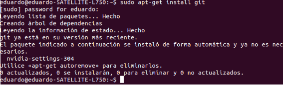

####Ejercicio 6:
####_1.Crear un proyecto y descargárselo con git. Al crearlo se marca la opción de incluir el fichero README._
####_2.Modificar el readme y subir el fichero modificado._

Creamos un repositorio en github: En mi caso lo he llamado prueba.
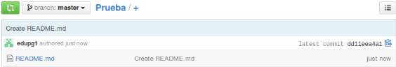

-Lo siguiente que vamos hacer es descargarnoslo a nuestro pc por ssh. Para ello clonamos el repositorio con el comando git clone y el ssh que nos viene del repositorio.

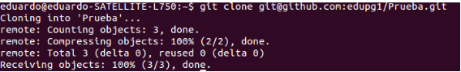

-Lo siguiente es modificar el readme del repositorio creado. 
Cuando se ha modificado vamos agregarlo con el comando git add README.md.
Despues fijamos los cambios con el comando git commit -a -m  “Modificacion”.
Y por último subimos los cambios al repositorio los cambios realizados mediante el comando git push origin master.

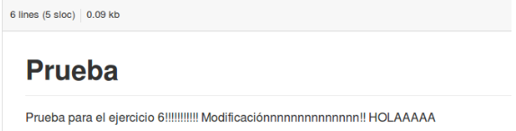

Como vemos se ha realizado la modificación.

####Ejercicio 6:
####_Comprobar si en la instalación hecha se ha instalado cgroups y en qué punto está montado, así como qué contiene._

-Para instalar he utilizado el comando: mount -t cgroup cgroup /sys/fs/cgroup/
La instalación se encuentra en /sys/fs/cgroup/ y contiene muchas carpetas, algunas de ellas son:

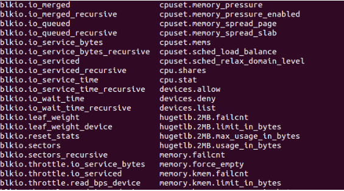

