#Ejercicios tema 2 Eduardo J. Polo González.#

###Ejercicio 1:
####Instalar un entorno virtual para tu lenguaje de programación favorito (uno de los mencionados arriba, obviamente).

El entorno virtual que he elegido es virtualenv para python.

- Primero vamos a instalar pip debido a que no dispongo de el en mi ordenador:

sudo apt-get install python-pip

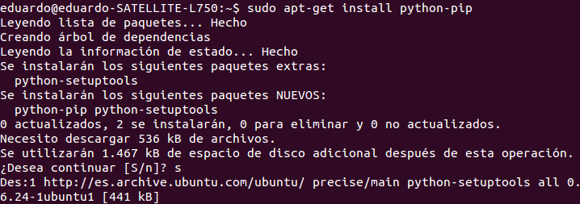

- Una vez finalizada la instalación de pip procedemos a instalar el entorno virtual que he elegido (en mi caso virtualenv para python).
- usamos el siguiente comando para la instalación: sudo pip install virtualenv.

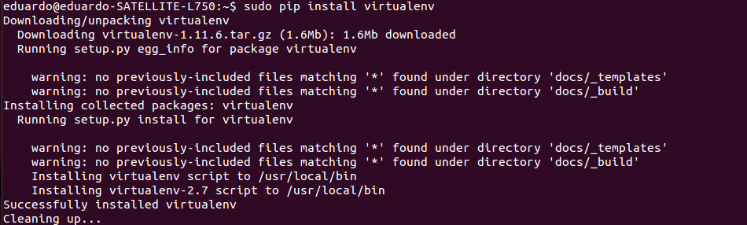

- Para usarlo utilizamos el siguiente comando: virtualenv ENV
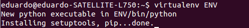

- Activamos el proyecto ENV con el siguiente comando: source bin/activate

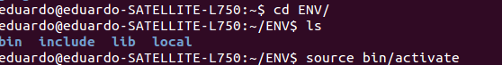

###Ejercicio 2:
####Darse de alta en algún servicio PaaS tal como Heroku, Nodejitsu u OpenShift.

El servicio PaaS en el que me voy a dar de alta es OpenShift.

- Lo primero que voy hacer es registrarme en su [página web](https://www.openshift.com).
- Una vez que nos registramos nos saldrá el siguiente mensaje:

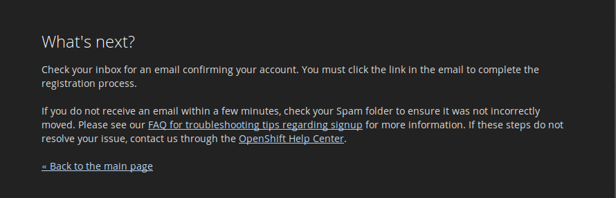

Para confirmar la cuenta recibiremos un email en el correo donde nos hemos registrado y desde ahí nos daremos de alta en el servicio OpenShift.

###Ejercicio 3:
####Crear una aplicación en OpenShift y dentro de ella instalar WordPress. 

-	Lo primero que tenemos que hacer es logearnos en la página.
-	Una vez logeados ya podemos crear una aplicación:

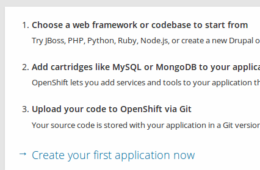

-	Escogemos instalar WordPress

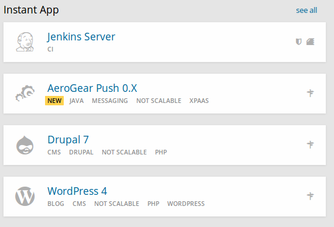

-	El siguiente paso es configurar la aplicación y crearla.

-	Una vez creada nos muestra lo siguiente:

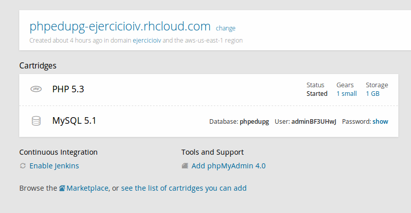

- Si le damos a la dirección de arriba nos muestra lo siguiente:

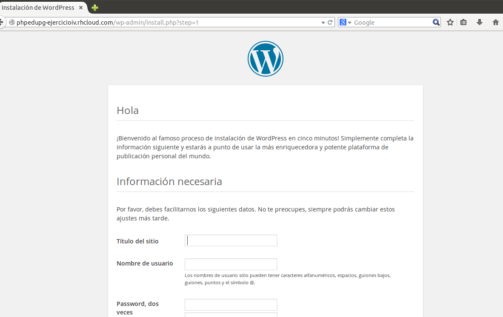

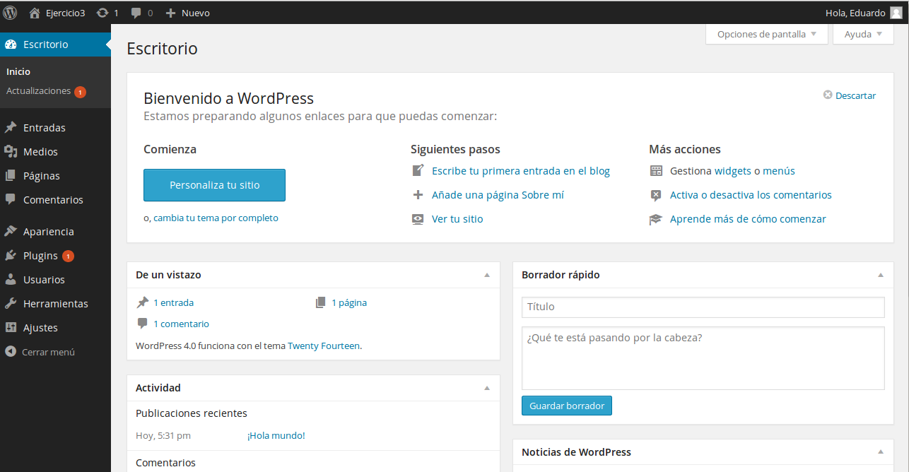

###Ejercicio 4:
####Crear un script para un documento Google y cambiarle el nombre con el que aparece en el menú, así como la función a la que llama. 

-Creamos el script

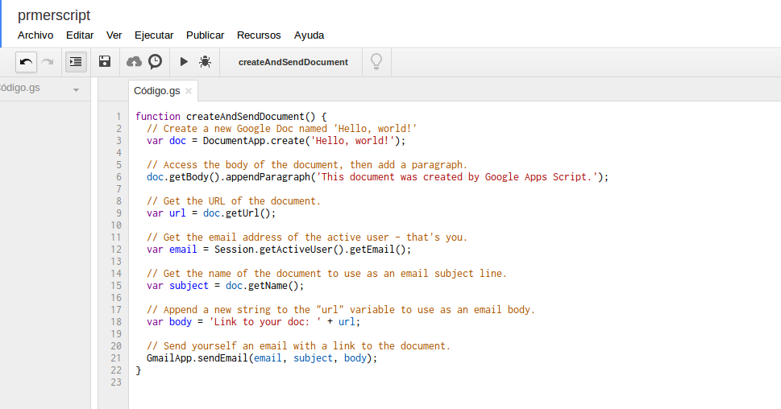

- Una vez creado, si lo queremos poner en marcha nos pedirá autorización

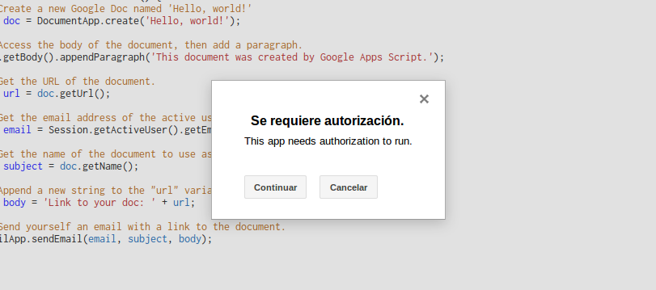

- Cuando lo abrimos muestra lo siguiente:

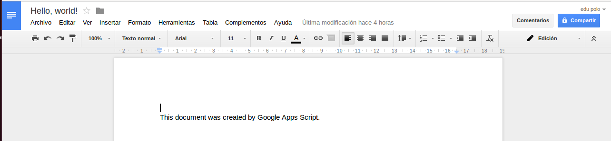

Script con el nombre del menú y la función cambiada.

-	Realizamos los cambios

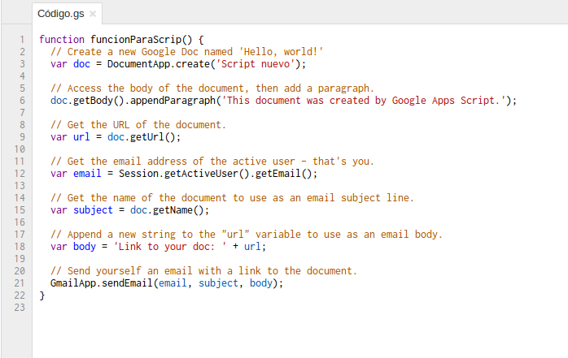
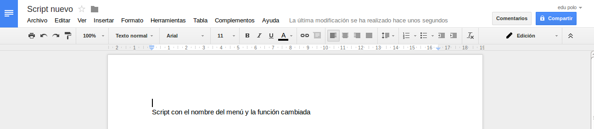

Vemos como en el menú aparece con distinto nombre:

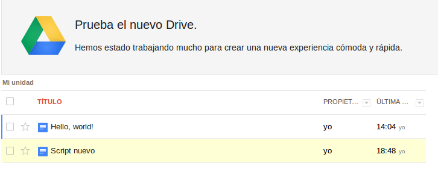

###Ejercicio 5:
####Buscar un sistema de automatización de la construcción para el lenguaje de programación y entorno de desarrollo que usemos habitualmente.

- El sistema de automatización de la construcción que uso es Ant para java.

	es una herramienta usada en programación para la realización de tareas 		mecánicas y repetitivas, normalmente durante la fase de compilación y 		construcción (build). Es, por tanto, un software para procesos de 			automatización de compilación, similar a Make pero desarrollado en 			lenguaje Java y requiere la plataforma Java, así que es más apropiado para 	   la construcción de proyectos Java.

    Esta herramienta, hecha en el lenguaje de programación Java, tiene la      	   ventaja de no depender de las órdenes del shell de cada sistema operativo, 	  sino que se basa en archivos de configuración XML y clases Java para la 		realización de las distintas tareas, siendo idónea como solución multi-		plataforma.

	La diferencia más notable entre Ant y Make es que Ant utiliza XML para 		describir el proceso de generación y sus dependencias, mientras que Make 	 utiliza formato makefile. Por defecto, el archivo XML se denomina 		 	 build.xml.

###Ejercicio 6:
####Identificar, dentro del PaaS elegido o cualquier otro en el que se dé uno de alta, cuál es el fichero de automatización de construcción e indicar qué herramienta usa para la construcción y el proceso que sigue en la misma.

- Las aplicaciones en OpenShift se construyen alrededor de un flujo de trabajo de control de código fuente en Git. Se codifica locálmente y luego sube los cambios al servidor. Opcionalmente también se pueden construirse usando Jenkins o, usando hot deployment lo que acelera el despliegue del código en OpenShift.

- OpenShift ejecutará archivos de script controlados en un repositorio de Git en puntos específicos durante el proceso de implementación. Si no existe el archivo de script correspondiente, el proceso de implementación continuará normalmente. Todos los enlaces se deben de colocar en el .openshift/action_hooks/ que es el repositorio de sus aplicaciones. Las fases de construcción son:

	- Pre-Receive: Durante el push, OpenShift comprueba que la aplicación se encuentra en un estado coherente.
	- Pre-Build: Ocurre cuando la aplicación está detenida y el nuevo repo dir se ha deplegado antes de la construcción. Ejecuta .openshift/action_hooks/pre_build script
	- Build: Construye la aplicación, descarga los deps necesarios, ejecuta el .openshift/action_hooks/build script y lo prepara para el despliegue.
	- Deploy: Ocurre justo antes de que la aplicación se inicie. Se realiza el trabajo de preparación necesario para conseguir que la aplicación esté lista para ser iniciada, esto se realiza en el .openshift/action_hooks/deploy hook.
	- Post-Deploy: Lo pueden necesitar algunas aplicaciones iniciadas para completar el proceso de implementación. Cuando se inicia la aplicación, se ejecutará el .openshift/action_hooks/post_deploy hook.

Para la construcción con Jekins: pulsar [enlace](https://developers.openshift.com/en/managing-continuous-integration.html)

###Ejercicio 7:
####Buscar un entorno de pruebas para el lenguaje de programación y entorno de desarrollo que usemos habitualmente.

Para Python el entorno de pruebas que utiliza es PyUnit, que es un estándar unit testing framework. Es la versión de JUnit para python. El autor es Steve Purcell

Virtualenv dispone de entornos para realizar pruebas. Para realizar pruebas basta con utilizar el siguiente comando: python setup.py testprueba