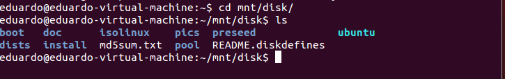

#Ejercicios tema 3 Eduardo J. Polo González.#

##Ejercicio 1.

###Crear un espacio de nombres y montar en él una imagen ISO de un CD de forma que no se pueda leer más que desde él. Pista: en [ServerFault](http://serverfault.com/questions/198135/how-to-mount-an-iso-file-in-linux) nos explican como hacerlo, usando el dispositivo loopback

- Lo primero que vamos hacer es crear el espacio de nombres (o namespaces del núcleo) y asignarle un nombre mediante los siguientes comandos:

	-  sudo unshare -u /bin/bash
	-  hostname nombre (en mi caso epg)

     

- Para volver al espacio de nombre corriente basta con utilizar el comando:  exit.

- Lo siguiente que vamos hacer es montar en el directorio mnt/disk una imagen ISO de un CD, para realizar esta acción usamos los siguientes comandos:

	

	- sudo su (porque necesitamos ser root para realizar la operación de montar la imagen).
	- mount -o loop imagen.iso mnt/disk.

	
	
    En mi caso la imagen.iso sería: ubuntu-14.04.1-server-i386.iso.

	mnt/disk es el directorio que yo he creado.
    
    Hacemos un ls en el directorio mnt/disk y comprobamos que está montado:
    
    
    
##Ejercicio 2.
###1.Mostrar los puentes configurados en el sistema operativo.

- El comando "ip addr show"  nos muestra la interfaz IP, MAC, ethernet, etc.

- Para mostrar los puentes que tenemos configurados en el sistema operativo usamos el siguiente comando:
	- Antes de poder utilizar brctl tenemos que instalar el paquete bridge-utils, mediante el siguiente comando: sudo apt-get install bridge-utils.

	

	- sudo brtcl show:
	
    
	como vemos no aparece ningún puente.

###2.Crear un interfaz virtual y asignarlo al interfaz de la tarjeta wifi, si se tiene, o del fijo, si no se tiene.

- Crearemos un puente de red usando el siguiente comando:
   	- sudo brctl addbr puenteREDEduardo.

    
    
- Una vez creado el puente vamos a comprobar las interfaces, usando ip addr show:
	
    
- en este instante ni está activado ni, en realidad, hace nada: no tiene dirección ethernet, aunque sí un MAC propio. Este puente podemos añadirlo a otro interfaz como el eth0, usando el siguiente comando:
	- sudo brctl addif puenteREDEduardo eth0.

- Si volvemos a mostrar las interfaces nos mostrará lo siguiente:

	 
     
- Si queremos activarlo usamos el siguiente comando:
	- sudo ifconfig puenteREDEduardo up.

##Ejercicio 3.
###1.Usar debootstrap (o herramienta similar en otra distro) para crear un sistema mínimo que se pueda ejecutar más adelante.

- Lo primero que vamos hacer es instalar debootstrap, usando el siguiente comando:
	-  sudo apt-get install debootstrap.

	 

- Una vez instalado vamos a crear una distro que se va a buscar en el repositorio saucy, usando el siguiente comando:

	- sudo debootstrap --arch=amd64 saucy /home/jaulas/saucy/ http://archive.ubuntu.com/ubuntu.

	 

###2.Experimentar con la creación de un sistema Fedora dentro de Debian usando Rinse.
- Lo primero que vamos hacer es instalar rinse, usando el siguiente comando:

	-  sudo apt-get install rinse

- Una vez instalado vamos a instalar algunas de las versiones de la lista siguiente:

	

    - Para instalar usamos el siguiente comando:
    	 sudo rinse --arch=amd64 --distribution fedora-core-10 --directory /home/jaulas/fedora

##Ejercicio 4.
###Instalar alguna sistema debianita y configurarlo para su uso. Trabajando desde terminal, probar a ejecutar alguna aplicación o instalar las herramientas necesarias para compilar una y ejecutarla.

-  Para entrar en la jaula se usa chroot:
	- sudo chroot /home/jaulas/saucy32

	
    
- Lo siguiente que vamos hacer es montar el filesystem virtual /proc, usando el siguiente comando:
	- mount -t proc proc /proc

	
    
    Lo que se está montando es el filesystem tipo proc (el primero) en el subdirectorio proc (el segundo) y usando /proc de la máquina anfitriona.
    
- Lo siguiente que vamos hacer es instalar el paquete español para evitar que nos dé una serie de errores, para ello usamos el siguiente comando:
	- apt-get install language-pack-es. 

	
    
    
    
- Lo siguiente que vamos hacer es crear una aplicación y compilarla:
	- El programa es el siguiente:
	
    
    
    - Para compilarlo usamos la siguiente orden:
	
    
	
##Ejercicio 5.
###Instalar una jaula chroot para ejecutar el servidor web de altas prestaciones nginx.

