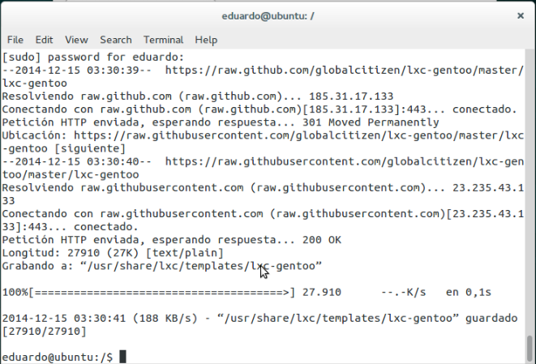
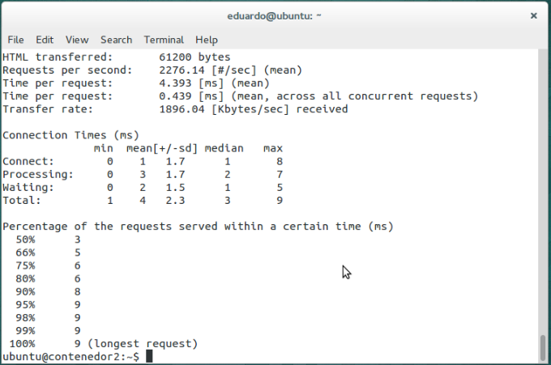
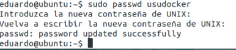

#Ejercicios tema 4 Eduardo J. Polo González.#

##Ejercicio 1.
###Instala LXC en tu versión de Linux favorita. Normalmente la versión en desarrollo, disponible tanto en GitHub como en el sitio web está bastante más avanzada; para evitar problemas sobre todo con las herramientas que vamos a ver más adelante, conviene que te instales la última versión y si es posible una igual o mayor a la 1.0.

- Lo primero que se va hacer es instalar lxc, para ello hay dos formas:
	- Una mediante el siguiente comando, sudo apt-get install lxc.
	- Otra, clonando el repositorio de github de lxc e instalandolo desde la carpeta clonada.

 

- Para comprobar que se ha configurado correctamente, usamos el siguiente comando: lxc-checkconfig.

##Ejercicio 2.
###Comprobar qué interfaces puente se han creado y explicarlos.

- Primero vamos a crear un contenedor, usando el siguiente comando: sudo lxc-create -t ubuntu -n contenedor2

- Para arrancar el contenedor y conectarse a él, usamos el siguiente comando: sudo lxc-start -n contenedor1

- Podemos listar los contenedores que tenemos disponibles usando el siguiente comando: sudo lxc-ls.

- Comprobar qué interfaces puente se han creado y explicarlos.
	- ifconfig -a:

	
	- brctl show:

	

    Se genera un puente de red preconfigurado.

##Ejercicio 3.
###1.Crear y ejecutar un contenedor basado en Debian.

- Primero vamos a crear el contenedor basado en debian, usando el siguiente comando: sudo lxc-create -t debian -n contDebian.

- Comprobamos que el contenedor está creado mediante el siguiente comando:  sudo lxc-ls.

- Lo siguiente que vamos hacer es iniciar el contenedor, usando el siguiente comando: sudo lxc-start -n contDebian.

###2.Crear y ejecutar un contenedor basado en otra distribución, tal como Fedora. Nota En general, crear un contenedor basado en tu distribución y otro basado en otra que no sea la tuya. Fedora, al parecer, tiene problemas si estás en Ubuntu 13.04 o superior, así que en tal caso usa cualquier otra distro. Por ejemplo, Óscar Zafra ha logrado instalar Gentoo usando un script descargado desde su sitio, como indica en este comentario en el issue.

- Voy a crear un contenedor con Gentoo.

- Lo primero es descargarnos la plantilla, usando el siguiente comando: sudo wget -P /usr/share/lxc/templates/ https://raw.github.com/globalcitizen/lxc-gentoo/master/lxc-gentoo y darle permisos de ejecución, usando el siguiente comando: sudo chmod +x /usr/share/lxc/templates/lxc-gentoo.

- Lo siguiente que vamos hacer es ejecutar la plantilla, usando el siguiente comando: sudo /usr/share/lxc/templates/lxc-gentoo create.

- Una vez descargado y configurado todo, vamos arrancar el contenedor, usando el siguiente comando: lxc-start -f "ARCHIVO_CONFIGURACION.conf" -n "NOMBRE_CONTENEDOR".

- Si nos aparecen errores al arrancar, para eliminarlos usamos los siguientes comandos:
	- sudo apparmor_parser -R /etc/apparmor.d/usr.bin.lxc-start
	- sudo ln -s /etc/apparmor.d/usr.bin.lxc-start /etc/apparmor.d/disable/
	- Y añadimos  la siguiente línea al principio del archivo de configuración del contendor(lxc.aa_profile = unconfined)

- Una vez realizado esto, debería de arrancarnos sin problemas.

##Ejercicio 4.
###1.Instalar lxc-webpanel y usarlo para arrancar, parar y visualizar las máquinas virtuales que se tengan instaladas.

- Para instalar lxc-webpanel usamos el siguiente comando: wget http://lxc-webpanel.github.io/tools/install.sh -O - | sudo bash

- Una vez que tenemos instalados el lxc-webpanel, nos vamos a firefox y ponemos localhost:5000/login y nos muestra los siguiente:

- Una vez introducido el usuario y contraseña nos muestra las máquinas virtuales que tenemos instaladas.

###2.Desde el panel restringir los recursos que pueden usar: CPU shares, CPUs que se pueden usar (en sistemas multinúcleo) o cantidad de memoria.

- Para restringir los recursos que pueden usar basta con pulsar en el contenedor al que queremos restringir esos recursos y nos saldrá lo siguiente:

Una vez realizados los cambios le damos a Apply.

##Ejercicio 5.
###Comparar las prestaciones de un servidor web en una jaula y el mismo servidor en un contenedor. Usar nginx.

- Lo primero de todo es instalar apache2 para usar el apache benchmark, debido a que es necesario para realizar la comparación de prestaciones, para ello usamos el siguiente comando: sudo apt-get install apache2-utils.

- Para usar apache benchmark usamos el siguiente comando: ab -n 100 - c 10 url

- En mi caso voy a comparar las prestaciones del servidor web de la jaula saucy32 y el del contenedor2.

- En la jaula saucy32 muestra los siguientes datos:

- En el contenedor2 muestra los siguientes datos:

Viendo los valores de cada una, el contenedor2 es más rápido que la jaula

##Ejercicio 6.
###1.Instalar juju.

- Primero añadimos el repositorio de la aplicación, para ello usamos el siguiente comando: sudo add-apt-repository ppa:juju/stable.

- Lo siguiente es instalar juju, usando el siguiente comando: sudo apt-get install juju-core.

###2.Usándolo, instalar MySQL en un táper.

- Lo primero que vamos hacer es iniciar juju, usando el siguiente comando: sudo juju init.

- Lo siguiente que vamos hacer es editar el archivo ~/.juju/environments.yaml es decir cambiamos default: amazon por default: local.

- Lo siguiente que vamos hacer es establecer que vamos a trabajar en el entorno de trabajo local, usando el siguiente comando: sudo juju switch local

- Lo siguiente que vamos hacer es instalar MongoDB, para ello usamos el siguiente comando: sudo apt-get install mongodb-server.

- Creamos el táper, usando el siguiente comando: sudo juju bootstrap

- Lo siguiente es instalar servicios dentro del táper, usamos los charms (script YAML para realizar tareas comunes) de los que no provee el propio sistema, concretamente el de para instalar MySQL, para ello usamos el siguiente comando: sudo juju deploy mysql

- Comprobamos el estado de las máquinas, usando el siguiente comando: sudo juju status

##Ejercicio 7.
###1.Destruir toda la configuración creada anteriormente.

- Para destruir toda la configuración, usamos el siguiente comando: juju destroy elemento_que_queremos_eliminar (Primero destruimos la unidad mysql, usando el siguiente comando: sudo juju destroy-unit mysql/0 y después destruimos la máquina creada, usando el siguiente comando: sudo juju destroy-machine 1)

###2.Volver a crear la máquina anterior y añadirle mediawiki y una relación entre ellos.

- Primero volvemos a crear la máquina anterior, usando el siguiente comando: sudo juju add-machine.

- Lo siguiente que vamos hacer es añadir mediawiki, usando el siguiente comando: sudo juju deploy mediawiki.

- Una vez añadida la wiki, vamos a añadir una relación entre ellos, usando el siguiente comando: sudo juju add-relation mediawiki:db mysql.

###3.Crear un script en shell para reproducir la configuración usada en las máquinas que hagan falta.

- El script va a contener los siguientes comandos: 

######!/bin/bash
###### Script para autoconfigurar juju con mysql y mediawiki en cualquier máquina
###### Inicializar el entorno de juju
######juju init
######Seleccionar un entorno de trabajo local
######juju switch local
######Crear el contenedor juju
######juju bootstrap
######Instalar mediawiki
######juju deploy mediawiki
######Instalar mysql
######juju deploy mysql
######Crear la relación necesaria entre mediawiki y mysql
######juju add-relation mediawiki:db mysql
######Publicar el acceso al servicio mediawiki
######juju expose mediawiki
######Mostrar el estado de la máquina
######juju status

##Ejercicio 8.
###Instalar libvirt. Te puede ayudar esta guía para Ubuntu.

- Para instalar libvirt, usamos el siguiente comando: sudo apt-get install kvm libvirt-bin

##Ejercicio 9.
###Instalar un contenedor usando virt-install.

- Para instalar virt que nos permitirá instalar un sistema operativo en una máquina virtual, usamos el siguiente comando: sudo apt-get install virtinst.

- Lo siguiente que vamos a instalar es virt-viewer que nos permite conectarnos a la consola de la máquina virtual, pero además usando una interfaz gráfica para la interacción con la máquina virtual, para ello usamos el siguiente comando: sudo apt-get install virt-viewer.

- El sistema que vamos a instalar en el contenedor es Ubuntu Server 13.10 64 bits. Primero me la voy a descargar usando el siguiente comando: wget http://ubuntu.uc3m.es/ubuntu-releases//saucy/ubuntu-13.10-server-amd64.iso.

- Una vez descargada la imágen, voy a instalarla con virtinstall, usando el siguiente comando: sudo virt-install -n virt-ubuntuserver -r 512 --disk path=/var/lib/libvirt/images/virt-ubuntuserver.img,bus=virtio,size=5 -c ubuntu1310server64.iso --accelerate --network network=default,model=virtio --connect=qemu:///system --vnc --noautoconsole -v

- Para listar las máquinas virtuales existentes, usamos el siguiente comando: sudo virsh -c qemu:///system list

- Para Continuar con la instalación, primero debemos conectarnos, usando el siguiente comando: virt-viewer -c qemu:///system virt-ubuntuserver

##Ejercicio 10.
###Instalar docker.

- Primero comprobamos que nuestra versión del kernel Linux sea mínimo 3.8, si no la tenemos la instalamos.

- Añadimos la llave del repositorio, usando el siguiente comando: sudo apt-key adv --keyserver hkp://keyserver.ubuntu.com:80 --recv-keys 36A1D7869245C8950F966E92D8576A8BA88D21E9

- Lo siguiente es añadir el repositorio de docker, usando el siguiente comando: sudo sh -c "echo deb https://get.docker.com/ubuntu docker main\
> /etc/apt/sources.list.d/docker.list"

- Lo siguiente que vamos hacer es actualizar los paquetes e instalar docker (lxc-docker), para estos procesos usamos los siguientes comandos:
	- sudo apt-get update
	- sudo apt-get install lxc-docker

- Por último vamos a iniciar docker, usando el siguiente comando: sudo docker -d &(me dá un error para arreglarlo utilizo los siguientes comandos: rm /var/run/docker.sock y rm /var/run/docker.pid)

Como vemos tiene un error.

##Ejercicio 11.
###1.Instalar a partir de docker una imagen alternativa de Ubuntu y alguna adicional, por ejemplo de CentOS.

- Para instalar con Docker una imagen de ubuntu, usamos el siguiente comando: sudo docker pull dockerfile/ubuntu.

- Para instalar con docker una imagen con centos, usamos el siguiente comando: sudo docker pull centos.

###2.Buscar e instalar una imagen que incluya MongoDB.

- He encontrado esta imagen que tiene MongoDB 2.4.6 instalado en un sistema CentOS 6.4 de 64 bits:
	- sudo docker pull jonhadfield/mongodb

- Compruebo todas las imágenes que acabo de instalar, usando el siguiente comando: sudo docker images

##Ejercicio 12.
###Crear un usuario propio e instalar nginx en el contenedor creado de esta forma.

- Lo primero que se va hacer es entrar en el contenedor, usando el siguiente comando: sudo docker run -i -t ubuntu /bin/bash.

- Lo siguiente que vamos hacer es crear en el contenedor un usuario propio, que le voy a dar el nombre de usudocker, para ello uso estos comandos: 
	- useradd -d /home/usudocker -m usudocker.
	- passwd usudocker

- Una vez creado el usuario propio, me voy a logear, usando el siguiente comando: login usudocker.

- Ahora vamos a instalar nginx en el contenedor, lo primero que vamos hacer es instalar el siguiente paquete: 
	- sudo apt-get install software-properties-common

- Lo siguiente que se va hacer es añadir el repositorio de nginx, usando el siguiente comando: sudo add-apt-repository ppa:nginx/stable

- Por último solo queda instalar nginx, usando el siguiente comando: sudo apt-get update && sudo apt-get install nginx.

##Ejercicio 13.
###Crear a partir del contenedor anterior una imagen persistente con commit.

- Primero tenemos que conocer la ID largo, usando el siguiente comando: sudo docker ps -notrunc

- Con esta ID podemos obtener diversa información de los contenedores, usando el siguiente comando: sudo docker inspect id larga

- Lo siguiente que vamos hacer es crear la imagen persistente en nuestro contenedor, usando el siguiente comando: sudo docker commit nuestraID nuevo-nombre.

##Ejercicio 14.
###Crear una imagen con las herramientas necesarias para el proyecto de la asignatura sobre un sistema operativo de tu elección.

- Lo primero que hay que hacer es registrarse en la [página](https://hub.docker.com/account/signup/).

- Lo siguiente que se va hacer es asociar la cuenta de docker con la cuenta de github.

- Seleccionamos y creamos el repositorio de la asignatura de github.

- Por último vamos a build details

- Y Le damos a Start a Build 

