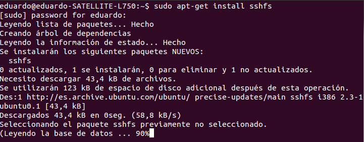
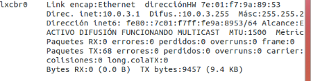
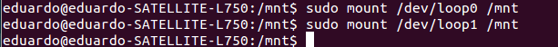
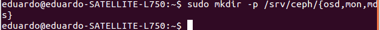

#Ejercicios tema 5 Eduardo J. Polo González.

####Ejercicio 1:
####1.¿Cómo tienes instalado tu disco duro? ¿Usas particiones? ¿Volúmenes lógicos?

- En mi disco duro tengo instalado Windows 7 y Ubuntu 12.04.

- Para ver mejor como la configuración de mi disco duro, uso el siguiente comando: sudo lsblk -fm.

Como vemos tengo el espacio en el disco duro particionado en:
	- Una partición reservada para el sistema.
    - Y luego cuatro particiones entre las que destacan la particion de windows, la de linux y swap

####2. Si tienes acceso en tu escuela o facultad a un ordenador común para las prácticas, ¿qué almacenamiento físico utiliza?

- Utiliza la particion U.

####3.Buscar ofertas SAN comerciales y comparar su precio con ofertas locales (en el propio ordenador) equivalentes.

- Para realizar el ejercicios he utilizado:
	- Para las ofertas SAN comerciales:
		-  HP P2000 G3 FC DC SMB SAN Starter Kit-AP847B y HP P2000 G3 FC DC Virtual SAN Starter Kit-AP848B
	- Para las ofertas locales:
		-  WD Red 4 TB Hard Drive for NAS (WD40EFRX) y WD Red 1 TB Hard Drive for NAS (WD10JFCX)

- Tabla comparativa entre ambos dispositivos:

|                   |   | HP AP847B | WD40EFRX |   | HP AP848B | WD10JFCX |
|:-----------------:|---|:---------:|:--------:|---|:---------:|:--------:|
|   Capacidad (TB)  |   |     48    |     4    |   |    28'8   |     1    |
|    Equivalencia   |   |     1     |    12    |   |     1     |    29    |
| Precio unidad (€) |   | 11.978'22 |    169   |   | 17.546'28 |   75'95  |
|   NAS necesarios  |   |     0     |     2    |   |     0     |     4    |
|   Precio NAS (€)  |   |    899    |    899   |   |    899    |    899   |
|  Precio final (€) |   | 11.978'22 |   3.826  |   | 17.546'28 | 5.798'55 |

####Ejercicio 2:
####Usar FUSE para acceder a recursos remotos como si fueran ficheros locales. Por ejemplo, sshfs para acceder a ficheros de una máquina virtual invitada o de la invitada al anfitrión.

- Lo primero que vamos hacer es instalar sshfs en la máquina anfitriona, usando el siguiente comando: sudo apt-get install sshfs.

- Lo siguiente instalar sshfs en la máquina invitada.
- Lo siguiente que vamos hacer es añadir al grupo fuse el usuario con el que nos conectamos a la máquina virtual, usando el siguiente comando: sudo usermod -a -G fuse eduardo.

- Lo siguiente es conocer la dirección ip de la máquina a la que nos queremos conectar, usamos el siguiente comando: ifconfig.

- Vamos a crear un directorio llamado ejer2t5 y dentro creamos un archivo llamado nada.

- En la máquina anfitriona también vamos a crear un directorio llamado ejer2t5anfitriona.

- Por último nos conectamos a la máquina virtual remota, usando el siguiente comando: sshfs eduardo@10.0.3.1:/home/eduardo/ejer2t5 /home/eduardo/ejer2t5anfitriona.

####Ejercicio 3:
####Crear imágenes con estos formatos (y otros que se encuentren tales como VMDK) y manipularlas a base de montarlas o con cualquier otra utilidad que se encuentre.

- raw: qemu-img create -f raw imagen-raw.img 20M
- qcow2: qemu-img create -f qcow2 imagen-qcow2.qcow2 20M
- vmdk: qemu-img create -f vmdk imagen-vmdk.vmdk 50M
- vdi: qemu-img create -f vdi imagen-vdi.vdi 30M

- Montar la imagen como un dispositivo loop:
- raw: sudo mount -t ntfs -o loop /home/eduardo/img-raw.raw /mnt/image
- qcow2: sudo mount -t ntfs -o loop /eduardo/img-qcow2.qcow2 /mnt/image
- vmdk: sudo mount -t ntfs -o loop /home/eduardo/img-vmdk.vmdk /mnt/image
- vdi: sudo mount -t ntfs -o loop /home/eduardo/img-vdi.vdi /mnt/image

####Ejercicio 4:
####Crear uno o varios sistema de ficheros en bucle usando un formato que no sea habitual (xfs o btrfs) y comparar las prestaciones de entrada/salida entre sí y entre ellos y el sistema de ficheros en el que se encuentra, para comprobar el overhead que se añade mediante este sistema.

- Primero vamos a instalar btrfs, usando el siguiente comando: sudo apt-get install btrfs-tools xfsprogs.

- qemu-img create -f raw xfs.img 1G
- qemu-img create -f raw btrfs.img 1G

- primero las ponemos accesibles con losetup, usando los siguientes comandos:

- btrfs: sudo losetup -v -f btrfs.img
- xfs: sudo losetup -v -f xfs.img

- Lo siguiente es darle formato a las imágenes, usando los siguientes comandos:
    - sudo mkfs.xfs /dev/loop1

	

    - sudo mkfs.btrfs /dev/loop0

	

- Montamos las imágenes, usando los siguientes comandos:
	- sudo mount /dev/loop0 /mnt
	- sudo mount /dev/loop1 /mnt

	

- comprobamos que aparecen como dispositivos montados en el sistema, usando el siguiente comando: df -h.

- Lo siguiente es crear imágenes para probar en que sistema de ficheros se copia con más velocidad, usando los siguientes comandos:

qemu-img create -f vmdk test.vmdk 80M
qemu-img create -f vmdk test.vmdk 100M

- Lo siguiente es comprobar cuanto tarda en copiarse, usando el siguiente comando: 
	- sudo time -v cp test.vmdk /mnt/

	

####Ejercicio 5:
####Instalar ceph en tu sistema operativo.
- Para instalar ceph usamos el siguiente comando: sudo apt-get install ceph-mds.

####Ejercicio 6:
####Crear un dispositivo ceph usando BTRFS o XFS.

- Lo primero que tenemos que tener es instalado ceph.
- Una vez que tenemos instalado ceph, crearemos los directorios donde se va a almacenar la información de Ceph, usando el siguiente comando: sudo mkdir -p /srv/ceph/{osd,mon,mds}.

- Lo siguiente que vamos hacer es crear el archivo de configuración ceph.conf, se encuentra en la ruta /etc/ceph/ceph.conf. El archivo va a contener lo siguiente:

[global]
    auth cluster required = none
    auth service required = none
    auth client required = none
    auth supported = none
    log file = /var/log/ceph/$name.log
    pid file = /var/run/ceph/$name.pid
[mon]
    mon data = /srv/ceph/mon/$name
[mon.gpc]
    host = eduardo-SATELLITE-L750
    mon addr = 127.0.0.1:6789
[mds]
[mds.gpc]
    host = eduardo-SATELLITE-L750
[osd]
    osd data = /srv/ceph/osd/$name
    osd journal = /srv/ceph/osd/$name/journal
    osd journal size = 1000
[osd.0]
    host = eduardo-SATELLITE-L750
    xfs devs = /dev/loop2

- Lo siguiente que hacemos es crear un sistema bucle con formato con sistema xfs, usando los siguientes comandos:
    - qemu-img create -f raw ceph_osd.img 2G
    - sudo losetup -v -f ceph_osd.img
    - sudo mkfs.xfs /dev/loop2

- Lo siguiente es crear un directorio para el servidor de objetos, usando el siguiente comando: sudo mkdir /srv/ceph/osd/osd.0.

- Lo siguiente es crear un sistema de ficheros, usando el siguiente comando: sudo /sbin/mkcephfs -a -c /etc/ceph/ceph.conf

- Lo siguiente es iniciar el servicio, usando el siguiente comando: sudo /etc/init.d/ceph -a start

- Lo siguiente es comprobar que se ha iniciado correctamente, usando el siguiente comando: sudo ceph -s
- Por último creamos el directorio donde lo vamos a montar, lo montamos y comprobamos que se ha montado, usando los siguientes comandos:
    - sudo mkdir /mnt/ceph
    - sudo mount -t ceph eduardo-SATELLITE-L750:/ /mnt/ceph
    - df

####Ejercicio 7:
####Almacenar objetos y ver la forma de almacenar directorios completos usando ceph y rados.

- Lo primero que vamos hacer es crear una piscina, usando el siguiente comando: rados mkpool piscina.
- Comprobamos que se han creado, usando el siguiente comando: rados lspools.
- Por último le añadimos un fichero, usando el siguiente comando: rados put -p piscina objeto archivo.img.

####Ejercicio 8:
####Tras crear la cuenta de Azure, instalar las herramientas de línea de órdenes (Command line interface, cli) del mismo y configurarlas con la cuenta Azure correspondiente

####Ejercicio 9:
####Crear varios contenedores en la cuenta usando la línea de órdenes para ficheros de diferente tipo y almacenar en ellos las imágenes en las que capturéis las pantallas donde se muestre lo que habéis hecho. 

####Ejercicio 10:
####Desde un programa en Ruby o en algún otro lenguaje, listar los blobs que hay en un contenedor, crear un fichero con la lista de los mismos y subirla al propio contenedor. Muy meta todo.