#Ejercicios tema 6 Eduardo J. Polo González.

####Ejercicio 1:
####Instalar los paquetes necesarios para usar KVM. Se pueden seguir estas instrucciones. Ya lo hicimos en el primer tema, pero volver a comprobar si nuestro sistema está preparado para ejecutarlo o hay que conformarse con la paravirtualización.

- Primero vamos a comprobar que nuestro procesador soporta virtualizacion, para ello introducimos egrep -c '(vmx|svm)' /proc/cpuinfo:
	- Me sale un valor distinto de 0. en mi caso el valor 4.

- Lo siguiente es comprobar si nuestro sistema está preparado para ejecutar KVM y no es necesario utilizar para virtualización:
	- kvm-ok

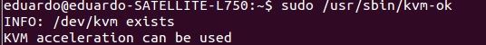

- Una vez comprobado todo esto, instalamos los paquetes necesarios para usar KVM y algunos más que es recomendable instalar, serán: qemu-kvm, libvirt-bin, virtinst y virt-manager, para ello utilizamos el siguiente comando: sudo apt-get install qemu-kvm qemu-system libvirt-bin virtinst virt-manager.

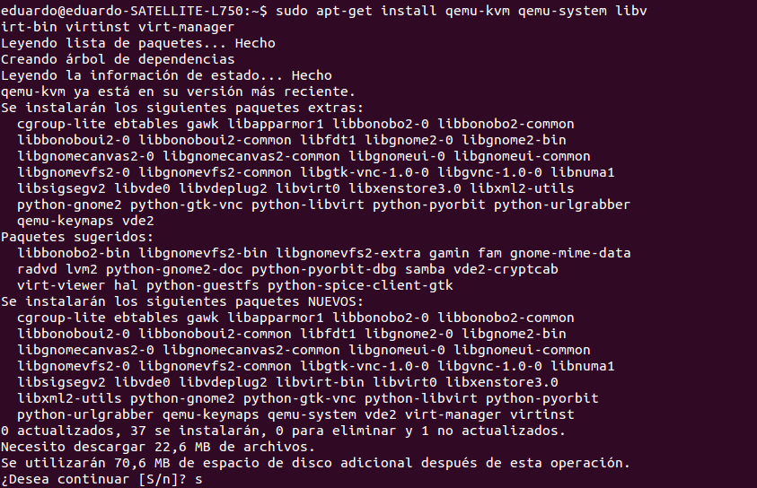

####Ejercicio 2:
####1.Crear varias máquinas virtuales con algún sistema operativo libre tal como Linux o BSD. Si se quieren distribuciones que ocupen poco espacio con el objetivo principalmente de hacer pruebas se puede usar CoreOS (que sirve como soporte para Docker) GALPon Minino, hecha en Galicia para el mundo, Damn Small Linux, SliTaz (que cabe en 35 megas) y ttylinux (basado en línea de órdenes solo).

- Primero vamos a activar el módulo del kernel de VKM, usando el siguiente comando: sudo modprobe kvm-intel

- Ahora vamos a realizar una instalación de CoreOS. se puede descargadar desde aquí junto con su script de ejecución:

wget http://storage.core-os.net/coreos/amd64-generic/dev-channel/coreos_production_qemu.sh.

wget http://storage.core-os.net/coreos/amd64-generic/dev-channel/coreos_production_qemu_image.img.bz2

chmod +x coreos_production_qemu.sh

bunzip2 coreos_production_qemu_image.img.bz2

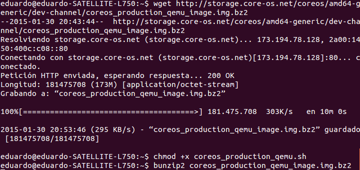

- Para acceder a la maquina virtual es necesario usar llaves ssh. Para simplificar el acceso, editamos el archivo ~/.ssh/config y añadimos las siguientes líneas:
	- Host coreos
	- HostName localhost
	- Port 2222
	- User core
	- StrictHostKeyChecking no
	- UserKnownHostsFile /dev/null
- Por último arrancamos la máquina, usando el siguiente comando: ./coreos_production_qemu.sh &.
- Accedemos a ella, usando el siguiente comando: ssh coreos.

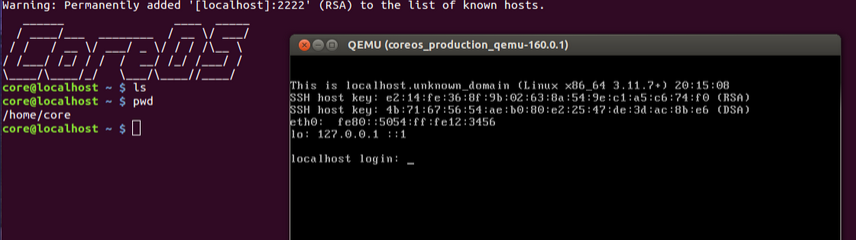

- Ahora vamos a instalar Damn Small Linux, para ello usamos los siguientes comandos:

wget ftp://distro.ibiblio.org/pub/linux/distributions/damnsmall/current/dsl-4.4.10.iso

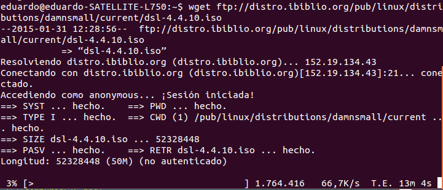

qemu-img create -f qcow2 hdd-dsl.img 500M

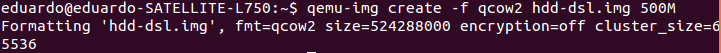

qemu-system-x86_64 -hda /hdd-dsl.img -cdrom /dsl-4.4.10.iso

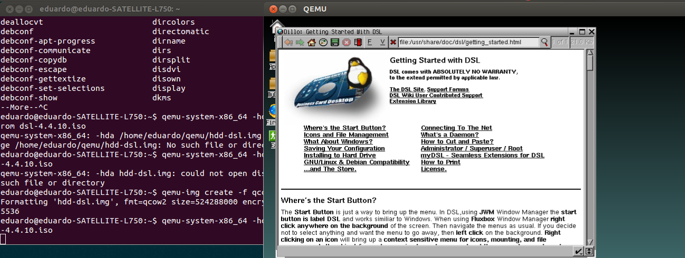

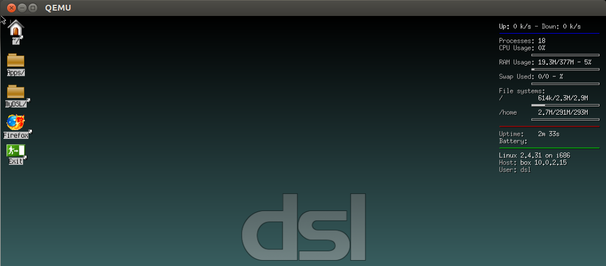

####2.Hacer un ejercicio equivalente usando otro hipervisor como Xen, VirtualBox o Parallels.

- El hipervisor que voy a utilizar es virtualbox, para instalarlo uso el siguiente comando: sudo apt-get install virtualbox.

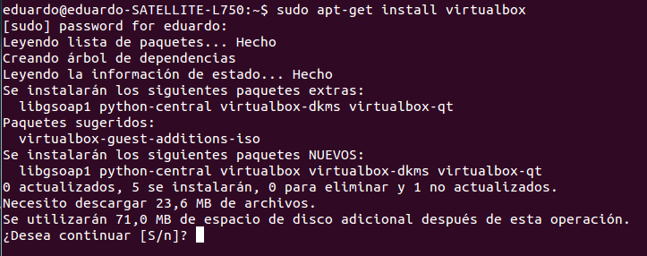

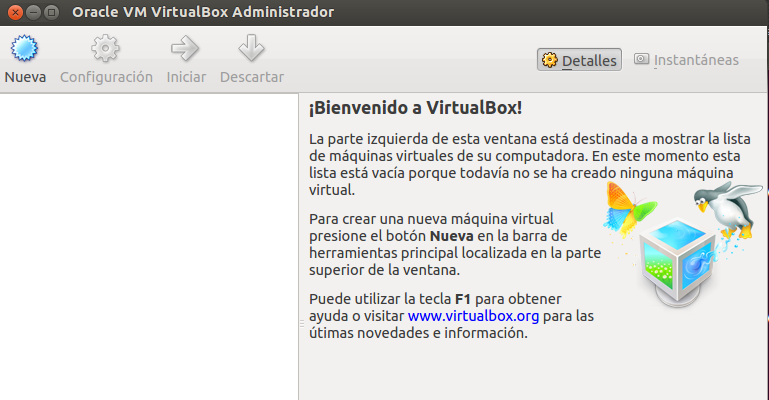

- Una vez instalado virtualbox, voy a descargarme la imagen que quiero instalar, en este caso voy a usar [SliTaz](http://www.slitaz.org/en/).

- Vamos a crear la máquina virtual con Slitaz.

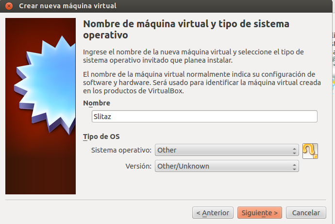

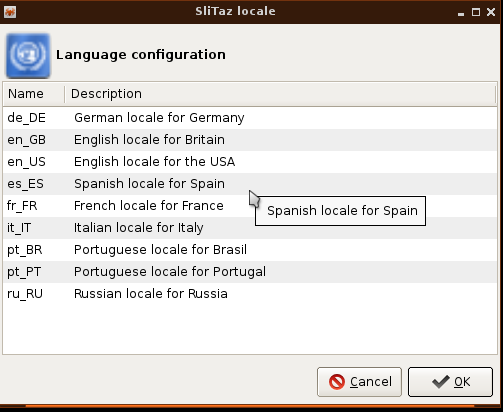

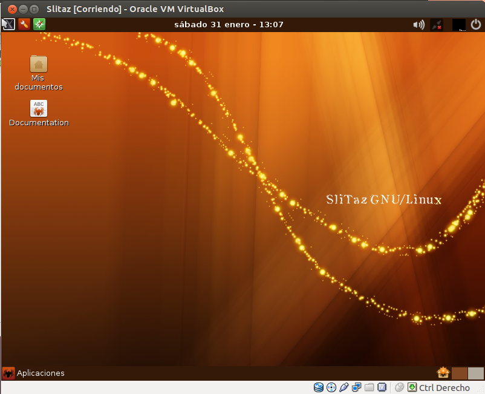

####Ejercicio 4:
####Crear una máquina virtual Linux con 512 megas de RAM y entorno gráfico LXDE a la que se pueda acceder mediante VNC y ssh.

- Primero voy a descargar Lubuntu (lubuntu-13.10-desktio-i386.iso).
- Lo siguiente que vamos hacer es crear la imagen, usando el siguiente comando: qemu-img create -f qcow2 hdd-lubuntu.img 10G.

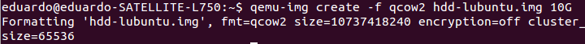

- Lo siguiente que vamos hacer es crear la máquina, usando el siguiente comando: qemu-system-x86_64 -hda hdd-lubuntu.img -cdrom lubuntu-13.10-desktop-i386.iso -m 512M.

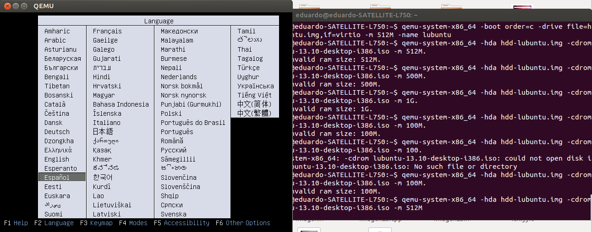

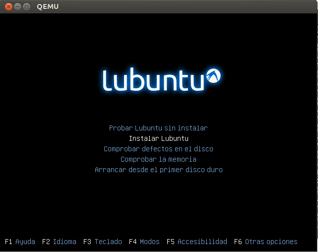

- Lo siguiente es comprobar que el sistema se ha instalado correctamente arrancándola normalmente, usando el siguiente comando: qemu-system-x86_64 -boot order=c -drive file=hdd-lubuntu.img,if=virtio -m 512M -name lubuntu

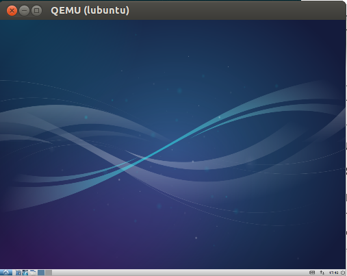

- Instalamos vinagre para conectarnos a la máquina, usando el siguiente comando: sudo apt-get install vinagre.

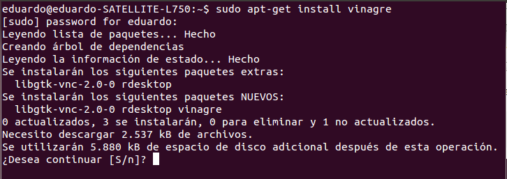

- La volvemos a arrancar usando -vnc :1 (qemu-system-x86_64 -boot order=c -drive file=hdd-lubuntu.img,if=virtio -m 512M -name lubuntu -vnc :1).

- Lo siguiente es conocer su ip con el siguiente comando: ifconfig.

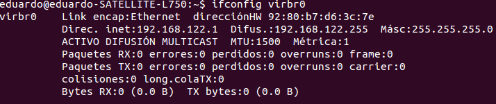

- Nos conectamos a la máquina con vinagre 192.168.122.1:5901 &.
- Redirigimos hacia el puerto que queramos, usando el siguiente comando: -redir tcp:2222::22

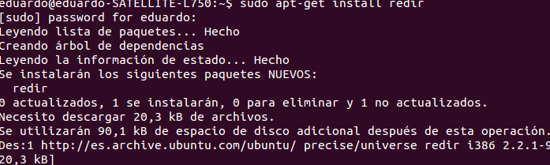

- qemu-system-x86_64 -boot order=c -drive file=~/qemu/hdd-lubuntu.img,if=virtio -m 512M -name lubuntu -redir tcp:2222::22.

- Por último nos conectamos por ssh, usando el siguiente comando: ssh -p 2222 eduardo@localhost.

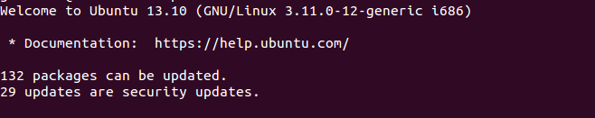

####Ejercicio 5:
####Crear una máquina virtual ubuntu e instalar en ella un servidor nginx para poder acceder mediante web.

- Listamos las máquinas virtuales disponibles, usando el siguiente comando: azure vm image list.

- Lo siguiente que vamos hacer es crear la máquina virtual, en mi caso me han prestado una ya creada porque no tengo cuenta azure para poder crearla.

- Lo siguiente que vamos hacer es conectarnos a la máquina virtual mediante ssh, usando el siguiente comando: ssh azureuser@javiaranda.cloudapp.net.

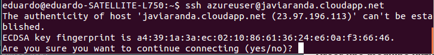

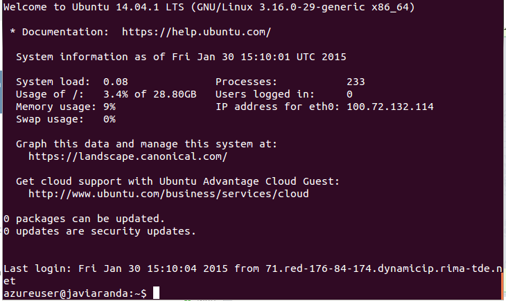

- Lo siguiente que vamos hacer es instalar nginx, para ello usamos el siguiente comando: sudo apt-get install nginx.

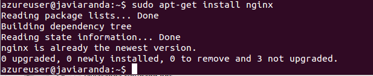

Como la máquina me la han prestado ya viene instalado nginx.

- Lo siguiente es comprobar nginx, usamos el siguiente comando: sudo service nginx status.

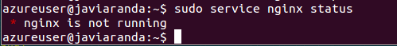

- Una vez comprobado si no está iniciado, pues se inicia nginx, para ello usamos el siguiente comando: sudo service nginx start. 

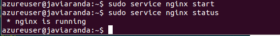

- Por último comprobamos que nginx está funcionando en la la web (http://javiaranda.cloudapp.net)

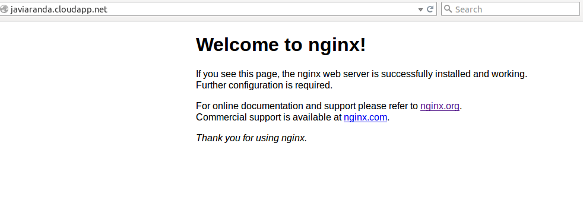

Como vemos nginx está funcionando en la web.

####Ejercicio 6:
####Usar juju para hacer el ejercicio anterior.

-  Generar el fichero de configuración de juju, usando el siguiente comando: sudo juju init.

-  Cambiar el fichero de configuración de juju environments.yaml.

-  Generamos un certificado para juju, para ello usamos los siguientes comandos:

	- openssl req -x509 -nodes -days 3650 -newkey rsa:2048 -keyout azure.pem -out azure.pem

	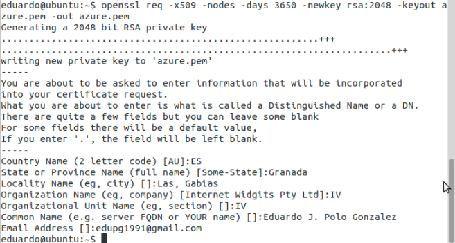

	- openssl x509 -inform pem -in azure.pem -outform der -out azure.cer

	- chmod 600 azure.pem

- Una vez creados los certificados .pem y .cer, podemos configurar environments.yaml. Se tiene que cambiar  management-subscription-id, management-certificate-path, y storage-account-name para reflejar correctamente la información del usuario.
	- El management-subscription-id se conoce utilizando el siguiente comando: azure account list.

	- El management-certificate-path es el lugar del certificado .pem, mientras que el storage-account-name es el nombre del almacenamiento que ya tiene creado el usuario. Para ello usamos el siguiente comando: azure storage account list.

- Lo siguiente que vamos hacer es iniciar juju usando azure, para ello usamos el siguiente comando: sudo juju switch azure.

- Lo siguiente es construir el bootstrap, para ello usamos el siguiente comando: sudo juju bootstrap.

- Lo siguiente es usar juju-gui, para ello usamos el siguiente comando: sudo juju deploy --to 0 juju-gui.

- Lo siguiente es exponerlo para poder usarlo, para ello usamos el siguiente comando: sudo juju expose juju-gui.

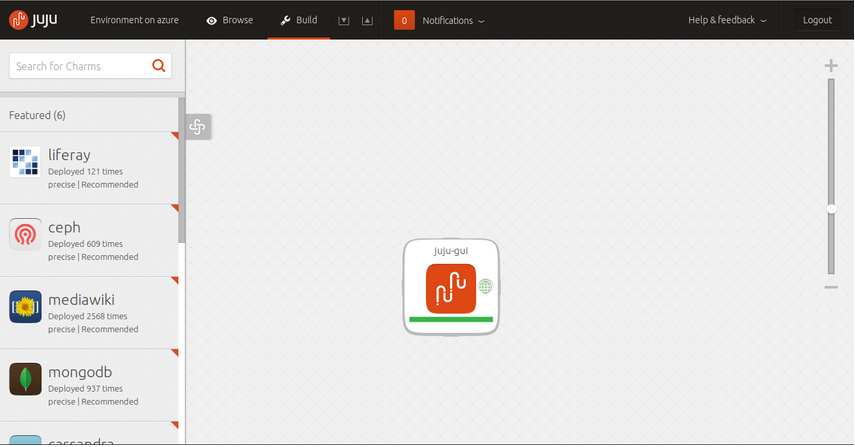

- Buscamos nginx en el panel de arriba a la izquierda y lo instalamos.

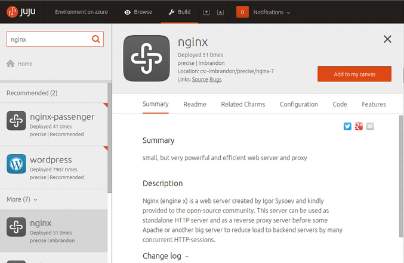

- Comprobamos que se ha añadido y lo exponemos, pasa ello usamos los siguientes comandos:
	- sudo juju status.
	- sudo juju expose nginx.
- Volvemos a entrar y vemos como nginx está en verde.

- Por último ya solo falta configurar nginx dentro de juju.

####Ejercicio 7:
####Instalar una máquina virtual con Linux Mint para el hipervisor que tengas instalado.

- Lo primero que vamos hacer es descargarnos la imagen de linuxmint (en mi caso voy a descargarme Linux Mint 13 "Maya" - Xfce (32-bit)).

- Una vez descargada la imagen, vamos a instalarlo en virtualbox.

