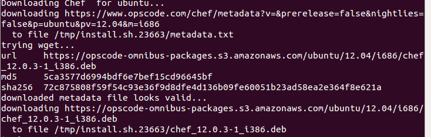

#Ejercicios tema 7 Eduardo J. Polo González.

##Ejercicio 1.
###Instalar chef en la máquina virtual que vayamos a usar.

- Voy a instalar chef usando el siguiente comando: curl -L https://www.opscode.com/chef/install.sh | sudo bash

##Ejercicio 2.
###Crear una receta para instalar nginx, tu editor favorito y algún directorio y fichero que uses de forma habitual.

- Dentro de chef vamos a crear un directorio llamado cookbooks y dos archivos uno node.json y otro solo.rb.

	- Dentro del directorio cookbooks voy a contener lo siguiente:
		- Directorio nano que va a contener:
			- recipes que a su vez va a contener:
				- default.rb.
		- Directorio git que va a contener:
			- recipes que a su vez va a contener:
				- default.rb.
		- Directorio nginx que va a contener:
			- recipes que a su vez va a contener:
				- default.rb.
- Voy a mostrarlo mediante el comando: tree

- solo.rb es el archivo de configuración de nuestro recetario. El archivo solo.rb va a contener lo siguiente:
	- file_cache_path "/home/eduardo/chef" (Indica la carpeta raíz en donde están los archivos de configuración)
	- cookbook_path "/home/eduardo/chef/cookbooks" (Indica el path en el que se encuentra el "libro de cocina")

	- json_attribs "/home/eduardo/node.json" (Indica dónde se encuentra el archivo con los atributos .json)

- node.json es el que indicará los atributos de cada una de las recetas de nuestro recetario (nombres, versiones, usuarios...), así como la forma de ejecutarlas (por ejemplo, ejecutar todas las recetas seguidas). El archivo node.josn va a contener lo siguiente:

	{

    "nginx": {

     "user"      : "www-data",
    "port"		: "80"
    },

	"run_list": [ "recipe[nano]", "recipe[git]", "recipe[nginx]" ]

	}

- Default.rb se indican los paquetes que vamos a instalar, en este caso solo git. También necesita uno por aplicación dentro de la carpeta recipes.

	- Default.rd de la carpeta recipes de nano contendrá lo siguiente:
			package "nano"

    - Default.rd de la carpeta recipes de nginx contendrá lo siguiente:
			package "nginx"
    - Default.rd de la carpeta recipes de git contendrá lo siguiente:
		directory '/home/eduardo/chef'
    		file "/home/eduardo/chef/cookbooks/test.txt" do
            owner "eduardo"
            group "eduardo"
            mode 00544
            action :create
            content "Directorio para documentos de la asignatura IV"
    		end

- instalación con el siguiente comando: sudo chef-solo -c chef/solo.rb -j chef/node.json

##Ejercicio 3.
###Escribir en YAML la siguiente estructura de datos en JSON.{ uno: "dos",tres: [ 4, 5, "Seis", { siete: 8, nueve: [ 10, 11 ] } ] }

- JSON

{
  uno: "dos",
  tres: [
    4,
    5,
    "Seis",
    {
      siete: 8,
      nueve: [
        10,
        11
      ]
    }
  ]
}

- YAML

---
- uno: "dos"
  tres:
    - 4
    - 5
    - "Seis"
    -
      - siete: 8
        nueve:
          - 10
          - 11

##Ejercicio 4.
###Desplegar los fuentes de la aplicación de DAI o cualquier otra aplicación que se encuentre en un servidor git público en la máquina virtual Azure (o una máquina virtual local) usando ansible.

- Entramos en la máquina virtual azure mediante ssh, usamos el siguiente comando: ssh azureuser@javiaranda.cloudapp.net

- Lo siguiente que vamos hacer es instalar ansible, primero tenemos que añadir su repositorio correspondiente, usando el siguiente comando: sudo add-apt-repository ppa:rquillo/ansible.

- Una vez que tenemos los repositorios añadidos  vamos a actualizar los paquetes e instalar ansible, para ello usamos los siguientes comandos:
	- sudo apt-get update
	- sudo apt-get install ansible

- Una vez instalado ansible, añadimos a un fichero, llamado inventario, que contiene las diferentes máquinas controladas por el mismo, usamos el siguiente comando: echo "javiaranda.cloudapp.net" > ~/ansible_hosts.
- Lo siguiente que vamos hacer es cambiar la ruta por defecto, para ello uso el siguiente comando: export ANSIBLE_HOSTS=~/ansible_hosts.
- Usamos la orden echo $ANSIBLE_HOSTS, que nos muestra lo siguiente:

- Lo siguiente que vamos hacer es realizar un ping para comprobar que funciona.

- Lo siguiente es instalar git en la máquina remota, usando el siguiente comando: sudo apt-get install git.

- ansible azure -m git -a "repo=https://github.com/edupg1/Practica10.git dest=~/Practica10 version=HEAD"

- Por último comprobar que los fuentes han sido desplegados correctamente en la máquina remota.

##Ejercicio 5.
###1. Desplegar la aplicación de DAI con todos los módulos necesarios usando un playbook de Ansible.

- Creamos el .yml

---
- hosts: azure
  sudo: yes
  remote_user: azureuser
  tasks:
    - name: Instalar Python y EasyInstall
      apt: name=build-essential state=present
      apt: name=python-dev state=present
      apt: name=python-setuptools state=present
    - name: Instalar MongoDB
      apt: name=mongodb-server state=present
    - name: Instalar módulos de Python necesarios
      command: easy_install web.py mako pymongo feedparser tweepy geopy
    - name: Crear servicio upstart
      template: src=dai.conf dest=/etc/init/dai.conf owner=root group=root mode=0644
    - name: Iniciar aplicación
      service: name=dai state=running

- Lanzamos el .yml con el siguiente comando: ansible-playbook script.yml
- Por último accedemos a la web y comprobamos que está funcionando.

###2.¿Ansible o Chef? ¿O cualquier otro que no hemos usado aquí?.

##Ejercicio 6.
###Instalar una máquina virtual Debian usando Vagrant y conectar con ella.

- Lo primero que vamos hacer es instalar Vagrant, para ello utilizamos el siguiente comando: sudo apt-get install vagrant.

- Lo siguiente que voy a hacer es buscar una máquina con formato Virtualbox que tenga una instalación de Debian 7. Nos la descargamos y la inicializamos usando los siguientes comandos:
	- vagrant box add debian https://dl.dropboxusercontent.com/u/197673519/debian-7.2.0.box

	

	- vagrant init debian7

	

- Lo siguiente será iniciar la máquina para poder conectarnos a ella, para ello usamos el siguiente comando: vagrant up.

- Por último solo nos queda acceder a la máquina, para ello usamos el siguiente comando: vagrant ssh.

##Ejercicio 7.
###Crear un script para provisionar `nginx` o cualquier otro servidorweb que pueda ser útil para alguna otra práctica.

- Editamos el Vangrantfile:

 -*- mode: ruby -*-
 vi: set ft=ruby :

Vagrant.configure("2") do |config|

  config.vm.box = "debian"

  config.vm.provision "shell",

   inline: "sudo apt-get install -y nginx"

end

- Provisionamos la máquina, usando el siguiente comando: vagrant provision.

##Ejercicio 8.
###Configurar tu máquina virtual usando vagrant con el provisionador ansible

- Lo primero que vamos hacer es configurar vagranfile:

	config.vm.network :private_network, ip: "192.168.2.50"

- Lo siguiente que vamos hacer es recargar vagrant, para ello usamos el siguiente comando: vagrant reload.

- Configuramos otra vez el vagrantfile, introduciendo lo siguiente:

	config.vm.provision "ansible" do |ansible| 
    	ansible.playbook = "playbook.yml"
 		end

- Donde el playbook.yml va a estar compuesto de lo siguiente:

---
- hosts: vagrant

  sudo: yes

  tasks:
    - name: Actualizar lista de paquetes

      apt: update_cache=yes

    - name: Instalar Nginx

      apt: name=nginx state=present

---
- Solo nos queda hacer uso del provision que acabamos de configurar, para ello usamos el siguiente comando: vagrant provision.

Si ahora accedemos desde una navegador a la dirección IP de la máquina virtual, veremos que el servidor funciona correctamente.

