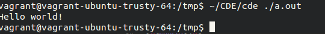
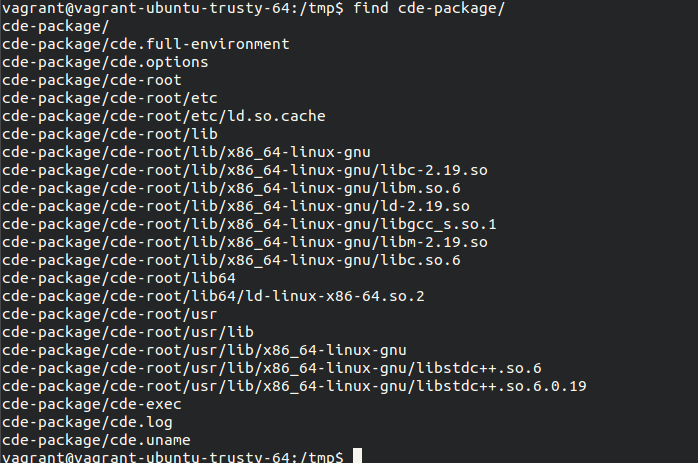
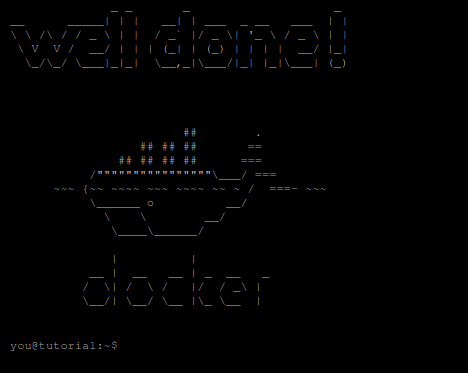
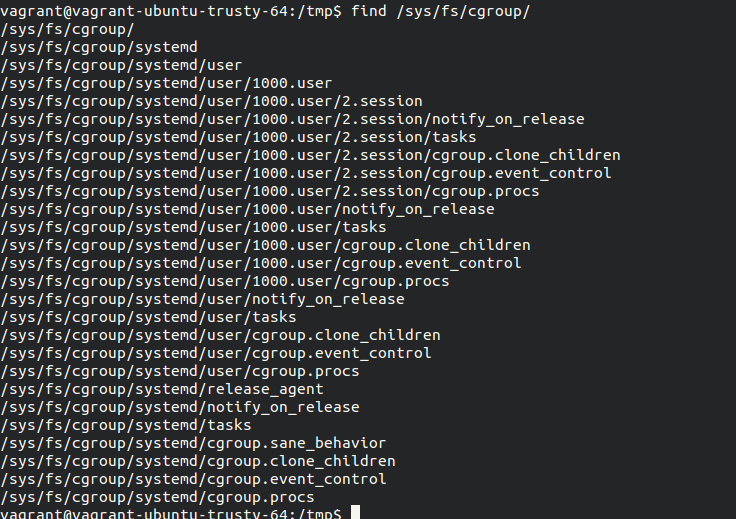

Tema 1
======

Ejercicio 1
-----------

**Consultar en el catálogo de alguna tienda de informática el precio de un ordenador tipo servidor y calcular su coste de amortización a cuatro y siete años.**

He seleccionado una máquina servidor Dell por el simple criterio de estar las primeras en los resultados de búsqueda. En concreto nos podemos fijar en una máquina cualquiera como la PowerEdge T320, de `746 €` (sin IVA).

Para amortizar el precio en 4 años tendríamos que deducir un `25%` cada año. Esto significa `186.5` euros por año.

Para amortizar el servidor a 7 años deducimos `14.28%` por año. En dinero significaría `106.5` euros durante 6 años y `107` euros para cuadrar mejor las cuentas en el séptimo (o el primero si nos viene mejor).

-----

Ejercicio 2
-----------

**Usando las tablas de precios de servicios de alojamiento en Internet y de proveedores de servicios en la nube, Comparar el coste durante un año de un ordenador con un procesador estándar (escogerlo de forma que sea el mismo tipo de procesador en los dos vendedores) y con el resto de las características similares (tamaño de disco duro equivalente a transferencia de disco duro) si la infraestructura comprada se usa sólo el 1% o el 10% del tiempo.**

Empezaremos haciendo un cálculo sencillo y aproximado de cuantos minutos hay en un año para poder dividir correctamente el uso en el caso del servidor en la nube:

```
365 dias * 24 horas/dia * 60 minutos/hora = 525600 minutos
```

Voy a comparar un servidor dedicado de [Strato](http://www.strato.es/servidor-dedicado-linux/), en concreto el `Linux Level 1`; con la oferta de computación en la nube que nos ofrece Google a través de [Compute Engine](https://cloud.google.com/compute/pricing).

Hay pequeñas incosistencias en la comparación, como que Compute Engine ofrece `3.75 GB` de RAM en lugar de los `4 GB` que ofrece Strato. También nos ofrece una cantidad ilimitada de transferencia en el dedicado (que habría que comprobar cuanto tiene de ilimitada) y que sin embargo se especifica y se cobra en Compute Engine. Al ser cifras relativamente parecidas y tener el único ánimo de comparar prefiero ignorar estas pequeñas diferencias.

Calculando en Strato nos ofrecen una tarifa plana de `29 €/mes`, así que en un cálculo rápido tengamos el nivel de uso que tengamos obtenemos:

```
29 €/mes * 12 meses/año = 348 €/año
```

En el caso de Compute Engine he usado directamente [la calculadora](https://cloud.google.com/products/calculator/) que tienen preparada a tal efecto.

Para un `10%` de uso obtenemos una estimación de `3.59 €/mes (4.55 $)` para el uso de CPU y `31.55 €/mes (40 $)` para el alojamiento de `1 TB` de datos. En total esto arroja un resultado al año de:

```
(3.59 € + 31.55 €) * 12 meses/año = 421.68 €/año
```

Para un `1%` de uso obtenemos una estimación de `0.37 €/mes (0.47 $)` para el uso de CPU y `31.55 €/mes (40 $)` para el alojamiento de `1 TB` de datos. En total esto arroja un resultado al año de:

```
(0.37 € + 31.55 €) * 12 meses/año = 383.04 €/año
```

-----

Ejercicio 3
-----------

a) **¿Qué tipo de virtualización usarías en cada caso? Comentar en el foro**

b) **Crear un programa simple en cualquier lenguaje interpretado para Linux, empaquetarlo con CDE y probarlo en diferentes distribuciones.**

Seguimos las instrucciones de [su sitio web](http://www.pgbovine.net/cde.html) para instalarlo en una máquina virtual con Ubuntu.

Después preparo un archivo simple main.cc que contiene un programa extremadamente simple para probarlo:

```cpp
#include <iostream>

int main() {
  std::cout << "Hello world!" << std::endl;
  return 0;
}
```

Una vez compilado usando el comando típico de `g++` podemos ejecutarlo con el comando que hemos construido mientras instalábamos CDE:



Una vez ejecutado podemos seguir el comando que indica [la documentación de CDE](http://www.pgbovine.net/cde/manual/) y ver que efectivamente se han generado y preparado en la carpeta todos los archivos, ejecutables, librerías, etc. que se necesitan para ejecutar nuestro programa (son pocos porque es un sistema simple).



En cualquier momento podríamos comprimir esa carpeta, enviarla como necesitemos por USB, a otro ordenador por red, etc. y descomprimirla. Luego podríamos ejecutarlo de nuevo sin problemas dado que nuestro programa va autocontenido dentro de dicha carpeta.


-----

Ejercicio 4
-----------

**Hacer el tutorial de línea de órdenes de docker para comprender cómo funciona. [Avanzado] Instalarlo y crear una aplicación contenedorizada**

He hecho directamente el tutorial online (de hecho lo había hecho ya anteriormente, lo repito solamente para tomar la captura).




-----

Ejercicio 5
-----------

**Instala el sistema de gestión de fuentes git**

En mi caso que uso Ubuntu tanto en la máquina virtual como en la máquina de uso diario la instalación es tan simple como un:

```shell
sudo aptitude install git
```

No hay captura de este punto porque es una herramienta que ya forma parte de mi kit de herramientas básico desde hace tiempo y ya la tengo instalada.


-----

Ejercicio 6
-----------

a) **Crear un proyecto y descargárselo con git. Al crearlo se marca la opción de incluir el fichero README. Modificar el readme y subir el fichero modificado.**

b) **Modificar el readme y subir el fichero modificado.**

Estos dos pasos ya los he dado numerosas veces con proyectos propios que están disponibles públicamente ahora mismo con lo que voy a suponer que está hecho el ejercicio para no hacer un repositorio de prueba exclusivamente para esto.


-----

Ejercicio 7
-----------

**Comprobar si en la instalación hecha se ha instalado cgroups y en qué punto está montado, así como qué contiene.**

Al estar usando Ubuntu lo que menciona la documentación es cierto y ya viene montado por defecto en la carpeta `/sys/fs/cgroup`. En la siguiente captura podemos apreciar un ejemplo de lo que contiene:



