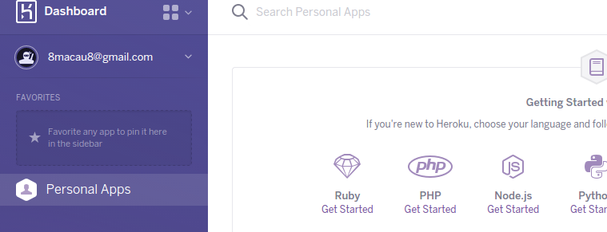
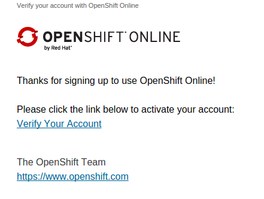
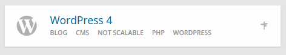
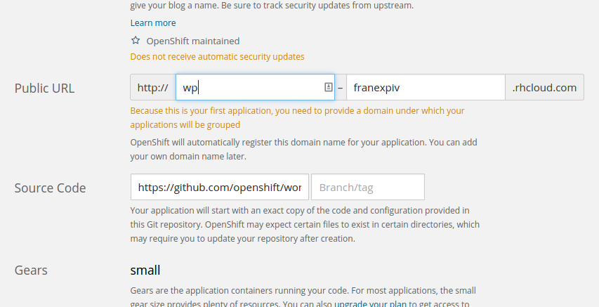
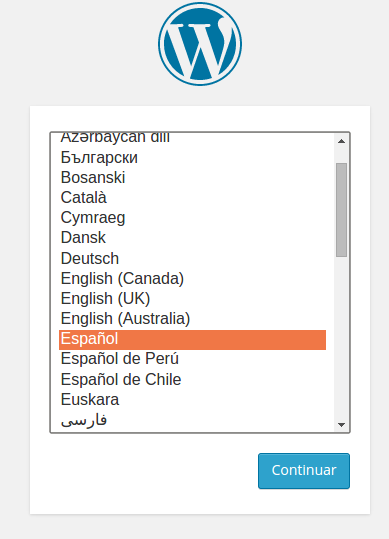
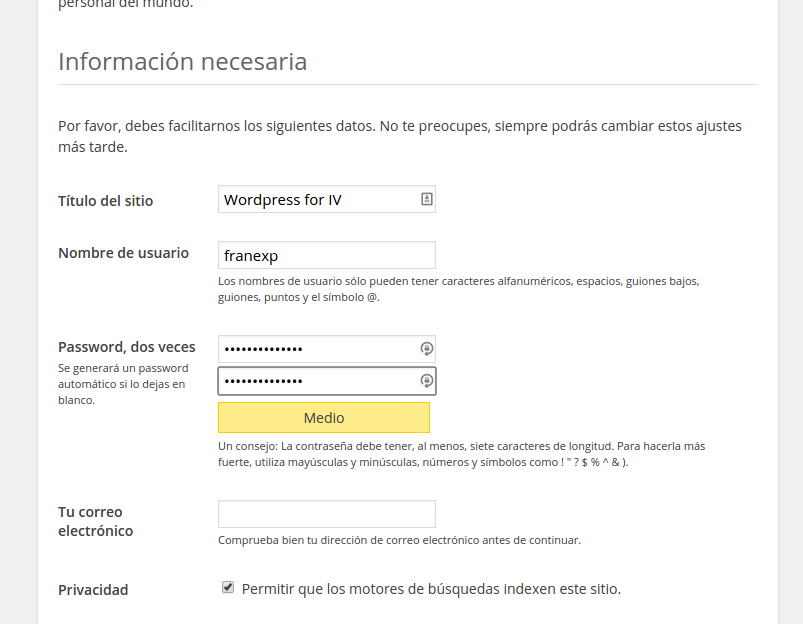
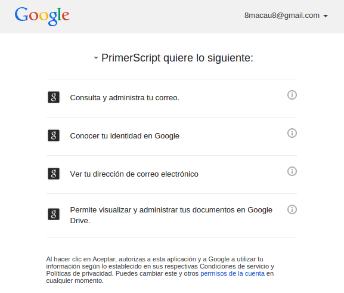
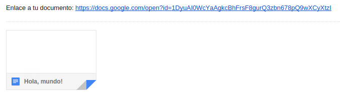

##Ejercicios Tema 2. [Francisco Javier Expósito Cruz](http://github.com/franexposito)

##Creando aplicaciones en la nube: Uso de PaaS y SaaS
###Ejercicio 1.
En mi caso he escogido [virtualenv](https://virtualenv.pypa.io/en/latest/virtualenv.html) para Python. Para ello seguiré el proceso de instalación descrito en la [documentacion](https://virtualenv.pypa.io/en/latest/virtualenv.html#installation).  

En primer lugar instalo Python-pip

	sudo apt-get install python-pip  

Ahora instalo **virtualenv**  

	sudo pip install virtualenv  

Activamos un nuevo entorno

	virtualenv ENV  

Ya podemos comenzar a utilizar el entorno de desarrollo.

###Ejercicio 2.
He decidido crear una cuenta en Heroku:  

  

###Ejercicio 3.
En primer lugar nos registramos en [OpenShift](https://www.openshift.com/):  

 

Tras el registro, debemos crear una nueva aplicación. En nuestor caso seleccionamos WordPress:  



Configuramos la aplicación:  



En el siguiente paso ya solo queda configurar la instalación de wordpress:  

  
  

Y ya tenemos el sitio listo: [Wordpress for IV](https://wp-franexpiv.rhcloud.com/).

###Ejercicio 4.
Siguiendo el [tutorial](https://developers.google.com/apps-script/overview) de la documentación de Google, creamos el primer script de prueba:  

```javascript
function createAndSendDocument() {
  // Create a new Google Doc named 'Hello, world!'
  var doc = DocumentApp.create('Hola, mundo!');

  // Access the body of the document, then add a paragraph.
  doc.getBody().appendParagraph('Este documento fue creado por Google Apps Script.');

  // Get the URL of the document.
  var url = doc.getUrl();

  // Get the email address of the active user - that's you.
  var email = Session.getActiveUser().getEmail();

  // Get the name of the document to use as an email subject line.
  var subject = doc.getName();

  // Append a new string to the "url" variable to use as an email body.
  var body = 'Enlace a tu documento: ' + url;

  // Send yourself an email with a link to the document.
  GmailApp.sendEmail(email, subject, body);
}
```

Concedemos los permisos necesarios para ejecutar el script:  



Y finalmente ejecutamos el script y vemos que recibimos un correo con el nuevo documento tal y como pone en nuestro código:  


###Ejercicio 5.

###Ejercicio 6.

###Ejercicio 7.

