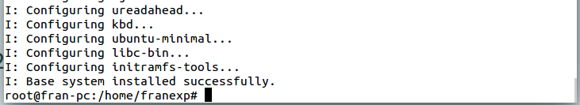
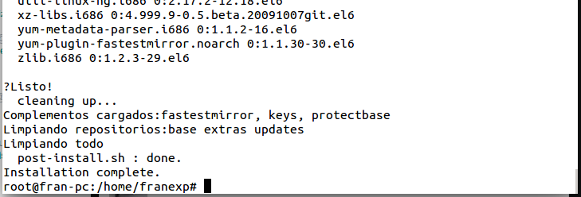
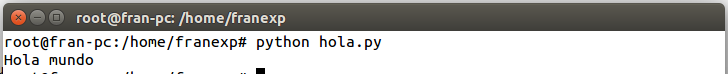
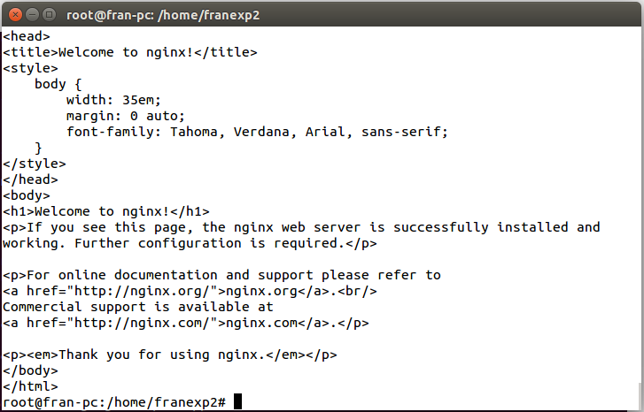

##Ejercicios Tema 3. [Francisco Javier Expósito Cruz](http://github.com/franexposito)

##Técnicas de virtualización.
###Ejercicio 1.
En primer lugar creamos el espacio de nombres:

		sudo unshare -u /bin/bash  
		hostname temporal

Despues montamos la imagen, para ello utilizaremos el siguiente comando:

	mount -o loop -t iso9660 ubuntu-14.04.1-server-i386.iso /mnt/test  

Y ya lo tenemos montado:

> Muestra del comando mount.  

###Ejercicio 2.
######Apartado 1.
  
>Muestra de los puentes en mi máquina.  

######Apartado 2.
En primer lugar creamos el puente:

	brctl addbr auxbridge  

> Creando el puente auxbridge.  

Posteriormente, añadiremos wlan0 al puente con el siguiente comando:  

	brctl addif auxbridge wlan0  

Finalmente lo activamos:  

	ifconfig auxbridge up  

###Ejercicio 3.
######Apartado 1.
En primer lugar instalamos debootstrap:  

	sudo apt-get install debootstrap  

Creamos la nueva distro:  

	sudo debootstrap --arch=i386 saucy /home/franexp/saucy32/ http://archive.ubuntu.com/ubuntu  

>Creada correctamente.  

######Apartado 2.
En primer lugar instalamos rinse:

	sudo apt-get install rinse  

Creamos una distro de Centos-6:  

	rinse --arch=i386 --distribution centos-6 --directory /home/franexp/centos6  

  
>Creada correctamente.

###Ejercicio 4.
Usaremos la distro de Ubuntu que hemos creado en el *ejercicio 3*.

	sudo chroot /home/franexp/saucy32  
	mount - t proc proc /proc  

Ahora toca instalar *python* para probar el típico Hola Mundo:  

	sudo apt-get install python  

Y probamos el *hola mundo*:  

  
>Probando el Hola Mundo.  

###Ejercicio 5.
En primer lugar añadimos el usuario *franexp2*:

	sudo useradd -s /bin/bash -m -d /home/jaulas/raring/./home/rjmerelo -c "Raring jmerelo" -g users rjmerelo  

En segundo lugar instalamos *nginx*:

	apt-get install nginx  

Lanzamos el servidor:  

	service nginx start  

Finalmente comprobamos la página de inicio de *nginx*:  

	curl localhost  

  
>Mostrando la página web por defecto de nginx.

###Ejercicio 6.
