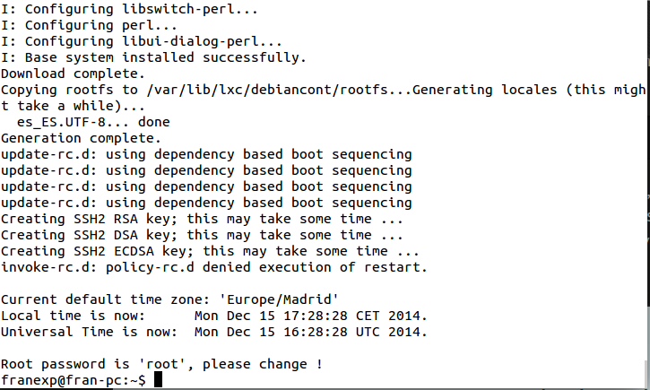
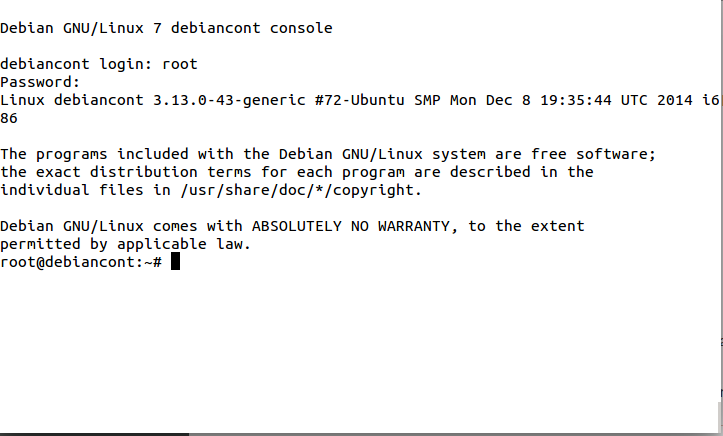
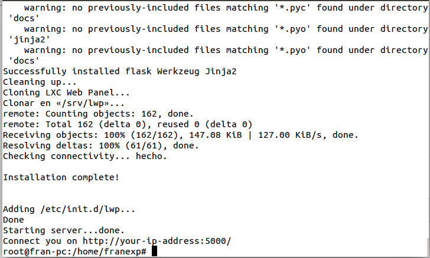
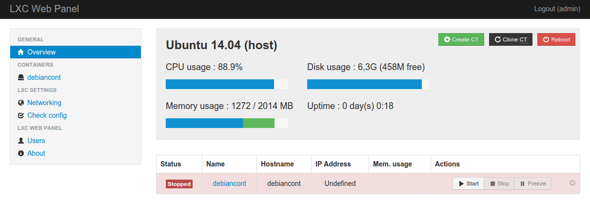
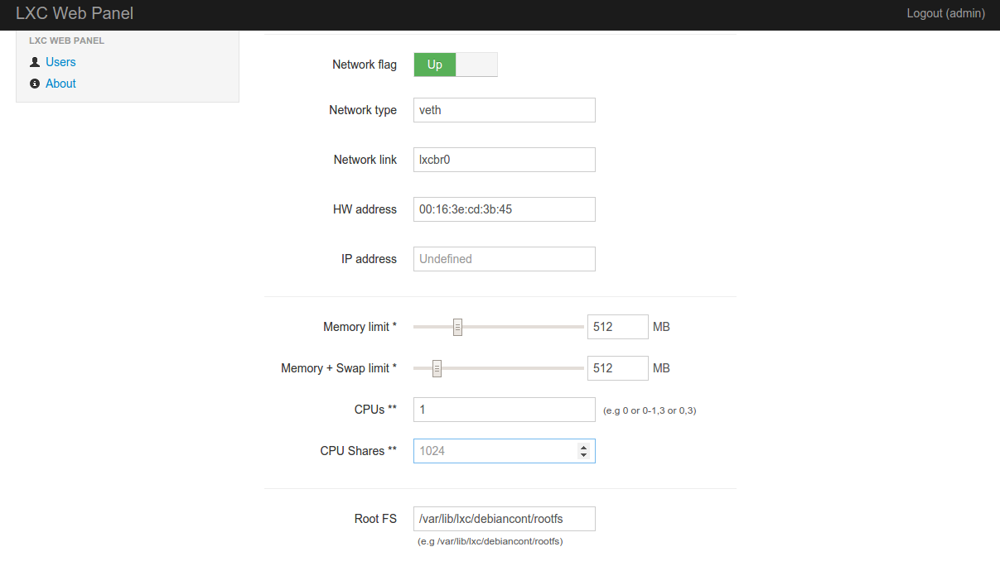

##Ejercicios Tema 4. [Francisco Javier Expósito Cruz](http://github.com/franexposito)

##Virtualización ligera usando contenedores.
###Ejercicio 1.
Para ello instalamos *LXC* desde el repo:

  sudo apt-get install lxc  


###Ejercicio 2.
Para ello ejecutamos el siguiente comando:  

    sudo ifconfig -a  

En mi caso, se ha creado la red **lxcbr0**  

###Ejercicio 3.
######Apartado 1.
En primer lugar ejecutamos el siguiente comando:  

    sudo lxc-create -t debian -n debiancont  

  

Para ejecutar:  

  sudo lxc-start -n debiancont  

  

######Apartado 2.
Instalado utilizando el script proporcionado en la github por [Gentoo](https://github.com/globalcitizen/lxc-gentoo/blob/master/lxc-gentoo).  

###Ejercicio 4.
Para instalar **lxc-panel** utilizaremos el comando proporcionado desde la [web oficial]():

  wget http://lxc-webpanel.github.io/tools/install.sh -O - | bash  



  

Para restringir los recursos debemos seleccionar el container deseado y modificar los parametros según nuestras necesidades:  

  


###Ejercicio 5.

###Ejercicio 6.  
Instalamos **juju**:  

```
  sudo add-apt-repository ppa:juju/stable  
  sudo apt-get update && sudo apt-get install juju-core  
```

Iniciamos **juju**:

```
  juju init
  juju bootstrap  
```

Tras esto instalamos **mediawiki** y **mysql**:  

```
  juju deploy mediawiki  
  juju deploy mysql  
  juju add-relation mediawiki mysql  
```


###Ejercicio 7.  


###Ejercicio 8.  
Para ello seguiremos la siguiente [guía](https://help.ubuntu.com/12.04/serverguide/libvirt.html)  

```sudo apt-get install kvm libvirt-bin virtinst```  


###Ejercicio 10.
Para instalar un Docker necesitaremos el siguiente script:  

```
sudo apt-get update
sudo apt-get install docker.io
source /etc/bash_completion.d/docker.io
[ -e /usr/lib/apt/methods/https ] || {
  apt-get update
  apt-get install apt-transport-https
}
sudo apt-key adv --keyserver hkp://keyserver.ubuntu.com:80 --recv-keys 36A1D7869245C8950F966E92D8576A8BA88D21E9
sudo sh -c "echo deb https://get.docker.com/ubuntu docker main\
> /etc/apt/sources.list.d/docker.list"
sudo apt-get update
sudo apt-get install lxc-docker
```

###Ejercicio 11.
Para instalar una imagen de centOS:  

```
docker pull centos
docker run -t -i centos /bin/bash
```

Para instalar una imagen con mongoDB:

```
docker pull mongo
docker run -t -i mongo /bin/bash
```
