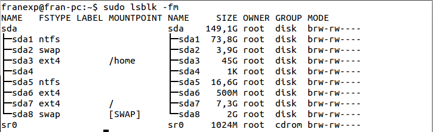
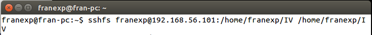
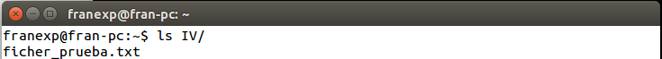
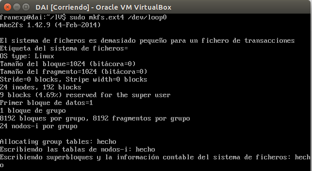
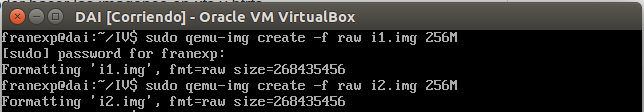
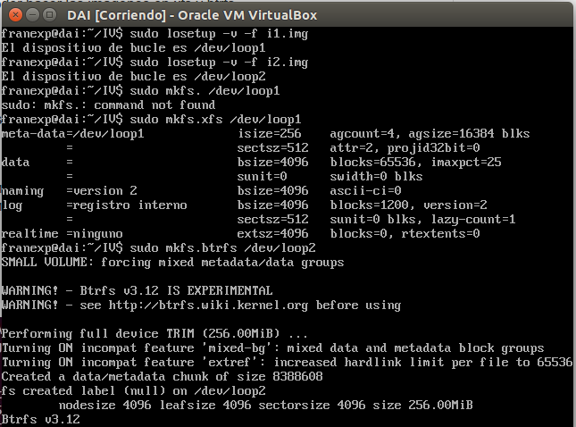
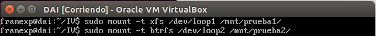
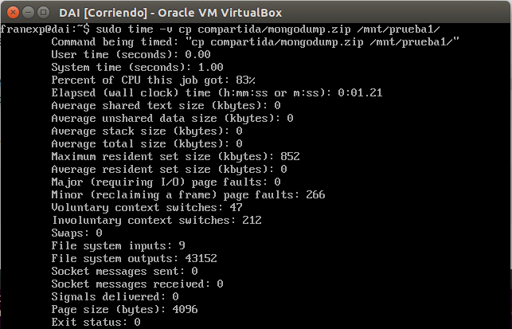
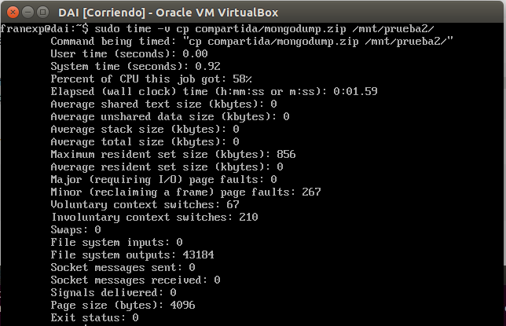
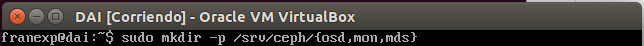

##Ejercicios Tema 5. [Francisco Javier Expósito Cruz](http://github.com/franexposito)

##Virtualización del almacenamiento
###Ejercicio 1.
#####Apartado 1.
Mi disco duro tiene las siguientes particiones:  

  

Comparación entre SAN:  

[HP P2000 G3 SAS MSA Dual Cntrl SFF Array](http://www.misco.co.uk/product/197626/HP-P2000-G3-SAS-MSA-Dual-Cntrl-SFF-Array?selectedTabIndex=2&tabBarViewName=ProductTechnicalSpecifications&page=1&#tabs)

* Precio: 5.254€
* Interfaz: 2 x SAS 6Gb/s - 26 pin 4x Shielded Mini MultiLane SAS (SFF-8088), 2 x management, 2 x management - RJ-45, 8 x SAS 6Gb/s  
* Expansión: 24 (total) / 24 (free) - 2.5" SFF - hot-swap  
* Max Supported Capacity 24 TB  
* Maximum LUNs	512  
* HDD Array External Interface	SAS 6Gb/s  

[IBM Storwize V3700 SFF Dual Control Enclosure](http://www.misco.co.uk/product/205412/IBM-Storwize-V3700-SFF-Dual-Control-Enclosure?selectedTabIndex=2&tabBarViewName=ProductTechnicalSpecifications&page=1&#tabs)  

* Precio: 3.651,9€  
* Expansión: 24 (total) / 24 (free) - 2.5" - hot-swap  
* Max Supported Capacity	24 TB  
* HDD Array External Interface	iSCSI  


###Ejercicio 2.
Para ello ejecutaremos el siugiente comando:  

  sshfs franexp@192.168.56.101:/home/franexp/IV /home/franexp/IV  

  

Comprobamos que se montó correctamente:  

  


###Ejercicio 3.
En primer lugar ejecutamos los siguientes comandos:  

```
sudo qemu-img create -f qcow2 cow.qcow2 10M
sudo losetup -v -f cow.qcow2
```  


Y finalmente:  

```
sudo mkfs.ext4 /dev/loop0
```



###Ejercicio 4.  
Crearemos las dos imágenes:  

```
sudo qemu-img create -f raw  i1.img 256M
sudo qemu-img create -f raw  i2.img 256M
```

  

```
sudo losetup -v -f i1.img
sudo losetup -v -f i2.img
sudo mkfs.xfs /dev/loop1
sudo mkfs.btrfs /dev/loop2
```

  

Montamos las imagenes en las carpetas **prueba1** y **prueba2**  

```
sudo mount -t xfs /dev/loop1 /mnt/prueba1
sudo mount -t btrfs /dev/loop2 /mnt/prueba2
```



Y movemos algún archivo pesado:  

```
sudo time -v cp /compatida/mongodump.zip /mnt/prueba1
```



```
sudo time -v cp /compatida/mongodump.zip /mnt/prueba2
```




###Ejercicio 5.
Para ello seguiremos esta [guía](http://ceph.com/docs/master/start/).  

```
sudo apt-get install ceph-mds
```

###Ejercicio 6.
Siguiendo las instrucciones del tema crearé un dispositivo ceph usando **XFS**.
En primer lugar:  

```
mkdir -p /srv/ceph/{osd,mon,mds}
```  
  

Después de crear los directorios necesarios crearemos el archivo de configuración:

  

Ahora crearemos los ficheros necesarios:

```
qemu-img create -f raw ceph.img 100M
sudo losetup -v -f ceph.img
sudo mkfs.xfs /dev/loop0
```

###Ejercicio 7.
Para ello ejecutaremos los siguientes comandos:  

```
sudo rados mkpool pooltemp
sudo rados put -p pooltemp obj FILE_NAME
```
