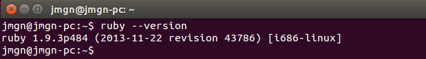
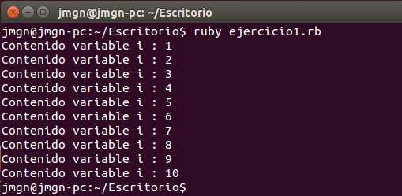
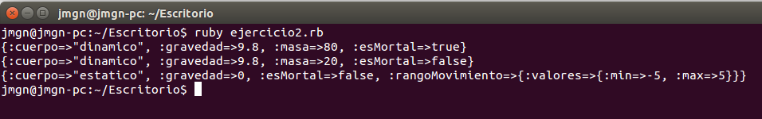
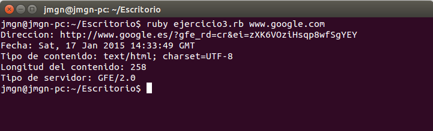

## Ejercicio 1

**Instalar Ruby y usar 'ruby --version'
para comprobar la versión instalada. A la vez, conviene instalar también irb, rubygems y rdoc.**

Comenzamos instalando Ruby.

```sudo apt-get install ruby ```


> Figura 1. Versión de Ruby instalada

A continuación instalamos las siguientes herramientas. 

Para la instalación del entorno interactivo por línea de comandos de Ruby conocido como **irb** ejecutamos el siguiente comando.

```sudo apt-get install irb ```
> **irb** suele instalarse por defecto con Ruby

Podemos comprobar también la versión que tenemos instalado mediante ```irb -v ```.

La siguiente herramienta es el gestor de paquetes para Ruby llamado **rubygems**. ( Comando para Ubuntu 14.04 )

```sudo apt-get install rubygems-integration ```

Y la última herramienta es **rdoc**, el generador de documentación de Ruby. Viene instalado por defecto desde la versión 1.8.2 de Ruby.

## Ejercicio 2

**Crear un programa en Ruby que imprima los números desde el 1 hasta otro contenido en una variable.**

```ruby 
#!/usr/bin/ruby

# Definimos la variable objetivo con el valor máximo que va alcanzar el bucle
objetivo=10

# Creamos el bucle for desde 1 hasta el valor objetivo
for i in 1..objetivo
  # Imprimimos el contenido de la variable i
  puts "Contenido variable i : #{i}"
end 
```


> Figura 2. Resultado ejecución del bucle

## Ejercicio 3

**¿Se pueden crear estructuras de datos mixtas en Ruby? Crear un array de hashes de arrays e imprimirlo.**

```ruby 
#!/usr/bin/ruby

# Creamos una estructura que contiene diferentes arrays

estructuraMixta = {
  :humano =>{
    :cuerpo => "dinamico",
    :gravedad => 9.8,
    :masa => 80,
    :esMortal => true
  },
  :piedra =>{
    :cuerpo => "dinamico",
    :gravedad => 9.8,
    :masa => 20,
    :esMortal => false
  },
  :plataforma =>{
    :cuerpo => "estatico",
    :gravedad => 0,
    :esMortal => false,
    :rangoMovimiento =>{ :valores =>{ :min => -5 , :max => 5 }}
  }
}

# Devolvemos los datos
estructuraMixta.keys().each() do |contenido|
  puts estructuraMixta[contenido]
end 
```


> Figura 3. Resultado ejecución del array de hashes arrays.

## Ejercicio 4

**Crear una serie de funciones instanciadas con un URL que devuelvan algún tipo de información sobre el mismo: fecha de última modificación, por ejemplo. Pista: esa información está en la cabecera HTTP que devuelve**

Investigamos un poco acerca de la [librearía NET::HTTP](http://apidock.com/ruby/Net/HTTP), que nos será de utilidad para este ejercicio. Una vez conocidos los diferentes campos a los que podemos acceder a través del header HTTP de una página web podemos proceder a crear el programa en ruby.


```ruby
#!/usr/bin/ruby

require 'net/http'

# Creamos la clase Cabecera que incluye las diferentes funciones para acceder a los campos
# de la cabecera de la página que le pasamos al inicializar la clase con la uri
class Cabecera

	def initialize(uri)
		@response = Net::HTTP.get_response(uri, '/')     				
	end

	def direccion()
		return @response['location'].to_s
	end

	def fecha()
		return @response['date'].to_s
	end

	def tipo_contenido()
		return @response['content-type'].to_s
	end

	def longitud_contenido()
		return @response['content-length'].to_s
	end

	def servidor()
		return @response['server'].to_s
	end
end	

# Creamos el objeto para acceder a las funciones de la clase
cabecera_test = Cabecera.new(ARGV[0])

# Devolvemos los resultados
puts "Direccion: " + cabecera_test.direccion()
puts "Fecha: "+ cabecera_test.fecha()
puts "Tipo de contenido: "+ cabecera_test.tipo_contenido()
puts "Longitud del contenido: "+ cabecera_test.longitud_contenido()
puts "Servidor: "+ cabecera_test.servidor()
```

> Figura 4. Resultado ejecución para obtener información de la cabecera de una url


## Ejercicio 5

**Ver si está disponible Vagrant como una gema de Ruby e instalarla.**

Para consultar si existen versiones disponibles usamos el comando ```gem search --remote vagrant```.

Veremos una gran cantidad de versiones de vagrant para diferentes sistemas operativos. Podemos instalar alguna de ellas mediante ```sudo gem install <version_vagrant> ```.

Sin embargo la propia recomendación de los creadores es acceder a su página web y desde ahí instalar la última versión, puesto que desde hace más de un año que no se actualiza su RubyGem.
