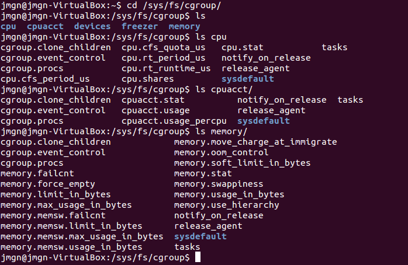

##Ejercicio 1

**Consultar en el catálogo de alguna tienda de informática el precio de un ordenador tipo servidor y calcular su coste de amortización a cuatro y siete años. Consultar este artículo en Infoautónomos sobre el tema.**

En la tienda online de DELL podemos encontrar una gran variedad de ordenadores orientados al uso como servidores, he optado por el modelo mejorado del DELL PowerEdge T20 que se ofrece al precio de 459 Euros (Sin IVA). Su precio total incluido el IVA, que en caso de dispositvos electrónicas sería del 21%, es de 555,39 €.

*Costes de Amortización a 4 y 7 años.*
Dado que el IVA se puede deducir al 100% los costes de amortización se calcularán sobre el precio base del dispostivo que son 459 €. La ley establece que el porcentaje máximo de amortización es del 26% anual y el periodo máximo no puede superar los 10 años. ( Supondremos que el equipo se compró a comienzos de año )


* Para 4 años - Aplicando el tipo máximo --> 459 € * 0,26 = 119,34 € ( Durante 3 años )
 					     459 € * 0,22 = 100,98 € ( Último año )

	* 1º - 3º año --> 119,34 €
	* 4º año      --> 100,98 €

* Para 4 años - Aplicando un tipo lineal --> 459 € * 0,25 = 114,75 €

	* 1º - 4º año --> 114,75 €


* Para 7 años - Aplicando un tipo lineal --> 100% / 7 = 14,2 % , Salvo el primer año que será un 14,8% debido al resto de 0,6%
					 --> 459 € * 0,148 = 67,93 €
					     459 € * 0,142 = 65,18 €

	* 1º año      --> 65,93 €
	* 2º - 7º año --> 65,18 €


##Ejercicio 2

**Usando las tablas de precios de servicios de alojamiento en Internet y de proveedores de servicios en la nube, Comparar el coste durante un año de un ordenador con un procesador estándar (escogerlo de forma que sea el mismo tipo de procesador en los dos vendedores) y con el resto de las características similares (tamaño de disco duro equivalente a transferencia de disco duro) si la infraestructura comprada se usa sólo el 1% o el 10% del tiempo.**


Buscamos una empresa que ofrezca tales servicios, como 1&1, y realizaremos la comparación entre dos de sus productos: [servidor dedicado](http://www.1and1.es/servidores-dedicados) vs [servidor cloud](http://www.1and1.es/servidor-cloud-dinamico).

Nuestra opción elegida para el servidor dedicado:

* Núcleos de CPU --> 2 Cores x 2,6 GHz
* Memoria RAM    --> 2 GB DDR2
* Disco Duro     --> 500 GB (2 x 500 SATA)
* **Precio** 	 --> 19,90 € / mes

En el caso del servidor cloud dispondremos de forma similar de:

* 2 Cores
* 2 GB de memoria RAM
* 500 GB de almacenamiento
* **Precio** 	--> 64,80 €* / mes ( * Este precio depende del consumo, 0,09 € / hora)

A lo largo de un año el gasto total supondría :

* **Servidor dedicado** --> 19,90 € * 12 = 238,8 € 

* **Servidor cloud**
	* Uso del 1%  --> 64,80 € * 12 * 0,01 = 7,77 €
	* Uso del 10% --> 64,80 € * 12 * 0,10 = 77,76 €

En el caso de Microsoft Azure el precio de una [máquina virtual Linux (A-Series)](http://azure.microsoft.com/es-es/pricing/calculator/?scenario=virtual-machines), de 2 Cores y 3,5 GB de RAM, ronda los €48,76 € / mes. Su consumo anual al 1% y 10% respectivamente supondría el siguiente gasto.

* **Microsoft Azure**
	* Uso del 1%  --> 48,76 € * 12 * 0,01 = 5,85 €
	* Uso del 10% --> 48,76 € * 12 * 0,10 = 58,51 €

##Ejercicio 3

**¿Qué tipo de virtualización es la más adecuada para: alojar varios clientes en un sólo servidor, crear un sistema efiiciente de web + middleware + base de datos, un sistema de prueba de software e integración continua? Responder aquí y razonar.**

Tenemos 3 diferentes escenarios:

1) Varios clientes en un solo servidor. 
  - Partiendo de la idea de que el cliente no tiene que encargarse de realizar configuraciones y administrar el sistema, lo más adecuado sería una virtualización a nivel de sistema operativo. De esta forma dispondremos de una serie de usuarios invitados, que estarán aislados del anfitrión, aunque limitados respecto a las decisiones que tome el administrador.

2) Sistema eficiente web + middleware + base de datos.
 - Si estamos interesados en disponer de forma aislada de todo el sistema, podiendo adaptar en función de las prestaciones necesarias cada recurso del ordenador se recomendaría la virtualización plena. Sin embargo, aún limitando prestaciones, si estamos interesados en la mayor compatibilidad posible sería recomendable una virtualización a nivel de aplicaciones, puesto que una vez aislado cualquier usuario podrá lanzar nuestra aplicación independientemente de que esté instalada en su sistema.
Al tratarse de una aplicación web donde el objetivo es llegar al mayor número de usuarios, optaria finalmente por la virtualización a nivel de aplicaciones.

3) Sistema de prueba de software e integración continua.
 - Dado que querremos disponer de entornos de producción simulados para poder realizar pruebas sobre el software en desarrollo, lo más recomendado en este caso sería una virtualización de entornos de desarollo.

-----------

**Crear un programa simple en cualquier lenguaje interpretado para Linux, empaquetarlo con CDE y probarlo en diferentes distribuciones.**

Instalamos CDE en nuestro sistema linux:

* ```git clone git://github.com/pgbovine/CDE.git``` 
* ```cd CDE``` 
* ```make```


> Figura 1. Instalando CDE.

Una vez instalado procedemos a crear un script, usaremos python en nuestro caso, y no nos olvidemos de indicar en la primera línea las directrices para convertir el archivo en ejecutable directamente.

```#! /usr/bin/env python```

El código utilizado para este ejemplo es el siguiente:

	#! /usr/bin/env python
	# -*- coding: utf-8 -*-
	import random
	
	num = random.randrange(100)+1
	
	
	print "Introduzca un número :"
	num_adivinado = input()
	num_intento=0
	
	while (num != num_adivinado and num_intento < 10 ):
	  num_intento= num_intento+1
	  if(num > num_adivinado):
	    print "Se ha equivocado. El número es MAYOR. Introduzca otro número."
	    num_adivinado = input()
	  else:
	    print "Se ha equivocado. El número es MENOR. Introduzca otro número."
	    num_adivinado = input()
	
	if(num_intento < 10):
	  print ("¡ENHORABUENA! Has adivinado el número de la máquina : ", num_adivinado)
	else:
	  print("¡HAS PERDIDO! Has superado el máximo de 10 intentos.")


Además habrá que darle al fichero los permisos de ejecución correspondientes. Ya podremos usar cde para crear el paquete portable.

```cde ./adivinar.py```

Se habrán creado los archivos correspondientes en el directorio cde-packages/ con las dependecias necesarias para poder ejecutar el programa que deseamos portar.
Dicho directorio lo podemos comprimir y usarlo en cualquier distribución linux que deseemos, ejecutando el fichero "adivinar.py.cde" que creó.


##Ejercicio4

**Hacer el tutorial de línea de órdenes de docker para comprender cómo funciona. Avanzado Instalarlo y crear una aplicación contenedorizada**

Finalziado el tutorial procedemos a la instalación de docker en nuestro sistema, usaré [Windows](https://docs.docker.com/installation/windows/) para este ejercicio. 

Nos descargamos la imagen del tutorial como se habia indicado:

```docker pull learn/tutorial```

> Figura 2. Descargando la imagen del tutorial.

Una vez descargada podemos hacer la comprobación de que funciona lanzando un mensaje "hello world".

> Figura 3. Prueba de funcionamiento.

Dado que todo está en funcionamiento podemos pasar a instalar programas en nuestro nuevo contenedor. Instalaremos nano para disponer de un editor de textos.

```docker run learn/tutorial apt-get install -y nano```

A continuación usamos el comando docker ps -l para concoer la ID del contenedor creado al instalar nano. Entonces ya podremos guardar este contenedor con el nombre de repositorio 'learn/nano'.

```docker commit b54 learn/nano```

Lanzamos el programa recién instalado y comprobamos que todo funciona.

```docker run -i -t learn/nano nano```


> Figura 4. Ejecutando nano.

##Ejercicio 5

**Instala el sistema de gestión de fuentes git**

Como podemos ver en el siguiente [tutorial](https://www.digitalocean.com/community/tutorials/how-to-install-git-on-ubuntu-12-04), existen dos formas de instalar git en nuestro sistema de distribución linux ( Ubuntu 12.04 en mi caso ).
O bien usando 'apt-get' o bien descargar e instalar los archivos fuente.

###Instalación mediante apt-get

```sudo apt-get install git-core```

###Instalación mediante el código fuente

* Actualizamos nuestros repositorios. sudo apt-get update
* Instalamos todas las dependencias necesarias. 
```sudo apt-get install libcurl4-gnutls-dev libexpat1-dev gettext libz-dev libssl-dev build-essential```
* Descargamos la última versión de git que se ofrece en la página de [google code](https://code.google.com/p/git-core/). Ej. ```wget https://git-core.googlecode.com/files/git-1.8.1.2.tar.gz```
* Descomprimimos el archivo descargado. 
```tar -zxf git-1.8.1.2.tar.gz```
* Nos colocamos en su directorio. 
```cd git-1.8.1.2```
* Instalamos los archivos. 
```make prefix=/usr/local all```
```sudo make prefix=/usr/local install```
* Si desea actualizar git en el futuro, puede usar el mismo git para hacerlo. 
```git clone git://git.kernel.org/pub/scm/git/git.git```

###Configurar git

* Podemos modificar el archivo de configuración de git. 
```sudo nano ~/.gitconfig```
* O introducimos nuestros datos de usuario.
```git config --global user.name "NewUser"```
```git config --global user.email newuser@example.com```
* Todas las configuraciones realizadas se pueden ver con el siguiente comando.  
```git config --list```

###Uso básico de git

Para un [tutorial extensivo](http://git-scm.com/docs/gittutorial) podemos acceder a la propia página web de git y descrubir toda su funcionalidad. Los comandos básicos que necesitaremos usar son los siguientes:

* Descargar un repositorio en nuestra máquina. 
``` git clone https://github.com/JJ/GII-2014 <directorio-local>```
* Añadir un cambio. 
```git add .```
* Para añadir de forma permanente los cambios en el repositorio hacemos un commit (local) . 
```git commit -m "Comentario.."```
* Transferir los commits del repositorio local al repositorio remoto.
```git push origin master```


##Ejercicio 6

**Crear un proyecto y descargárselo con git. Al crearlo se marca la opción de incluir el fichero README. Modificar el readme y subir el fichero modificado.**

En primer lugar generamos el nuevo repositorio para hacer la prueba.


> Figura 5. Creando un nuevo proyecto.

Procedemos a descargarlo en nuestra máquina mediante git usando ```git clone``` y comprobamos que efectivamente tenemos acceso.


> Figura 6. Descargando el proyecto.

Realizmos una ligera modificación en el fichero README y subimos los cambios añadiendo el fichero y salvamos todo mediante un commit.


> Figura 7. Subiendo el archivo README modificado.

##Ejercicio 7

**Comprobar si en la instalación hecha se ha instalado cgroups y en qué punto está montado, así como qué contiene.**

Una vez instalado el directorio de cgroup se halla en /sys/fs/cgroup. La jerarquía de carpetas generada incluye diferentes recursos del sistema, tales como CPU, memoria, uso de disco, etc. los cuales podemos analizar, limitar e asignar a diferentes grupos de procesos.



> Figura 8. Directorios de cgroup.


##Ejercicio 8

**Crear diferentes grupos de control sobre un sistema operativo Linux. Ejecutar en uno de ellos el navegador, en otro un procesador de textos y en uno último cualquier otro proceso. Comparar el uso de recursos de unos y otros durante un tiempo determinado.**

Generemos los diferentes grupos de control en el directorio /sys/fs/cgroup/cpuact para poder analizar el uso de cpu.


> Figura 9. Creando grupos en cgroup.

Tras crear los tres grupos, asignados a cada uno una tarea diferente.
* Grupo 1. Navegador Chromium
* Grupo 2. Editor de textos gedit
* Grupo 3. Navegador Firefox


> Figura 10. Asignando tareas

Ahora podemos comparar el uso de recursos ( se expresa en nanosegundos ).


> Figura 11. Comparando uso de recursos

Podemos observar que el navegador Chromium es bastante más ligero que Firefox en cuanto a consumo de CPU.

---------------

**Calcular el coste real de uso de recursos de un ordenador teniendo en cuenta sus costes de amortización. Añadir los costes eléctricos correspondientes.**


Reutilizando los datos del ejercicio 2

Servidor con un precio de 555,39 €.

* Para 4 años - Aplicando un tipo lineal --> 459 € * 0,25 = 114,75 €

	* 1º - 4º año --> 114,75 €

Realizamos los cálculos correspondientes para un uso de 24 horas al dia.


> Figura 12. Gasto eléctrico del servidor

El consumo eléctrico del servidor supondría por tanto 421,61 € para una tiempo de vida de 6 años estimado. Lo que implica un gasto anual eléctrico de 70.60 €.
Por tanto el gasto total anual supondria 114,75 € + 70.60 € = **185,35 € / año**.

##Ejercicio 9

**Discutir diferentes escenarios de limitación de uso de recursos o de asignación de los mismos a una u otra CPU.**

Escenarios posibles existen varios, principalmente basados en querer ahorrar recursos. Ejemplos posibles serían el de un servidor cuyo nivel de uso en determinadas fechas sea muy reducido, pudiendo asignar los procesos a una CPU de menores prestaciones o bien limitar el uso de sus recursos, y en fechas de alto uso usar una política diferente. Otro escenario sería el de una empresa de que dispone de una serie de empleados que tendrán una determinada cantidad de recursos asignada de un servidor con el cual trabajarían.


**Implementar usando el fichero de configuración de cgcreate una política que dé menos prioridad a los procesos de usuario que a los procesos del sistema (o viceversa).**

En primer lugar localizamos el fichero de configuración de cgcreate que se encuentra en el directorio '/etc', nombrado como 'cgconfig.conf'.

El siguiente paso es crear los dos grupos dentro del fichero los cuales serán dos : uno para procesos de **usuario** y otro para procesos de **sistema**. Asignaremos una mayor prioridad de los procesos de sistema.


```
mount {
	cpu = /sys/fs//cgroup/cpu;
	cpuacct = /sys/fs/cgroup/cpuacct;
	devices = /sys/fs/cgroup/devices;
	memory = /sys/fs/cgroup/memory;
	freezer = /sys/fs/cgroup/freezer;
}

#cpu.shares es un parámetro que determina el reparto de CPU disponible para cada proceso en todos los cgroups
#Los recursos para la CPU se repartirán en un ratio 1:3 para los usuarios y sistema respectivamente

#memory.limit_in_bytes es un parámetro que representa la cantidad de memoria que está disponible para cada proceso dentro de un determinado cgroup
#El grupo de usuarios dispondrá de 1GB, mientras que el del sistema de 2GB

group usuario{
	cpu{
		cpu.shares="250"
	}
	memory {
                memory.limit_in_bytes="1G";
        }

}

group sistema{

	cpu{
		cpu.shares="750"
	}
	memory {
                memory.limit_in_bytes="2G";

        }

}
```

El siguiente paso es crear las reglas de modo que el demonio cgrulesengd pueda mover los procesos a su grupo correspondiente. Para ello abrimos el fichero de configuración **/etc/cgrules.conf** y añadimos las dos nuevas reglas.

```
#<usuario>      <controladores>     <cgroup>   
usuario            cpu                /sys/fs/cgroup/cpu/usuario   
sistema            cpu                /sys/fs/cgroup/cpu/sistema  
```

Y finalmente para aplicar los cambios reiniciamos el servicio de cgconfig e iniciamos el cgred, para que se puedan aplicar las reglas anteriores de asignar los procesos a sus grupos correspondientes.

```
sudo service cgconfig restart
sudo cgred start
``` 

Si queremos que los cambios sean permamentes tenemos que configurar los servicios de cgconfig y cgred para que se inicien por defecto.

```
sudo chkconfig cgconfig on
sudo chkconfig cgred on
```

**Usar un programa que muestre en tiempo real la carga del sistema tal como htop comprobar los efectos de la migración en tiempo real de una tarea pesada de un procesador a otro (si se tiene dos núcleos en el sistema).**

Instalamos el programa htop para monitorizar en directo la actividad de los recursos de nuestro sistema.

```sudo apt-get install htop```


> Figura 13. Ejecución de htop.

Al usar una máquina virtual solo tengo asignada 1 core, de modo que para la migración de tareas entre cores primero añadiré un nuevo core a la máquina virtual.


> Figura 14. Ejecución de htop con 2 cores.

Para la asginación de tareas a cores específicos he seguido el siguiente [tutorial](http://xmodulo.com/run-program-process-specific-cpu-cores-linux.html). En él se hace uso de la herramienta 'taskset'.

Con esta herramienta se permite la planificación manual de la CPU. Asignaremos al primer core una serie de tareas para ver como aumenta su consume respecto al segundo core que no se alterará debido a dichas nuevas tareas. Usaremos Firefox, pero al no ser una tarea muy pesada asignaremos la misma aplicación varias veces.

```
taskset 0x1 firefox
```


> Figura 15. Consumo del primer core tras asginar más tareas.


**Configurar un servidor para que el servidor web que se ejecute reciba mayor prioridad de entrada/salida que el resto de los usuarios.**

Haciendo uso del servidor web apache procedemos a crear un grupo para nuestro servidor. Para indicar la prioridad en cuanto a entradas salidas tenemos que hacer uso del parámetro 'blkio.weight' en el archivo de configuración de cgconfig.
Dándole a dicho parámetro un valor de 750 le estamos asignando un 75% de los recursos correspondientes disponibles al servidor.


```
mount {
   blkio = /sys/fs/cgroup/blkio;
}

group apache {
    blkio {
        blkio.weight = "750";
    }
}
```

##Ejercicio 10

**Comprobar si el procesador o procesadores instalados tienen estos flags. ¿Qué modelo de procesador es? ¿Qué aparece como salida de esa orden?**

Lanzamos el comando indicado. 

```egrep '^flags.*(vmx|svm)' /proc/cpuinfo```


> Figura 16. Comprobando la actividad de flags.

Al no listar nada podemos decir que o bien el procesador no posee dicha funcionalidad o está desactivada.
El modelo de procesador usado es el "Intel Core i7-4702MQ".

##Ejercicio 11

**Comprobar si el núcleo instalado en tu ordenador contiene este módulo del kernel usando la orden kvm-ok.**

Mi sistema no soporta las extension KVM, por tanto no puede usar la aceleración por hardware del procesador.


> Figura 17. Resultado de kvm-ok en mi sistema.

##Ejercicio 12

**Comentar diferentes soluciones de Software as a Service de uso habitual**

Desde Google Drive con todas sus aplicaciones, Google Mail y Google Maps hasta productos de Microsoft tales como Office Live y Windows Live, pasando por ERP's de Oracle y CRM's de Salesforce, la gama de productos de SaaS, es decir, software como un servicio, donde la carga se reparte entre el cliente y el servidor, es inmensa. 
Y no nos podemos olvidar de la misma plataforma que estamos usando, GitHub, además de todas las aplicaciones que implican enviar mensajes a través de internet, tales como Twitter, Facebook, Whatsapp, etc.

