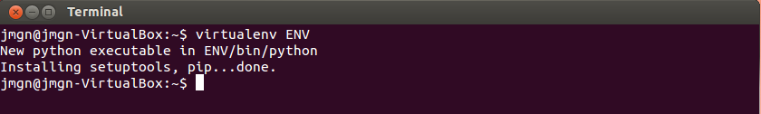
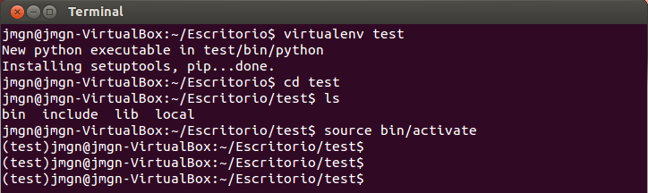
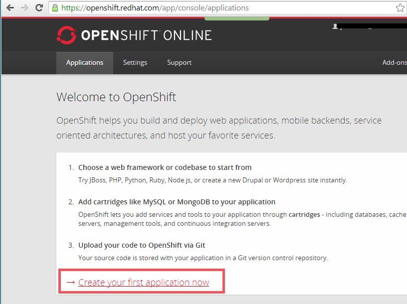
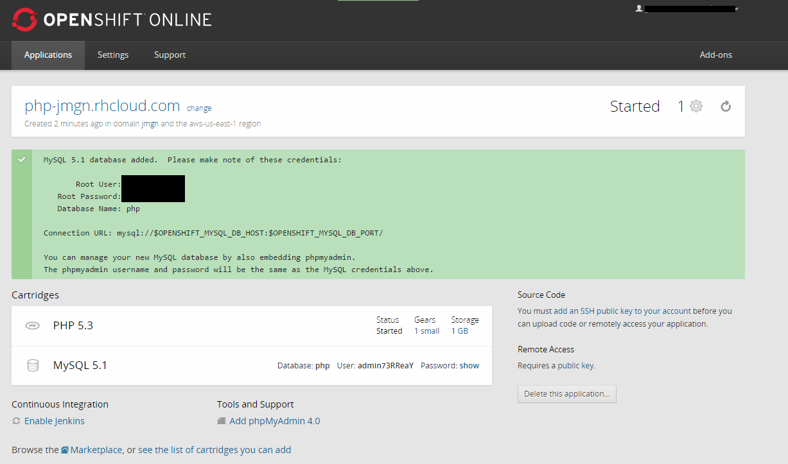
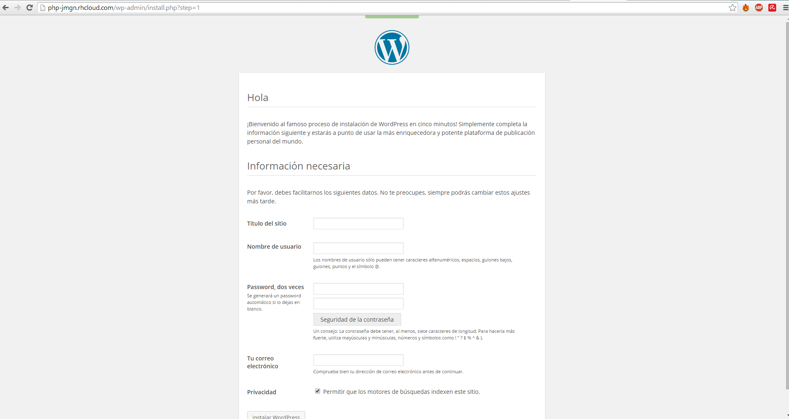

##Ejercicio 1

**Instalar un entorno virtual para tu lenguaje de programación favorito (uno de los mencionados arriba, obviamente).**

El enterno visual de desarrollo elegido es para el lenaguaje de programación Python. Procedemos por tanto a la isntalación de "virtualenv".

```sudo pip install virtualenv```

Si no disponemos de pip : ```sudo apt-get install python-pip.```

Finalizada la instalación lanzamos el comando "virtualenv ENV" que creará el directorio "ENV/lib/pythonX.X/site-packages", donde se almacenarán todas las librerias que instalemos. Y además creará el directorio "ENV/bin/python", el cual es el intérprete de Python que usará este entorno creado.

###Crear y activar un proyecto

*Creamos un proyecto. ```virtualenv test```

> Figura 1. 

*Activamos el proyecto. ```source bin/activate```

> Figura 2. 

##Ejercicio 2

**Darse de alta en algún servicio PaaS tal como Heroku, Nodejitsu u OpenShift.**

Openshift. Procedeemos a su página web https://www.openshift.com, y en mi caso elegiré la opción gratuita.

##Ejercicio 3

Siguiendo el tutorial ofrecido por el siguiente [enlace](http://www.hongkiat.com/blog/setup-wordpress-openshift/)


> Figura 3. Creando una nueva aplicación en openshift.

Creamos la aplicación con las opciones por defecto.


> Figura 4. Usar la app de Wordpress.

De momento indicaremos que no deseamos modificar el código, pulsando "Not now, continue.".


> Figura 5. 

Y ya tendremos todo instalado y podremos configurar Wordpress accediendo a la página web indicada.


> Figura X. Wordpress instalado y listo para configurarse.


