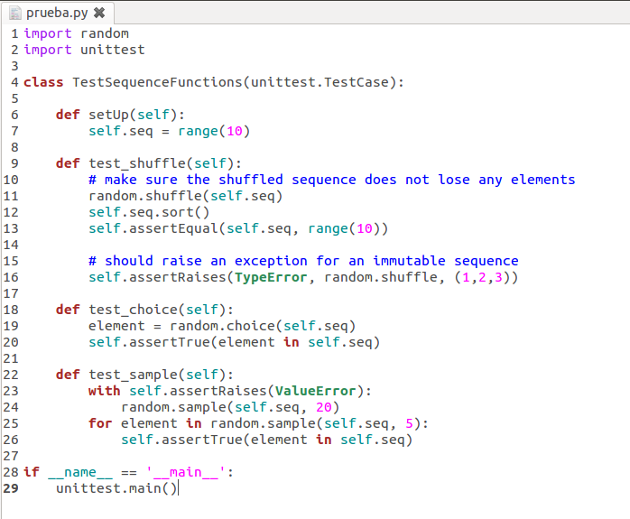

##Ejercicio 1

**Instalar un entorno virtual para tu lenguaje de programación favorito (uno de los mencionados arriba, obviamente).**

El enterno visual de desarrollo elegido es para el lenaguaje de programación Python. Procedemos por tanto a la isntalación de "virtualenv".

```sudo pip install virtualenv```

Si no disponemos de pip : ```sudo apt-get install python-pip.```

Finalizada la instalación lanzamos el comando "virtualenv ENV" que creará el directorio "ENV/lib/pythonX.X/site-packages", donde se almacenarán todas las librerias que instalemos. Y además creará el directorio "ENV/bin/python", el cual es el intérprete de Python que usará este entorno creado.

###Crear y activar un proyecto

*Creamos un proyecto. ```virtualenv test```

> Figura 1. 

*Activamos el proyecto. ```source bin/activate```

> Figura 2. 

##Ejercicio 2

**Darse de alta en algún servicio PaaS tal como Heroku, Nodejitsu u OpenShift.**

Openshift. Procedeemos a su página web https://www.openshift.com, y en mi caso elegiré la opción gratuita.

##Ejercicio 3

Siguiendo el tutorial ofrecido por el siguiente [enlace](http://www.hongkiat.com/blog/setup-wordpress-openshift/)


> Figura 3. Creando una nueva aplicación en openshift.

Creamos la aplicación con las opciones por defecto.


> Figura 4. Usar la app de Wordpress.

De momento indicaremos que no deseamos modificar el código, pulsando "Not now, continue.".


> Figura 5. 

Y ya tendremos todo instalado y podremos configurar Wordpress accediendo a la página web indicada.


> Figura 6. Wordpress instalado y listo para configurarse.

##Ejercicio 4

**Crear un script para un documento Google y cambiarle el nombre con el que aparece en el menú, así como la función a la que llama.**

Siguiendo el tutorial para [Google Apps Script](https://developers.google.com/apps-script/overview), usamos su ejemplo para realizar las pruebas. Se trata de un código javascript que genera un fichero de título "Hello World" y lo envía por correo a nuestra cuenta. 


> Figura 7. Script para enviar un correo.

Una vez creado el script tenemos que darle las autorizaciones pertenecientes para poder acceder a la información que requiere de modo que se pueda ejecutar. 
Comprobamos que todo funciona como vemos en las siguientes capturas.


> Figura 8. Aceptar autorización para acceder a funcionalidades de tu cuenta google.

El siguiente paso es añadir un menú a nuestro documento, en el cual incluiremos la anterior función, y añadiremos que se envien notificaciones al usuario.
Usando el código de ejemplo para crear [menús personalizados](https://developers.google.com/apps-script/guides/menus) realizamos las modificaciones necesarias.


> Figura 9. Código del menú junto al código de enviar el correo

Los resultados son los siguientes:


> Figura 10. Visualización del menú.

Tenemos un menú que incluye un primer item para la notificación al usuario y un segundo item que es otro menú que incluye la posibilidad de enviar un correo al usuario conectado.Usamos la funcionalidad de enviar un correo y comprobamos nuestra mailbox.


> Figura 11. Ejemplo de envío del correo


##Ejercicio 5

**Buscar un sistema de automatización de la construcción para el lenguaje de programación y entorno de desarrollo que usemos habitualmente.**

Dado que el proyecto estará centrado principalmente en el lenguaje de programación python, en cuanto a sistemas de automatización se refiere destaca Fabric.
Fabric es una herramienta que hace bastante más que la función Make, principalmente permite ejecutar tareas en múltiples sistemas remotos y permite crear plugins para desarollar funcionalidades aún más avanzadas.
En su [página oficial](http://www.fabfile.org/) podemos encontrar más información al respecto. 

Haciendo uso del gestor de paquetes para python 'pip' podemos instalar fabric:

```pip install fabric```

##Ejercicio 6

**Identificar, dentro del PaaS elegido o cualquier otro en el que se dé uno de alta, cuál es el fichero de automatización de construcción e indicar qué herramienta usa para la construcción y el proceso que sigue en la misma.**

Para el PaaS Openshift se necesita hacer uso del "OpenShift Client Tools" que se trata de un gestor de las aplicaciones openshift en nuestro sistema. Para ello se requiere tener instalada una versión Ruby 1.8.7 o superior. Incluido tras instalar ruby tendremos su gestor de paquetes asociado 'gem'.
Usando dicho gestor instalamos el cliente de openshift denominado 'rhc.

```gem install rhc```

El siguiente paso es lanzar rhc para realizar su configuración mediante:

```rhc setup```

Indicamos nuestras credenciales y podemos generar un token de autorización para no tener que introducir la contraseña continuamente ( podemos eliminar dicha key con un 'rhc logout') y lo enviamos a los servidores de openshift.

Una vez todo configurado podemos lanzar 'rhc apps' para ver nuestras aplicaciones creadas en openshift.


> Figura 12. Aplicaciones creadas en OpenShift.

En la Git URL se indica el repositorio donde se encuentran los datos de nuestra aplicación. Podemos descargarla y ya realizar los cambios pertenecientes.


##Ejercicio 7

**Buscar un entorno de pruebas para el lenguaje de programación y entorno de desarrollo que usemos habitualmente.**

Como podemos ver en la [guía python en cuanto a pruebas de código](http://docs.python-guide.org/en/latest/writing/tests/) la batería de software existente es extensa.

Usaremos como ejemplo unittest que viene por defecto incluido en las librerías estándar de python.
Usamos el [código de ejemplo](https://docs.python.org/2/library/unittest.html#basic-example) que prueba tres funciones del módulo random.


> Figura X.

Y vemos los resultados esperados.


> Figura X.


