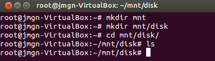

##Ejercicio 1

**Crear un espacio de nombres y montar en él una imagen ISO de un CD de forma que no se pueda leer más que desde él. Pista: en ServerFault nos explican como hacerlo, usando el dispositivo loopback**


En primer lugar creamos el espacio de nombres mediante :

```sudo unshare -u  /bin/bash```

Y asignamos un nuevo nombre:

```hostname <nombre>```


> Figura 1. Creando nueva espacio de nombres.

Hemos definido por tanto un nuevo nombre del ordenador y su dominio. Para volver a nuestro espacio de nombres anterior usamos ```exit```.


> Figura 2. Cambiando de espacio de nombres.

Según se indica en [serverfault](http://serverfault.com/questions/198135/how-to-mount-an-iso-file-in-linux) usamos el comando mount con la opción de loopback de modo que se permita montar un fichero que contenga un sistema de fichero. Para que funcione el directorio /mnt/disk debe estar creado.

Creamos los directorios.
```mkdir <directorio>```


> Figura 3. Creando directorios mnt/disk

Y montamos la imagen iso.

```mount -o loop disk.iso /mnt/disk```


> Figura 4. Montando la iso de ubuntu 14.

Comprobamos que se ha montado correctamente.


>Figura 5. Iso montada en el directorio mnt/disk


##Ejercicio 2

**Mostrar los puentes configurados en el sistema operativo.**

Para obtener toda la información respecto a nuestras interfaces de red tales como la IP, MAC, etc. usamos el siguiente comando:

```ip addr show```


> Figura 6. Interfaces de red en el sistema.

Si queremos ver los puentes de red configurados tenemos que hacer uso de la herramienta ```bcrtl``` del paquete bridge-utils ( su instalación se especifica en el siguiente apartado ).
Esta herramienta permite mostrar los puentes de red configurados:

```sudo brctl show```


> Figura 7. Puentes de red configurados en el sistema.

De momento como podemos apreciar no hay ningun puente de red configurado.

---

**Crear un interfaz virtual y asignarlo al interfaz de la tarjeta wifi, si se tiene, o del fijo, si no se tiene.**

Instalamos el paquete de linux ```bridge-utils```, que incluye una funcionalidad necesaria para crear y gestionar dispositivos puente, y por tanto nos será de utilidad para configurar redes para una máquinas virtuales.

```sudo apt-get install bridge-utils```

A continuación hacemos uso de la herramienta ```brctl``` que incluye en paquete anterior y nos permitirá crear un nuevo puente de red.

```sudo brctl addbr puenteRedIV```


> Figura 8. Creando nueve puente de red.


> Figura 9. Interfaces tras crear el puente.

De momento este puente ni está activado ni tiene una interfaz asociada, de modo que tenemos que añadirle una interfaz para darle una funcionalidad real al puente de red recien creado.

Comprobamos mediante ```ifconfig``` o la herramienta anteriormente usada ```ip addr show``` cuales son las interfaces disponibles.


> Figura 10. Ver interfaces mediante ifconfig.

Tenemos una interfaz eth0 de conexión Ethernet ( realmente el sistema anfitrión está conectado por WIFI, pero al ser una máquina virtual con la configuración de red por defecto se simula una conexión directa Ethernet a la red que sería la conectada al sistema anfitrión ).

Asociamos dicha interfaz ```eth0``` al puente de red.

```sudo brctl addif puenteRedIV eth0```


> Figura 11. Asociando eth0 al puente de red.

Si deseamos activarlo es mediante:

```sudo ifconfig puenteRedIV up```


##Ejercicio 3

**Usar debootstrap (o herramienta similar en otra distro) para crear un sistema mínimo que se pueda ejecutar más adelante.**

Instalamos debootstrap.

```sudo apt-get install debootstrap```

Creamos una nueva distro que se va a buscar en el repositorio ```saucy```.

```sudo debootstrap --arch=i386 saucy /home/jaulas/saucy32/ http://archive.ubuntu.com/ubuntu```


> Figura 12. Instalación de Ubuntu saucy en una jaula.

---

**Experimentar con la creación de un sistema Fedora dentro de Debian usando Rinse.**

Instalamos rinse:

```sudo apt-get install rinse```

Comprobamos las distribuciones disponibles.


> Figura 13. Distribuciones disponibles.

Instalamos alguna versión de fedora existente en nuestro sistema.

Ejemplo : ```sudo rinse --arch=amd64 --distribution fedora-core-10 --directory /home/jaulas/fedora64```


##Ejercicio 4

**Instalar alguna sistema debianita y configurarlo para su uso. Trabajando desde terminal, probar a ejecutar alguna aplicación o instalar las herramientas necesarias para compilar una y ejecutarla.**

Una vez creada la instalación del sistema operativo, para entrar en la jaula se usa chroot.

Ejemplo.:  ```sudo chroot /home/jaulas/saucy32```

A continuación montamos el sistema de ficheros.

```mount -t proc proc /proc```

Para evitar una serie de errores instalamos el paquete español.

```apt-get install language-pack-es```

Instalaremos las siguientes herramientas:

 * Editor de textos : ```sudo apt-get install nano```
 * Compilador de C++ : ```sudo apt-get install g++```


> Figura 14. Ejemplo "Hola mundo" ejecutado en la jaula de Ubuntu saucy.

##Ejercicio 5

**Instalar una jaula chroot para ejecutar el servidor web de altas prestaciones nginx.**

Usaré la jaula del ejercicio anterior ```Ubuntu saucy```. Por tanto vamos a instalar en ella ```nginx``` y para poder visualizar a través de la terminal la página usaremos ```curl```.

Si queremos instalar mediante apt-get tendremos que añadir los repositorios de nginx editando el fichero ```sources.list``` que se haya en el directorio ```/etc/apt/```.

```nano /etc/apt/sources.list```

Y añadimos los repositorios siguientes :

```deb http://nginx.org/packages/ubuntu/ saucy nginx```

```deb-src http://nginx.org/packages/ubuntu/ saucy nginx```

Ahora procedemos a obtener la key del repositorio de nginx.

```apt-get install wget```

```wget http://nginx.org/keys/nginx_signing.key```

```apt-key add nginx_signing.key```

Actualizamos los repositorios del sistema e instalamos nginx.

```apt-get update```

```apt-get install nginx```

Ya podemos lanzar el servidor.

```service nginx start```

En caso de que de problemas lanzar el servidor por tener en uso el puerto 80 salimos de la jaula e liberamos el puerto ```fuser -k 80/tcp```.

Instalamos curl para poder visualizar a través de la terminal páginas web.

```apt-get install curl```

```curl localhost```


> Figura 15. Servidor nginx ejecutado en la jaula Ubuntu saucy.


##Ejercicio 6

**Crear una jaula y enjaular un usuario usando `jailkit`, que previamente se habrá tenido que instalar.**

En primer lugar descargamos e instalamos jailkit.

```wget http://olivier.sessink.nl/jailkit/jailkit-2.17.tar.gz```

```tar -xzvf jailkit-2.17.tar.gz```

```cd jailkit-2.17```

```./configure && make && sudo make install```

Creamos una nueva jaula.

```sudo mkdir /home/jaulas/la_isla``` 
```sudo jk_init -v -j /home/jaulas/la_isla jk_lsh basicshell netutils editors```

A continuación creamos un usuario nueva y lo enjaulamos en la jaula recién creada.

```sudo adduser usuario````

```sudo jk_jailuser -m -j /home/jaulas/la_isla usuario```
