##Ejercicio 1

**Instala LXC en tu versión de Linux favorita. Normalmente la versión en desarrollo, disponible tanto en GitHub como en el sitio web está bastante más avanzada; para evitar problemas sobre todo con las herramientas que vamos a ver más adelante, conviene que te instales la última versión y si es posible una igual o mayor a la 1.0.**

Para usar la última versión procedemos a copiar el repositorio GitHub de lxc.

```git clone https://github.com/lxc/lxc ```

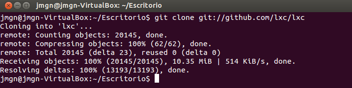
> Figura 1. Descargando la última versión de lxc.

A continuación nos colocamos en el directorio creado ( por defecto será "lxc" ).

```cd lxc```

Finalmente usando privilegios de administrador ( ```sudo``` ) podemos realizar la instalación. Los pasos se especifican en el fichero 'INSTALL' incluido en el directorio 'lxc' , la opción más simple para compilar e instalar es la siguiente:

*	Generamos el fichero 'configure'.

	```./autogen.sh ```

> En el caso de obtener el error 'aclocal: not found' o similar, tendremos instalar automake ( ```apt-get install automake``` )

*	Configuramos el paquete para nuestro sistema.

	```./configure ```

*	Compilamos el paquete

	```make ```

*	Iniciamos la instalación de los programas junto a los ficheros de datos y su documentación.

	```make install ```

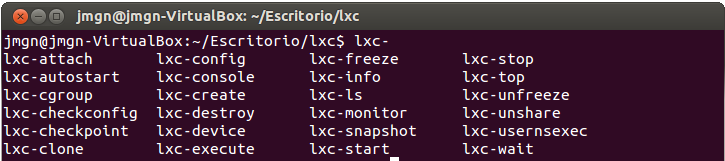
> Figura 2. Programas de la suite de lxc.


##Ejercicio 2

**Pasos previos al ejercicio 2**

Debemos de comprobar si nuestro núcleo del sistema operativo está preparado para usar la tecnología de lxc. En mi caso no están activados los "User namespace".

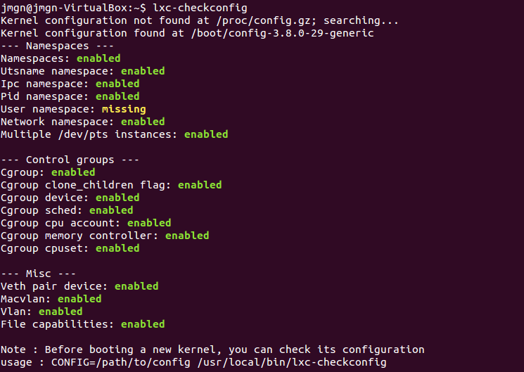
> Figura 3. User namespace: missing

Podemos comprobar nuestra versión del kernel usando el comando ```uname -a```.

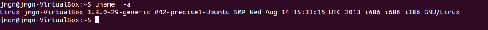
> Figura 4. Versión del kernel.

Para usar por tanto lxc tendremos que [actualizar el kernel](https://wiki.debian.org/HowToUpgradeKernel). Los pasos para un sistema basado en debian son los siguientes:

*	Comprobamos las nuevas versiones kernel disponibles.
	```apt-cache search linux-image ```
*	Procedemos a descargar e instalar la más reciente
	```apt-get install linux-image-flavour ```

	En mi caso: ```sudo apt-get install linux-image-3.13.0-40-generic ```

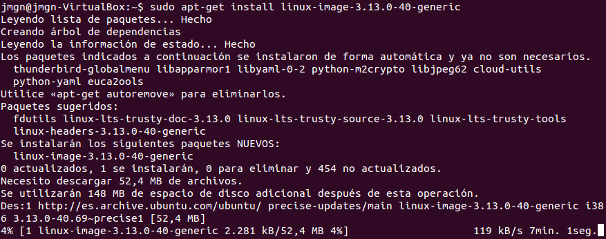
> Figura 5. Descargando y actualizando kernel del sistema operativo.

Tras actualizar debemos de reiniciar el sistema operativo para que se apliquen correctamente los cambios. Tras reiniciar comprobamos de nuevo mediante ```uname -a ```. 

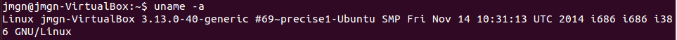
> Figura 6. Versión del nuevo kernel.

A continuación tenemos que volver a instalar las cabeceras del kernel para poder compilar módulos.

```sudo apt-get install linux-headers-$(uname -r) ```

Finalmente está todo configurado correctamente para poder usar lxc, como observamos si ejecutamos el comando ```lxc-checkconfig```.

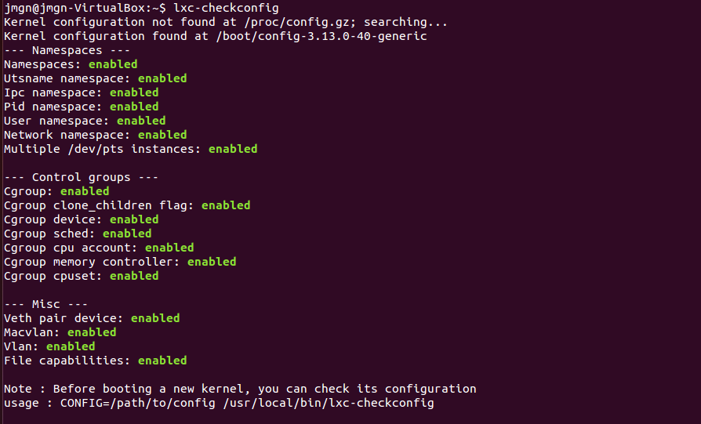
>Figura 7. Comprobación de la configuración para lxc.

**Instalación del contenedor**

Ya podemos realizar la instalación del contenedor usando lxc.

```sudo lxc-create -t ubuntu -n una-caja ```

```sudo lxc-create -t ubuntu-cloud -n nubecilla ```

Arrancamos el contenedor creado y nos conectamos a él.

```sudo lxc-start -n nubecilla ```

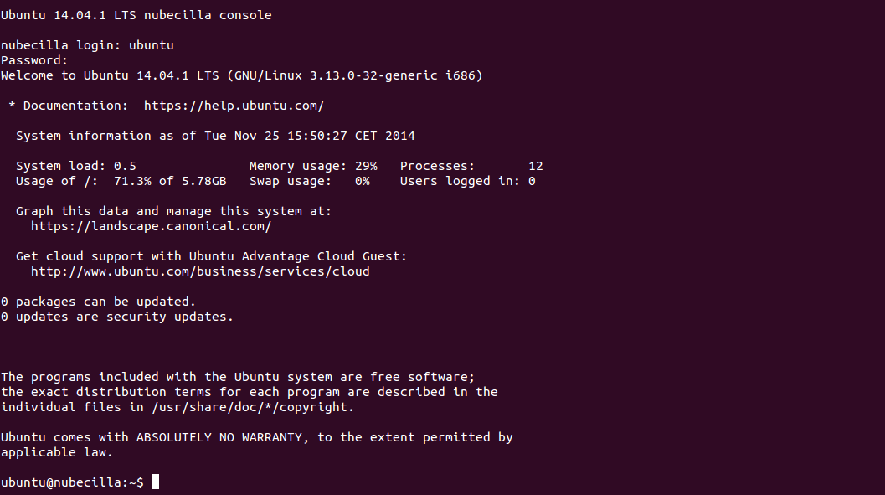
>Figura 8. Contenedor en funcionamiento.

**Comprobar qué interfaces puente se han creado y explicarlos.**

Al crear el contenedor anterior lxc ha generado un puente de red pre-configurado y además se crea una interfaz virtual que permite disponer de una conexión tipo ethernet dentro de un contenedor.


>Figura 9. Puentes de red creados.

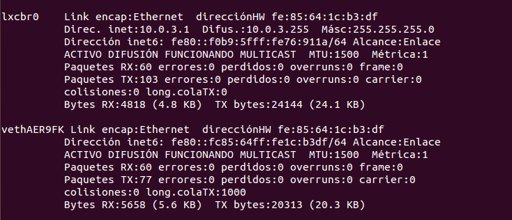
>Figura 10.


##Ejercicio 3

**Crear y ejecutar un contenedor basado en Debian.**

Instalamos el contenedor debian.

```sudo lxc-create -t debian -n caja-debian ```

Y lo iniciamos.

```sudo lxc-start -n caja-debian ```

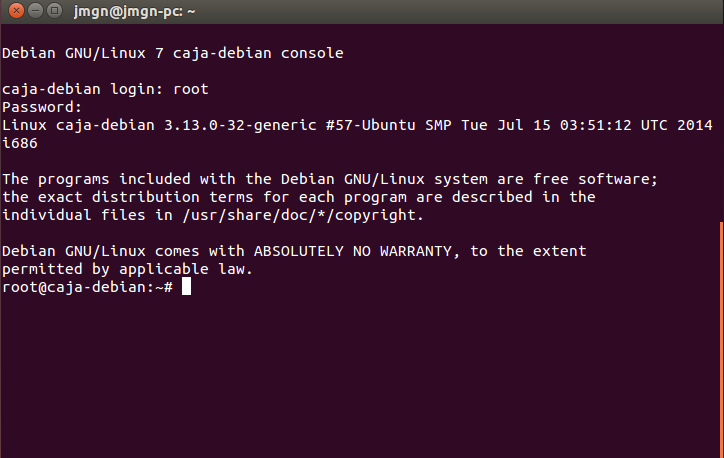
>Figura 11. Contenedor debian.

---

**Crear y ejecutar un contenedor basado en otra distribución, tal como Fedora. Nota En general, crear un contenedor basado en tu distribución y otro basado en otra que no sea la tuya. Fedora, al parecer, tiene problemas si estás en Ubuntu 13.04 o superior, así que en tal caso usa cualquier otra distro.**

Si queremos instalar a través de un template disponible podemos comprobar en ```/usr/share/lxc/templates ``` los que están disponibles.

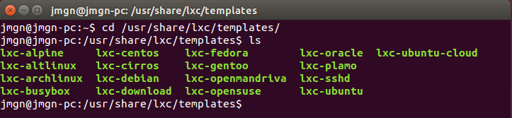
>Figura 12. Templates de distribuciones linux.

Elegimos alguna distribución diferente a la elegida en el paso anterior y la instalamos. Instalaremos CentOs por ejemplo.

```sudo lxc-create -t centos -n caja-centos ```

> Si queremos instalar CentOs se requiere el gestor de paquetes yum ```sudo apt-get install yum ``` 

Y la ejecutamos para comprobar que funciona correctamente.

```sudo lxc-start -n caja-centos ```

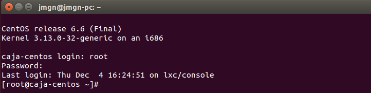
>Figura 13. Contenedor CentOs.

##Ejercicio 4

**Instalar lxc-webpanel y usarlo para arrancar, parar y visualizar las máquinas virtuales que se tengan instaladas.**

En la página github de [lxc-webpanel](http://lxc-webpanel.github.io/install.html) se nos indica el procedimiento para una instalación automática.

```wget http://lxc-webpanel.github.io/tools/install.sh -O - | bash ```

Instalamos de la manera indicada. Para acceder al panel abrimos un navegador y procedemos a localhost en el puerto 5000. 

> User : admin   
Password : admin

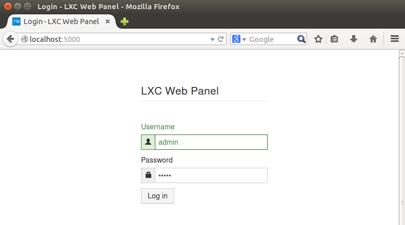
>Figura 14. Login lxc-webpanel.

Una vez logeados podemos gestionar los contenedores creados.

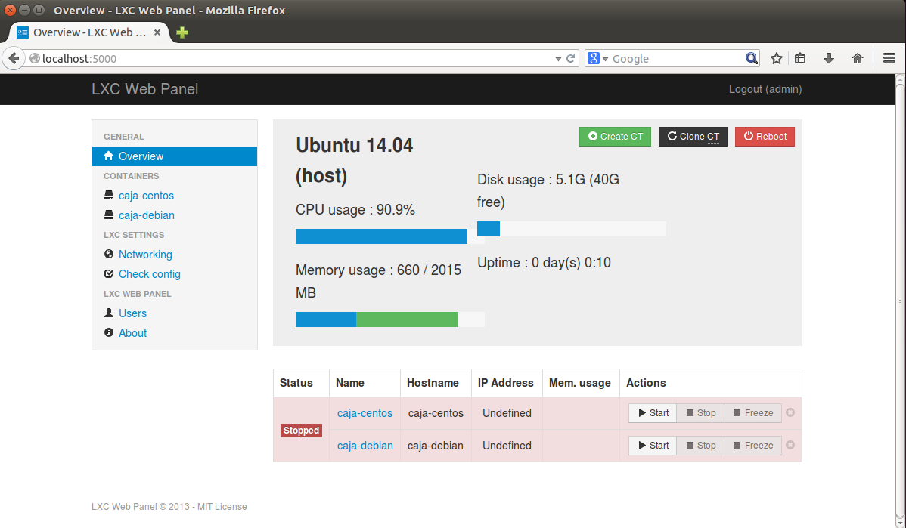
>Figura 15. Login lxc-webpanel.

> Podemos reiniciar el servidor con ```service lwp restart ```

---

**Desde el panel restringir los recursos que pueden usar: CPU shares, CPUs que se pueden usar (en sistemas multinúcleo) o cantidad de memoria.**

Tras clickear en algun contenedor podemos restringirle los recursos. En este ejemplo reduciremos la cantidad de memoria de 1 GB.

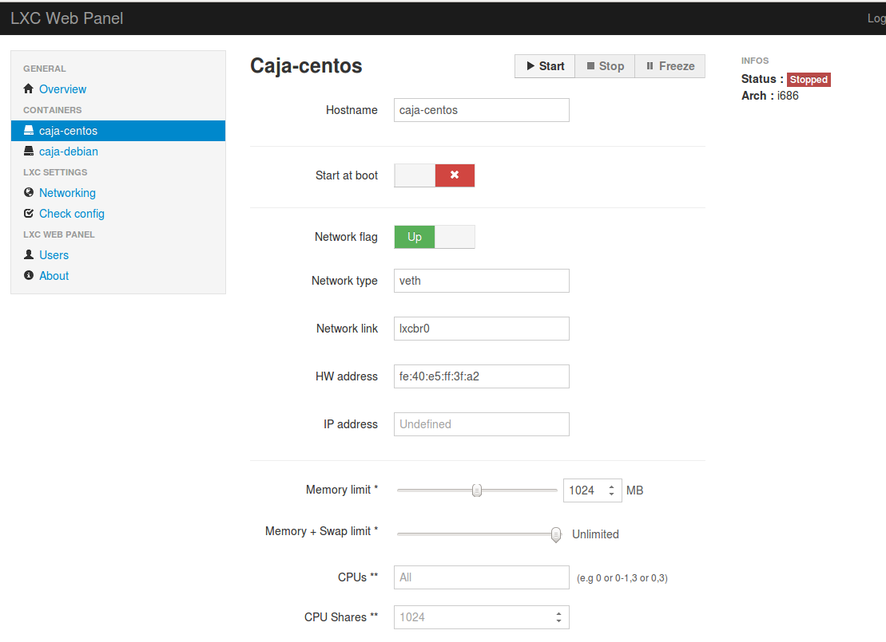
>Figura 16. Restringiendo recursos del contenedor.

##Ejercicio 5

**Comparar las prestaciones de un servidor web en una jaula y el mismo servidor en un contenedor. Usar nginx.**

Para analizar el rendimiento de nuestro servidor podemos usar una serie de herramientas diferentes tales como [OpenWebLoad](http://openwebload.sourceforge.net/) , [httperf](https://code.google.com/p/httperf/) y [ApacheBenchmark](http://httpd.apache.org/docs/2.2/programs/ab.html). Usaré dos herramientras para las comparaciones ab y openload.

Instalamos los paquetes necesarios para poder disponer de las dos herramientas.

```sudo apt-get install apache2-utils ```

```sudo apt-get install openload ```

A continuación lanzamos los dos servidores web nginx en una jaula ubuntu saucy y en el contenedor debian. Conociendo previamente las IP's respectivas.

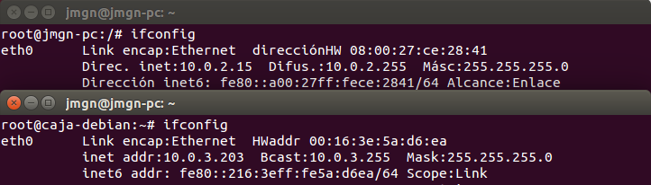
>Figura 17. IP local de la jaula y el contenedor respectivamente.

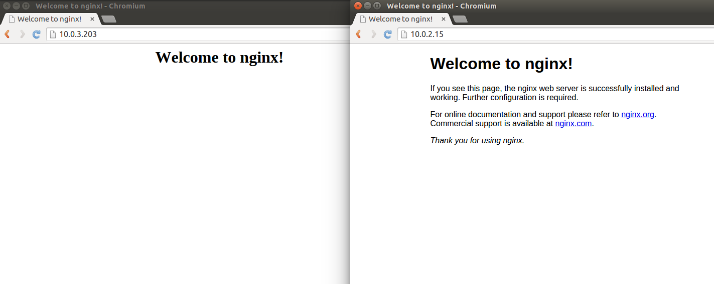
>Figura 18. Servidores web en funcionamiento

La primera comparación la haremos usando la herramienta ```ab ```.

Para el test lanzaremos 500.000 peticiones con una concurrencia de 100 peticiones en el mismo instante.

```ab -n 500000 -c 100 <enlace> ```

###Resultados jaula - ApacheBenchmark

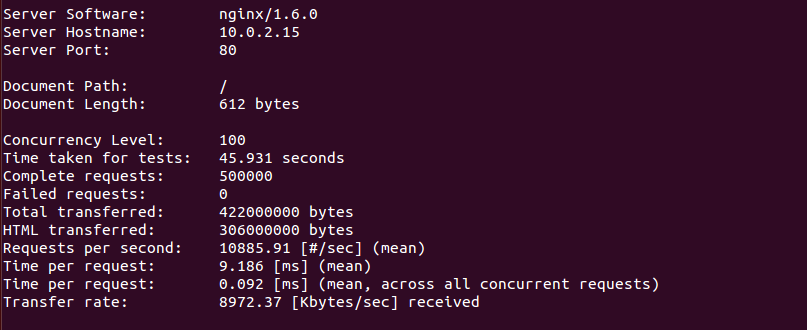
>Figura 19. Resultados ab jaula

###Resultados contenedor - ApacheBenchmark

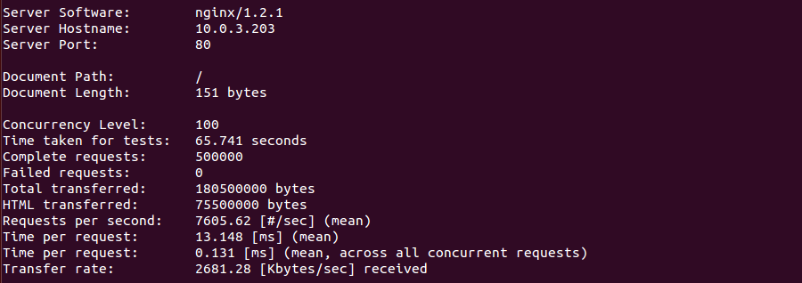
>Figura 20. Resultados ab contenedor

Vemos que hay una diferencia significativa en cuanto al tiempo necesario. El servidor web de la jaula tarda bastante menos que el del contenedor y además la pagina web servida es 4 veces mayor ( 612 bytes frente a 151 bytes). 
A continuación compararemos usando OpenWebLoad.

###Resultados jaula - OpenWebLoad

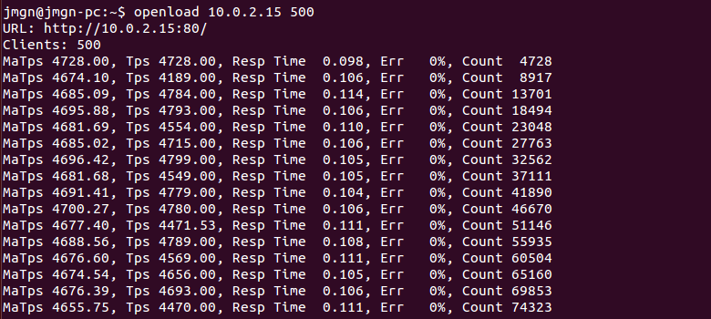
>Figura 21. Resultados openload jaula

###Resultados contenedor - OpenWebLoad

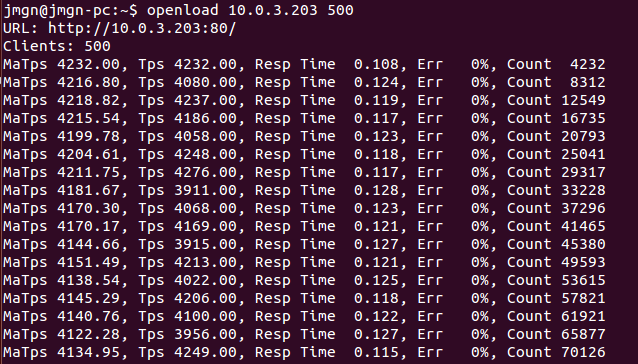
>Figura 22. Resultados openload contenedor

Tendremos que realizar varias pruebas para realizar una comparación extensa sin embargo a ojo podemos afirmar que el rendimiento del servidor web lanzado en la jaula es superior al del contenedor. En el caso de openload para 1000 usuarios simultáneas el servidor web ejecutado en el contenedor colapsa mientras que el de la jaula es capaz de procesarlos.


##Ejercicio 6

**Instalar juju.**

Seguimos los pasos indicados en la sesión anteriores a este ejercicio para la instalación.

Añadimos a los repositorios la última versión de juju, actualizamos y finalmente instalamos el programa.

```sudo add-apt-repository ppa:juju/stable ```

```sudo apt-get update && sudo apt-get install juju-core ```

Para inicializar el entorno del que precisa juju ejecutamos :

```juju init ```

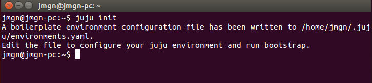
>Figura 23. Empezando a trabajar con juju

Seguimos los pasos dados para poder trabajar en local, ya que por defecto el fichero de configuración usará Amazon EC2. Abrimos el fichero de configuración por tanto:

```sudo nano /home/jmgn/.juju/environments.yaml ```

Y modificamos el proveedor por defecto a local.

```default: local```

---

**Usándolo, instalar MySQL en un táper.**

Dado que juju requiere de sus propios contenedores con su configuración dada, pasamos a crear un llamado 'taper'. Hacemos uso del siguiente comando :

```juju bootstrap ```
> Tenemos instalado previamente mongodb-server  para poder trabajr en local 

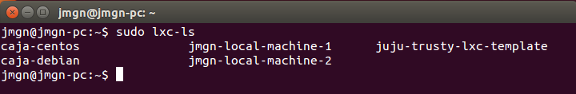
>Figura 24. Lista de contenedores

Como vemos se han creado tres nuevos contenedores. Finalmente instalamos mysql.

```juju deploy mysql ```


##Ejercicio 7

**Destruir toda la configuración creada anteriormente**

Eliminamos el servicio mysql que se habia instalado en el táper.

```juju destroy-service mysql ```

Y a continuación destruimos el entorno local.

``` sudo juju destroy-environment local ```

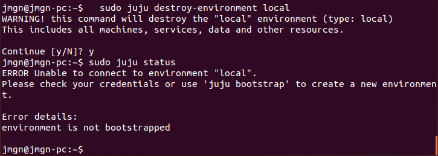
>Figura 25. Eliminando la configuración anterior


---

**Volver a crear la máquina anterior y añadirle mediawiki y una relación entre ellos.**

Repetimos los pasos anteriores. Usamos el comando ```juju debootstrap ``` para crear los contenedores. A continuación desplegamos instalamos mysql y la mediawiki.

```juju deploy mysql ```

```juju deploy mediawiki ```

Y creamos la relación entre mysql y mediawiki para indicarle a la wiki la base de datos que usará.

```juju add-relation mediawiki:db mysql ```

Y finalmente podemos lanzar el servicio para poder ser usado.

```juju expose mediawiki ```

La estado resultante de la máquina nos ofrecerá toda la información respecto a los servivios disponibles que han de ser la wiki y la base de datos mysql, y os estados de los contenedores.

> Hay que esperar varios minutos en determinados sistemas hasta que todo esté operativo

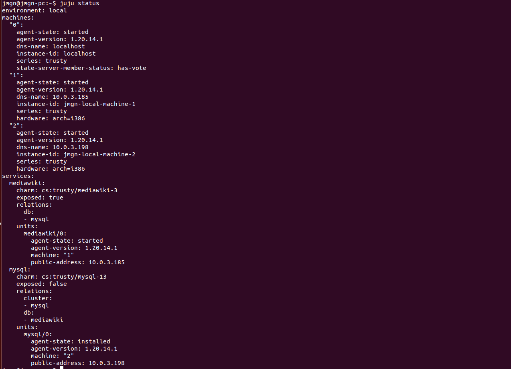
>Figura 26. Estado de las máquinas

Podemos conectarnos a la wiki usando la IP dada y comprobar que todo funciona correctamente.

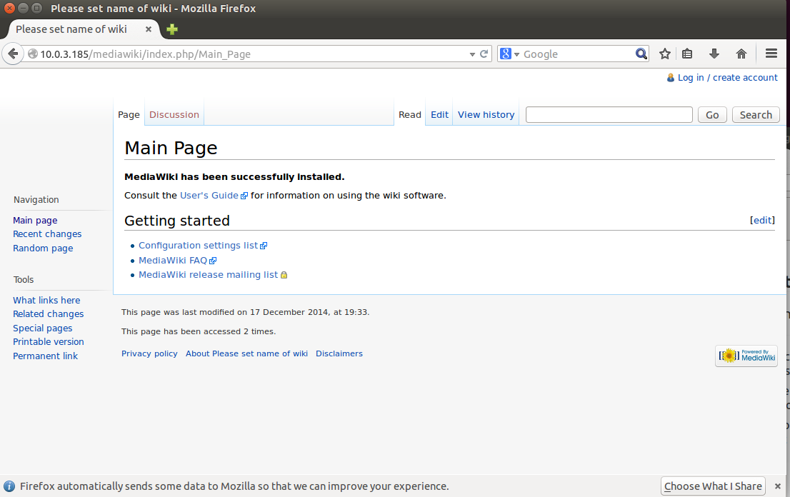
>Figura 27. Estado de las máquinas

---

**Crear un script en shell para reproducir la configuración usada en las máquinas que hagan falta.**

Para el script necesitamos replicar los comandos anteriores, que tendrá una forma similar a la siguiente:

```
#!/bin/bash

sudo juju switch local
sudo juju bootstrap
juju deploy mysql
juju deploy mediawiki
juju add-relation mediawiki:db mysql
juju expose mediawiki
```

##Ejercicio8

**Instalar libvirt.**

Antes de comenzar con libvirt es mejor asegurarse de que su hardware admite las extensiones de virtualización necesarias para KVM. 
En mi caso al trabajar con una máquina virtual la CPU no soportará la virtualización por hardware.

Aún así continuaremos siguiendo las indicaciones dadas en la página de ayuda de ubuntu hasta dar con un error.

Para instalar libvirt usamos el siguiente comando:

```sudo apt-get install kvm libvirt-bin ```

Y ejecutamos la interfaz de aplicación por línea de comandos 'virsh'.

```virsh ```

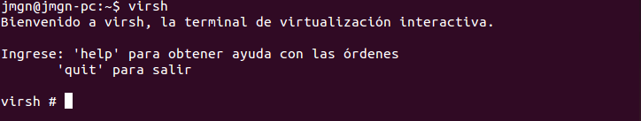
>Figura 28. Aplicación virsh.

##Ejercicio 9

**Instalar un contenedor usando virt-install.**

Abrimos la terminal e instalamos virt-install.

```sudo apt-get install virtinst ```

Necesitaremos una forma para conectarnos a la consola gráfica de nuestro invitado, para ello podemos utilizar virt-viewer o virt-manager.
Recomiendo el uso de virt-manager puesto que además permite crear y eliminar máquinas virtuales y realizar otras tareas.

```sudo apt-get install virt-manager ```

> A partir de aquí pueden aparecer los problemas al no poder virtualizar el hardware. Sin embargo en mi caso no hubo errores en cuanto a la instalación y uso.

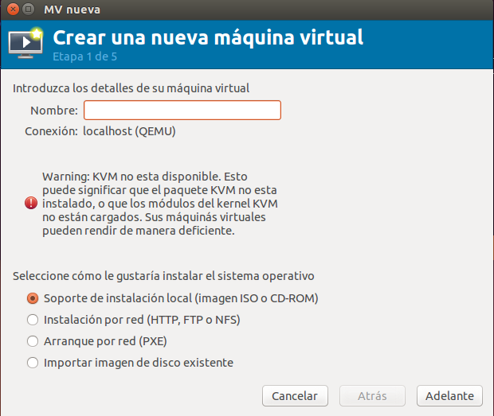
>Figura 29. Warning no kvm.

Nos descargamos alguna imagen que querramos usar para nuestra máquina virtual. Y al usar el instalador le pasamos dicha iso.
Un ejemplo de uso seria el siguiente, indicando el nombre de la máquina y la ISO en los dos campos por rellenar. ( Ejemplo con 512 MB de RAM ).

```sudo virt-install -n <nombre-maquina> -r 512 --disk path=/var/lib/libvirt/images/ubuntu-libvirt.img,bus=virtio,size=5 -c <nombre-iso> --accelerate --network network=default,model=virtio --connect=qemu:///system --vnc -v```

Ejecutamos el virt-manager para poder manejar las máquinas virtuales.

```sudo virt-manager -c qemu:///system  ubuntu-libvirt ```

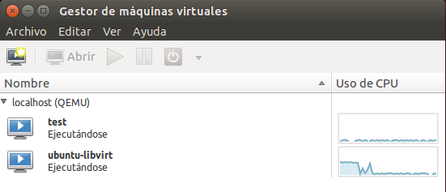
>Figura 30. Virt-manager

Con un simple doble clic podemos inciar la máquina, además el manager nos permite realizar más funciones como crear/borrar máquinas, apagarlas/reiniciarlas, etc.

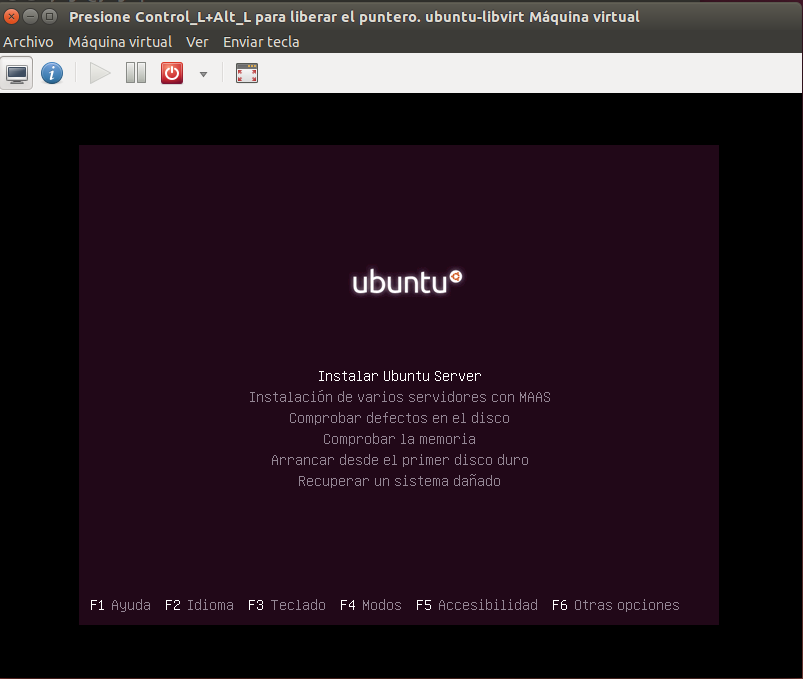
>Figura 31. Ejemplo con ubuntu server 13.10.

##Ejercicio 10

**Instalar docker.**

Para [instalar el gestor de contenedores docker](http://docs.docker.com/installation/ubuntulinux/), podemos hacer uso del script creado por parte de sus desarroladores para ubuntu. 

```
# Check that HTTPS transport is available to APT
if [ ! -e /usr/lib/apt/methods/https ]; then
	apt-get update
	apt-get install -y apt-transport-https
fi

# Add the repository to your APT sources
echo deb https://get.docker.com/ubuntu docker main > /etc/apt/sources.list.d/docker.list

# Then import the repository key
apt-key adv --keyserver hkp://keyserver.ubuntu.com:80 --recv-keys 36A1D7869245C8950F966E92D8576A8BA88D21E9

# Install docker
apt-get update
apt-get install -y lxc-docker

#
# Alternatively, just use the curl-able install.sh script provided at https://get.docker.com
# 
```

Mediante el siguiente comando podemos descargar y ejecutar directamente el script anterior.

```curl -sSL https://get.docker.com/ubuntu/ | sudo sh ```
El script proporcionado en la página de docker da problemas al no encontrarse el paquete lxc-docker, por tanto he optado por un tutorial diferente, que nos ofrecen en el [siguiente enlace](http://www.liquidweb.com/kb/how-to-install-docker-on-ubuntu-14-04-lts/).

Seguimos los pasos que se nos indican.


##Ejercicio 11

**Instalar a partir de docker una imagen alternativa de Ubuntu y alguna adicional, por ejemplo de CentOS.**

Finalizada la instalación comprobamos que todo funciona de la forma esperada ( con el ejemplo de una imagen ubuntu).

```sudo docker run -i -t ubuntu /bin/bash ```

> En mi caso al utilizar una máquina virtual de 32 bits , la imagen descargada de 64 bits no funcionará y dará un error de ejecución ( además docker utiliza binarios de 64 bits ).

> 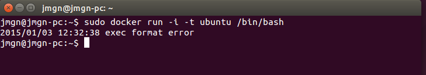
> Figura 32. Error ejecución imagen 64 bits.

Me cambio apartir de aquí a una máquina virtual docker de 64 bits ( boot2docker ).

A continuación descargaremos la imagen CentOS.

```sudo docker pull centos ```

```docker run -i -t centos /bin/bash ```


---

**Buscar e instalar una imagen que incluya MongoDB.**

Para buscar contenedores en docker usamos el comando ```docker search <keyword>```. En este comando indicamos la palabre clave que deseamos buscar. En este caso al necesitar una imgen que incluya mongoDB usaremos : 

```docker search mongodb ```

Guardamos los resultados en un fichero y los consultamos.

> 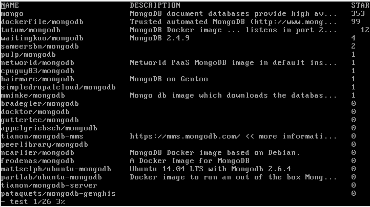
> Figura 33. Imágenes que incuyen mongodb.

Elegimos alguna de las imágenes disponibles para instalar. He optado por la imagen docker MongoDB basada en Debian.

```sudo docker pull ncarlier/mongodb ```

##Ejercicio 12

**Crear un usuario propio e instalar nginx en el contenedor creado de esta forma.**

Haciendo uso de algún contenedor creado, lo usaremos para crear el nuevo usuario e instalar nginx.

En primer lugar nos conectamos al contenedor.

```docker run -i -t centos /bin/bash ````.

Ahora tenemos que crear el nuevo usuario.

```useradd -s /bin/bash usernginx ```
```passwd usernginx ```

> Por defecto no viene el comando passwd en la imagen docker centos, por tanto tendremos que instalarlo mediante ```yum install passwd ```

El siguiente paso es añadir el usuario a la list de sudo.

Instalamos sudo.

```yum install sudo ```

Damos permisos al fichero de la lista.

```chmod 666 /etc/sudoers ```

Y editamos el fichero añadiendo el usuario.

```vi /etc/sudoers ```

> 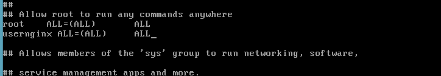
> Figura 34. Añadiendo usuario a la lista de usuarios sudo.

Y volvemos los permisos sobre el fichero a como estaban antes.

```chmod 440 /etc/sudoers ```


Cambiamos de usuario al recién creado y procedemos a instalar nginx.

```su nginxuser ```

Añadimos el repositorio de nginx para Centos 7 e instalamos.

```sudo rpm -Uvh http://nginx.org/packages/centos/7/noarch/RPMS/nginx-release-centos-7-0.el7.ngx.noarch.rpm```

```sudo yum install nginx ```

> 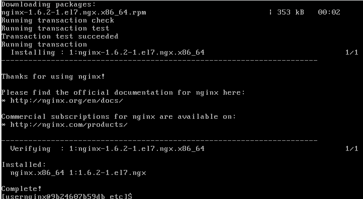
> Figura 35. Instalación nginx.


##Ejercicio 13

**Crear a partir del contenedor anterior una imagen persistente con commit.**

Lanzamos el contenedor y pulsamos ```CTRL+P ``` seguido de ```CTRL+Q ``` para salirnos de la shell sin matar el proceso del contenedor.

Seguido ejecutamos el comando ```docker ps ``` para conocer la ID de nuestro contenedor y crear así la imagen persistente mediante un commit.

```docker commit 94fa8c991ddd centosiv ```

Y finalmente usando ```docker images ``` podemos consultar nuestras imágenes docker.

> 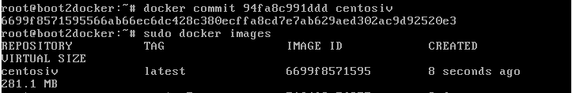
> Figura 36. Creación de una imagen persistente mediante un commit.


##Ejercicio 14

**Crear una imagen con las herramientas necesarias para DAI sobre un sistema operativo de tu elección.**

En mi caso puedo reutilizar el script usado para la práctica tercera de la asignatura que automatiza todo el proceso.

Lanzamos el contenedor que vayamos a utilizar ( Ubuntu en este caso ).

```sudo docker run -i -t ubuntu /bin/bash ```

Instalamos la herramienta wget para poder descargar el script.

```sudo apt-get install wget ```

Y procedemos a descargar e script.

```wget https://raw.githubusercontent.com/julioxus/iv-aerospace/master/Hito3/install.sh ```

Finalmente damos los permisos de ejecución al script y lo podremos ejecutar.

```chmod +x install.sh ```

```./install.sh ```