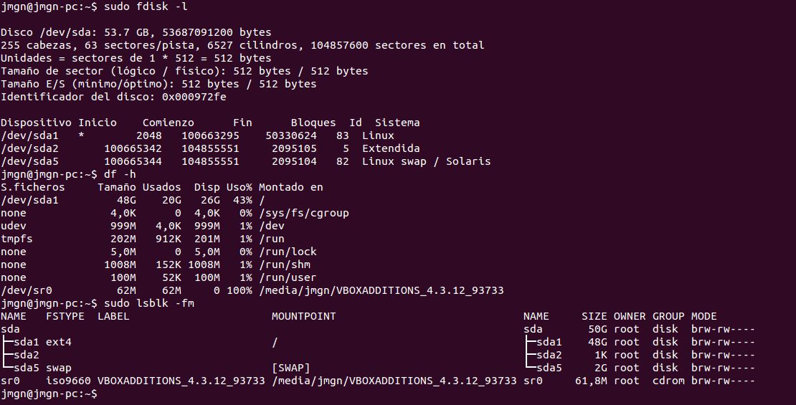
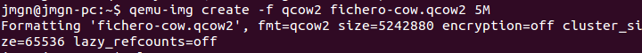
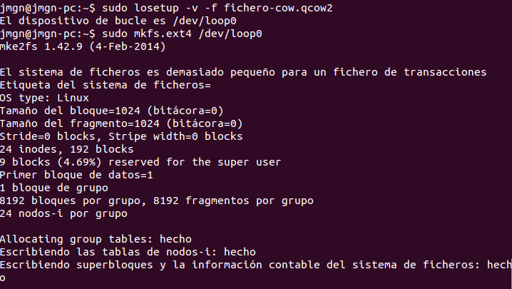
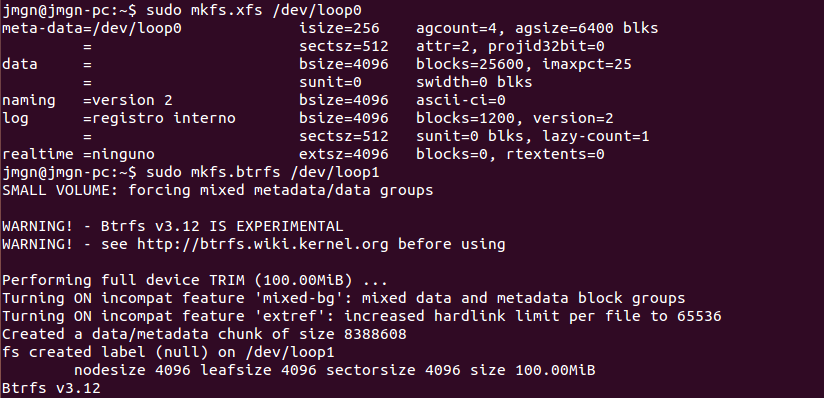
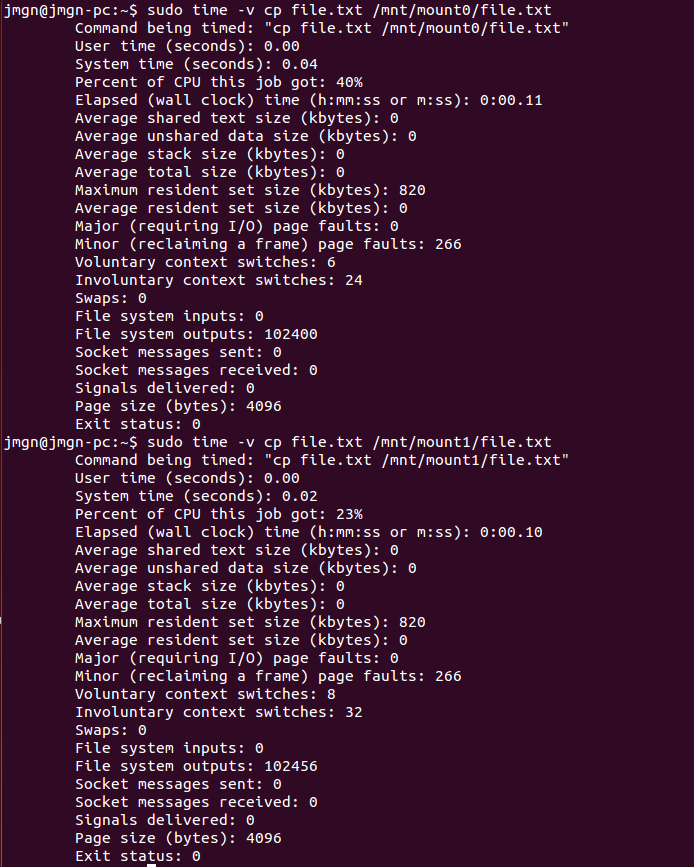

## Ejercicio 1

**¿Cómo tienes instalado tu disco duro? ¿Usas particiones? ¿Volúmenes lógicos?**

Al trabajar en máquina virtual sin configuración previa de particiones, el sistema viene con las de por defecto: para Linux, otra extendida para Linux y la de SWAP.

Los comandos para conocer información acerca del disco duro y sus particiones son bastantes algunos de ellos son los siguientes:

```sudo fdisk -l ```

```df -h ```

```sudo lsblk -fm ```


> Figura 1. Información disco duro/particiones.

Podemos también escanear todos los dispositivos buscando por volúmenes LVM, en mi caso no tengo ninguno.

```sudo lvmdiskscan ```


> Figura 2. Información volúmenes/particiones.


**Si tienes acceso en tu escuela o facultad a un ordenador común para las prácticas, ¿qué almacenamiento físico utiliza?**

> Pendiente por realizar en los aulas de clase.


**Buscar ofertas SAN comerciales y comparar su precio con ofertas locales (en el propio ordenador) equivalentes.**

## Ejercicio 2

**Usar FUSE para acceder a recursos remotos como si fueran ficheros locales. Por ejemplo, sshfs para acceder a ficheros de una máquina virtual invitada o de la invitada al anfitrión.**

> Problemo al ser máquina virtual.

## Ejercicio 3

**Crear imágenes con estos formatos (y otros que se encuentren tales como VMDK) y manipularlas a base de montarlas o con cualquier otra utilidad que se encuentre**

Para ello instalaremos el emulador de procesadores [QEMU](http://wiki.qemu.org/Main_Page). Su objetivo principal es emular un sistema operativo dentro de otro sin tener que reparticionar el disco duro, usando para ello cualquier directorio dentro de este.

Instalamos la herramienta mediante :

```sudo apt-get install qemu-system ```

Y ya podemos seguir los pasos indicados en los apuntes. Creamos el fichero mediante ```qemu-img ````.

```qemu-img create -f qcow2 fichero-cow.qcow2 5M ```

Esto generará un fichero de un tamaño inferior al indicado (5 M).


> Figura 3. Generando imagen.

Para que este fichero se pueda usar como sistema de almacenamiento virtual tenemos que convertirlo a un dispositivo loop mediante ```losetup ```.

```sudo losetup -v -f fichero-cow.qcow2 ```

Y finalmente tenemos que formatear el dispositivo de bucle como si de un disco duro normal se tratara usando algunas de las herramientas conocidas. Ej.:

```sudo mkfs.ext4 /dev/loop0 ```


> Figura 4. Dispositivo loop formateado.

Formateado ya podemos montarlo usando ```mount ```.

```sudo mount /dev/loop0 <mount-point> ```

> Se debería usar un tamaño superior a los 5 M del ejemplo.


## Ejercicio 4

**Crear uno o varios sistema de ficheros en bucle usando un formato que no sea habitual (xfs o btrfs) y comparar las prestaciones de entrada/salida entre sí y entre ellos y el sistema de ficheros en el que se encuentra, para comprobar el overhead que se añade mediante este sistema**

Vamos a crear sistemas de ficheros en bucle usando ambos formatos del enunciado : xfs y btrfs.
Para [btrfs](https://btrfs.wiki.kernel.org/index.php/Btrfs_source_repositories) hay varias repositorios fuente para instalarlo, usaremos apt-get.

```sudo apt-get install btrfs-tools ```

Y a continuación instalamos también las herramientas necesarias para poder usar el formato [xfs](https://wiki.ubuntu.com/XFS).

```sudo apt-get install xfsprogs xfsdump ```

> Es necesaria tambíen la herramienta ```mount ``` que suele venir instalada por defecto.

Una vez tengamos todas las herramientas necesarias podemos empezar a crear los sistemas de ficheros.

Primero generamos las imágenes.

```
sudo qemu-img create -f raw imagenXfs.img 100M
sudo qemu-img create -f raw imagenBtrfs.img 100M 
```

Convertimos las imágenes creadas a un dispositivo de bucle.

```
sudo losetup -v -f imagenXfs.img
sudo losetup -v -f imagenBtrfs.img 
```

Ahora podemos darle el formato correspondiente a cada uno.

```
sudo mkfs.xfs /dev/loop0
sudo mkfs.btrfs /dev/loop1
```


> Figura 5. Formateo.

Y finalmente creamos los puntos de montaje y montamos los sistemas de ficheros.

```
sudo mkdir /mnt/mount0
sudo mkdir /mnt/mount1
sudo mount -t xfs /dev/loop0 /mnt/mount0/
sudo mount -t btrfs /dev/loop1 /mnt/mount1/ 
```

Para comparar las prestaciones entre ambos vamos a [generar un fichero con datos aleatorios de un tamaño determinado](http://www.skorks.com/2010/03/how-to-quickly-generate-a-large-file-on-the-command-line-with-linux/). Se recomienda el uso del comando ```dd ```.

Este comando genera un fichero de 50 MB con bytes aleatorios, cuyo contenido no será nada leible.

```dd if=/dev/urandom of=file.txt bs=524288 count=100 ```

Mediante la herramienta ```time ``` compararemos los resultados al copiar un fichero.

```
sudo time -v cp file.txt /mnt/mount0/file.txt
sudo time -v cp file.txt /mnt/mount1/file.txt 
```


> Figura 5. Comparando prestaciones xfs y btrfs.

El sistema de ficheros con formato btrfs muestra mejores marcas de tiempo (0.02s y xfs 0.04s) al igual que un menor gasto de CPU para realizar la misma tarea, un 23% frente al 40% usado para copiar al sistema de ficheros con formato xfs.

## Ejercicio 5

**Instalar ceph en tu sistema operativo.**

Usando apt-get el comando para instalar ceph en nuestro sistema es el siguiente.

```sudo apt-get install ceph-mds ```

## Ejercicio 6

**Crear un dispositivo ceph usando BTRFS o XFS**

Creamos el directorio que va usarse para el dispositivo ceph

```sudo mkdir -p /srv/ceph/{osd,mon,mds} ```

Creamos el fichero de configuración ```/etc/ceph/ceph.conf ```

```
[global]
log file = /var/log/ceph/$name.log
pid file = /var/run/ceph/$name.pid
[mon]
mon data = /srv/ceph/mon/$name
[mon.mio]
host = jmgn-pc
mon addr = 127.0.0.1:6789
[mds]
[mds.mio]
host = jmgn-pc
[osd]
osd data = /srv/ceph/osd/$name
osd journal = /srv/ceph/osd/$name/journal
osd journal size = 1000 ; journal size, in megabytes
[osd.0]
host = jmgn-pc
devs = /dev/loop2
```


**Avanzado Usar varios dispositivos en un nodo para distribuir la carga.**

## Ejercicio 7

**Almacenar objetos y ver la forma de almacenar directorios completos usando ceph y rados.**

Creamos la "piscina" para poder almacenar los objetos en rados.

```rados mkpool pool ```

Ya podemos crear un fichero e introducirlo en dicho sistema recien creado.

```rados put -p prueba-pool objeto prueba.txt ```

Con ```rados lspools ``` podemos comprobar que se ha creado todo correctamente.

## Ejercicio 8 - 10

> No dispongo de una cuenta de azure, caducaron las ofrecidas por el profesor.

