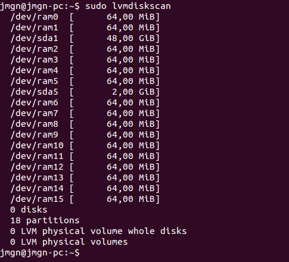

## Ejercicio 1

**¿Cómo tienes instalado tu disco duro? ¿Usas particiones? ¿Volúmenes lógicos?**

Al trabajar en máquina virtual sin configuración previa de particiones, el sistema viene con las de por defecto: para Linux, otra extendida para Linux y la de SWAP.

Los comandos para conocer información acerca del disco duro y sus particiones son bastantes algunos de ellos son los siguientes:

```sudo fdisk -l ```

```df -h ```

```sudo lsblk -fm ```


> Figura 1. Información disco duro/particiones.

Podemos también escanear todos los dispositivos buscando por volúmenes LVM, en mi caso no tengo ninguno.

```sudo lvmdiskscan ```


> Figura 2. Información volúmenes/particiones.


**Si tienes acceso en tu escuela o facultad a un ordenador común para las prácticas, ¿qué almacenamiento físico utiliza?**

> Pendiente por realizar en los aulas de clase.


**Buscar ofertas SAN comerciales y comparar su precio con ofertas locales (en el propio ordenador) equivalentes.**

## Ejercicio 2

**Usar FUSE para acceder a recursos remotos como si fueran ficheros locales. Por ejemplo, sshfs para acceder a ficheros de una máquina virtual invitada o de la invitada al anfitrión.**

> Problemo al ser máquina virtual.

## Ejercicio 3

**Crear imágenes con estos formatos (y otros que se encuentren tales como VMDK) y manipularlas a base de montarlas o con cualquier otra utilidad que se encuentre**

Para ello instalaremos el emulador de procesadores [QEMU](http://wiki.qemu.org/Main_Page). Su objetivo principal es emular un sistema operativo dentro de otro sin tener que reparticionar el disco duro, usando para ello cualquier directorio dentro de este.

Instalamos la herramienta mediante :

```sudo apt-get install qemu-system ```

Y ya podemos seguir los pasos indicados en los apuntes. Creamos el fichero mediante ```qemu-img ````.

```qemu-img create -f qcow2 fichero-cow.qcow2 5M ```

Esto generará un fichero de un tamaño inferior al indicado (5 M).


> Figura 3. Generando imagen.

Para que este fichero se pueda usar como sistema de almacenamiento virtual tenemos que convertirlo a un dispositivo loop mediante ```losetup ```.

```sudo losetup -v -f fichero-cow.qcow2 ```

Y finalmente tenemos que formatear el dispositivo de bucle como si de un disco duro normal se tratara usando algunas de las herramientas conocidas. Ej.:

```sudo mkfs.ext4 /dev/loop0 ```


> Figura 4. Dispositivo loop formateado.

Formateado ya podemos montarlo usando ```mount ```.

```sudo mount /dev/loop0 <mount-point> ```

> Se debería usar un tamaño superior a los 5 M del ejemplo.


## Ejercicio 4

**Crear uno o varios sistema de ficheros en bucle usando un formato que no sea habitual (xfs o btrfs) y comparar las prestaciones de entrada/salida entre sí y entre ellos y el sistema de ficheros en el que se encuentra, para comprobar el overhead que se añade mediante este sistema**

## Ejercicio 5

**Instalar ceph en tu sistema operativo.**

## Ejercicio 6

**Crear un dispositivo ceph usando BTRFS o XFS**

**Avanzado Usar varios dispositivos en un nodo para distribuir la carga.**

## Ejercicio 7

**Almacenar objetos y ver la forma de almacenar directorios completos usando ceph y rados.**

## Ejercicio 8

**Tras crear la cuenta de Azure, instalar las herramientas de línea de órdenes (Command line interface, cli) del mismo y configurarlas con la cuenta Azure correspondiente**

## Ejercicio 9

**Crear varios contenedores en la cuenta usando la línea de órdenes para ficheros de diferente tipo y almacenar en ellos las imágenes en las que capturéis las pantallas donde se muestre lo que habéis hecho.**

## Ejercicio 10 

**Desde un programa en Ruby o en algún otro lenguaje, listar los blobs que hay en un contenedor, crear un fichero con la lista de los mismos y subirla al propio contenedor. Muy meta todo.**