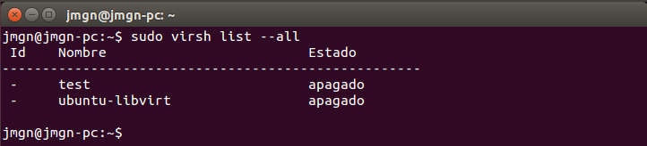

## Ejercicio 1

**Instalar los paquetes necesarios para usar KVM. Se pueden seguir estas instrucciones. Ya lo hicimos en el primer tema, pero volver a comprobar si nuestro sistema está preparado para ejecutarlo o hay que conformarse con la paravirtualización.**

Las herramientas ya las tenía instaladas sin embargo al trabajar con máquina virtual la CPU no soporta las extensiones de KVM.

Aunque pueda crear máquinas virtuales al no soportarse KVM las máquinas funcionarán de forma deficiente.

Los dominios que creé en el tema 4 son los siguientes.


> Figura 1. Dominios creados.

## Ejercicio  2

**Crear varias máquinas virtuales con algún sistema operativo libre tal como Linux o BSD. Si se quieren distribuciones que ocupen poco espacio con el objetivo principalmente de hacer pruebas se puede usar CoreOS (que sirve como soporte para Docker) GALPon Minino, hecha en Galicia para el mundo, Damn Small Linux, SliTaz (que cabe en 35 megas) y ttylinux (basado en línea de órdenes solo).**

Creamos las diferentes imágenes que vamos a necesitar para almacenar los diferentes sistemas operativos instalados.

```qemu-img create -f qcow2 dsl.qcow2 1G ```
```qemu-img create -f qcow2 slitaz.qcow2 1G ```

Una vez creado el fichero de almacenamiento virtual y descargada la ISO que usaremos para arrancar el sistema ya podemos instalarlo. Usaré una ISO de las últimas versiones de "[Damn Small Linux](http://distro.ibiblio.org/damnsmall/release_candidate/)" y "[SliTaz](http://www.slitaz.org/en/news/#d20140519)".

```qemu-system-x86_64 -hda dsl.qcow2 -cdrom Escritorio/dsl-4.11.rc1.iso -m 1G -boot d ```


> Figura 2. Funcionamiento de DSL.

Instalamos ahora la siguiente ISO de SliTaz ( aunque ocupe poco, el proceso de instalación es bastante más extenso que Damn Small Linux ). Seguimos todos los pasos y ya podremos usar la máquina virtual.

```qemu-system-x86_64 -hda dsl.qcow2 -cdrom Escritorio/slitaz-5.0-rc2.iso -m 1G -boot d ```


> Figura 3. Funcionamiento de LiiTaz.

**Hacer un ejercicio equivalente usando otro hipervisor como Xen, VirtualBox o Parallels.**

Nos descargamos alguna iso de las disponibles. Voy a realizar el ejercicio usando una versión de [Damn Small Linux](http://distro.ibiblio.org/damnsmall/release_candidate/) como en el apartado anterior.

E instalamos algún hipervisor como VirtualBox.

```sudo apt-get install virtualbox ```

Arrancamos el hipervisor y creamos una nueva máquina.


> Figura 4. Creación de nueva máquina virtual.

A continuación le pasamos la imagen del sistema operativo para cargarla al iniciar.


> Figura 5. Cargando iso del DSL.

Ya podemos iniciar la máquina virtual, para DSL en concreto no se requieren pasos iniciales de configuración para su instalación. Podremos usar directamente el SO una vez finalizada la configuración automática.


> Figura 6. DSL instalado mediante virtualbox. 

## Ejercicio 3

**Crear un benchmark de velocidad de entrada salida y comprobar la diferencia entre usar paravirtualización y arrancar la máquina virtual simplemente con : `qemu-system-x86_64 -hda /media/Backup/Isos/discovirtual.img
`**

He reutilizado un benchmark que escribí para la asignatura de ISE, que calcula la velocidad de lectura/escritura del disco duro.

```
#include <iostream>
#include <fstream>
#include <cstdio>
#include <ctime>

using namespace std;

void test_memoria(){

// Abrimos el flujo para el archivo de entrada y podremos calcular su tamaño en bytes.

ifstream fichero_entrada("f1");

double inicio, final, tamanio_archivo;
inicio = fichero_entrada.tellg();
fichero_entrada.seekg(0, ios::end);
final = fichero_entrada.tellg();
fichero_entrada.close(); // Ya que nos hemos colocado al final o bien podemos cerrar el fichero y abrirlo de nuevo o colocarnos de nuevo al comienzo del fichero

tamanio_archivo = (final-inicio)/(1024*1024); // Pasamos los datos a MegaBytes

// Ahora que ya tenemos el tamaño del archivo podemos abrir todos los flujos

fichero_entrada.open("f1");
ofstream fichero_salida("f2");

std::clock_t start, end;
string aux;

// Calculamos los tiempos que tarda para realizar la lectura/escritura del fichero

start= std::clock();

while(!fichero_entrada.eof()){
     fichero_entrada >> aux;
 fichero_salida << aux;
}

end = std::clock();

double tiempo_total = (end-start)/(double) CLOCKS_PER_SEC; 

cout << "\nTiempo transcurrido : " << tiempo_total << " segundos" << endl;
cout << "Tamaño del fichero : " << tamanio_archivo << " MegaBytes" << endl;
cout << "\nVelocidad de lectura/escritura : " << tamanio_archivo/tiempo_total << " MB/s\n" << endl;

fichero_entrada.close();
fichero_salida.close();

}

int main(){

	test_memoria();

}
```

> Al usar máquinas virtuales sobre máquinas virtuales no he podido ejecutar el benchmark sobre las máquinas. Eran demasiado lentas...

## Ejercicio 4

**Crear una máquina virtual Linux con 512 megas de RAM y entorno gráfico LXDE a la que se pueda acceder mediante VNC y ssh.**

Creamos la el almacenamiento virtual que usará la nueva máquina virtual.

```qemu-img create -f qcow2 lubuntu.qcow2 5G ```

Y nos descargamos la ISO que vamos a usar. Para este ejercicio usaré [Lubuntu](https://help.ubuntu.com/community/Lubuntu/GetLubuntu), que viene por defecto con el entorno gráfico LXDE, y creamos la máquina virtual asignándole 512 MB de RAM.

```qemu-system-i386 -hda lubuntu.qcow2 -cdrom Descargas/lubuntu-14.10-desktop-i386.iso -m 512M ```


> Figura 7. Instalación de lubuntu.

> Dado que es extremadamente lento al usar máquina virtual sobre máquina virtual, he repetido el ejercicio asignando el máximo de RAM simulado permitido para qemu : 2047 MB

Instalamos el cliente para VNC vinagre en caso de que no venga con nuestra distribución.

```sudo apt-get install vinagre ```

Lanzamos la máquina virtual.

```qemu-system-i386 -hda lubuntu.qcow2 vnc :1 ```

Usamos ```ifconfig ``` para conocer su dirección IP.

```ifconfig ```

Si no se indica un puerto de forma específica, el puerto por defecto será el 5900. En este caso :1 hace referencia al puerto 5901.

Usamos el cliente para conectarnos a la máquina virtual de forma remota.

```vinagre 192.168.122.1:5901 ```

## Ejercicio 5

**Crear una máquina virtual ubuntu e instalar en ella un servidor nginx para poder acceder mediante web.**

Dado que no dispongo de una cuenta azure, usaré Koding que es gratuito y no solicita una tarjeta de crédito.

Nos registramos y arrancamos una nueva máquina virtual.


> Figura 7. Creando una máquina virtual en Koding.

Las máquinas virtuales de Koding por defecto vienen instaladas con Apache, servicio que se arranca por defecto al iniciar la máquina.
La recomendación sería desinstalar dicho servicio antes de instalar nginx en ella.

```sudo apt-get remove --purge apache2 ```

Y ya podemos proceder a instalar nginx.

```sudo apt-get install nginx ```


> Figura 7. Nginx instalado en Koding.
