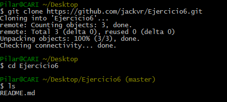

#Ejercicio 1
He utilizado el servidor que aparece en el siguiente enlace:
[servidor dell](http://www.dell.com/us/p/xps-8700/pd.aspx?c=us&cs=19&l=en&s=dhs)

He escogido el primero de 699,99$ y su coste de amortización a 4 años es:
25% de 699,99$ = 174,9975$ cada año

El coste de amortización a 7 años  es:
Los 6 primeros al 15%  = 104,9985$ y el ultimo al 10% = 69,999$

#Ejercicio 2
Para este ejercicio vamos a comparar los sitios web de [microsoft azure](http://azure.microsoft.com/es-es/pricing/details/cloud-services/) y [google engine](https://cloud.google.com/products/calculator/#id=3ba97ab0-ea02-48e1-a35c-1b8b1d54e053) 

En azure usamos un ordenador de 1 núcleo, 1,75GB de RAM y 224GB de disco y nos da el siguiente resultado: 

En google usamos uno con las mismas condiciones y nos da el resultado que vemos a continuación:

Vemos que en google engine sale casi 4€ más caro el mes. Calculamos ahora el precio al año de cada uno:

**Microsoft**

44,69 x 12 = 536,28€ al año. 
Si solo lo usamos un 1% del tiempo nos da 5,3628€ al año y si lo usamos el 10% tendríamos 53,628€ al año.

**Google engine**

48,01$ x 12 = 576,12$ al año. Si solo lo usamos un 1% del tiempo nos da 5,7612$ al año y si lo usamos el 10% tendríamos 57,612$ al año.

Teniendo en cuenta que 1$ son 0,80€ aproximadamente, nos saldría más rentable usar la plataforma google computer engine.

#Ejercicio 3

**Apartado 2**

Voy a usar el siguiente código en c que imprime un mensaje por pantalla:

Después instalo CDE con apt-get install cde y comprobamos que se ha creado la carpeta cde-package para empaquetar programas:

#Ejercicio 4

He seguido los pasos pertinentes y he realizado el tutorial de órdenes de Docker.

#Ejercicio 5
Para instalarlo hay que introducir la orden "sudo apt-get install git " en el terminal y se procederá a su instalación como se observa a continuación:

#Ejercicio 6
**Apartado 1**

Para crear el repositorio entramos en github y arriba a la derecha, al lado de nuestro nombre de usuario y seleccionamos la opción "New repository". Le ponemos nombre al repositorio y marcamos la opción de inicializar el repositorio con un README.

Seguidamente copiamos el url del repositorio recién creado y lo introducimos en el terminal git como se ve en la siguiente captura:

Vemos que el README se encuentra dentro del repositorio que acabamos de clonar.

**Apartado 2**

Después modificamos el README y lo agregamos con la orden "git add README.md." A continuación fijamos los cambios con el comando "git commit -a -m “Modificando README”."

Y por último subimos los cambios al repositorio los cambios realizados mediante el comando git push origin master.

#Ejercicio 7
En mi máquina virtual no venía montada esta configuración y para instalarla he usado la orden: "sudo mount -t cgroup cgroup /sys/fs/cgroup/".

Esta montada en /sys/fs y estos son algunos de los archivos que contiene:

#Ejercicio 8

Para empezar creamos los grupos de control con permiso de superusuario y creamos los 3 grupos con el siguiente comando:

mkdir /sys/fs/cgroup/navegador (para el navegador, /texto para el procesador de textos y /calc para el gedit)

Ahora buscamos el PID de los procesos que queremos asignar a cada grupo y posteriormente le asignaremos el proceso. Usamos "ps aux | grep <proceso_a_buscar>" para buscar el PID de cada uno de ellos.

Por último con la instrucción "echo <IDproceso> >/cgroup/<nombre_del_grupo>/tasks" le asignamos el PID buscado a cada grupo, y ya podemos comprobar el uso de recursos usando la orden: "cat /sys/fs/cgroup/<grupo>/cpuacct.usage"

Vemos que el que más consume de los tres es el navegador con mucha diferencia.

#Ejercicio 10

El modelo de mi procesador es: Pentium(R) Dual-Core CPU t4500 @ 2.30GHz 2.30 GHz

He usado la orden: "egrep '^flags.*(vmx|svm)' /proc/cpuinfo" pero no me ha devuelto nada en la salida.

#Ejercicio 11
Esta orden no me funciono al principio porque no tenía el programa kvm-ok instalado y me indicó que lo instalase con la orden "sudo apt-get install cpu-checker".
Lo instalé pero me dijo que mi CPU no soporta esta extensión.

