#Ejercicio 1
Vamos a instalar el entorno virtualenv para python. Para ello lo primero  que tenemos que hacer es instalar pip ya que no lo tenía instalado previamente en mi equipo:

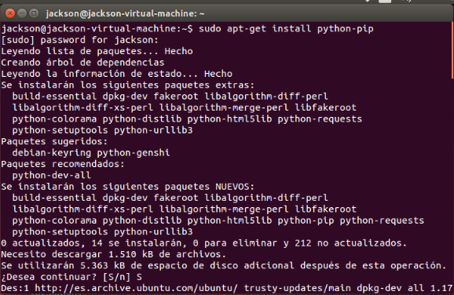

Cuando acabe el proceso de instalación de pip ya podremos instalar el entorno virtual y hacer uso de él como se muestra a continuación:

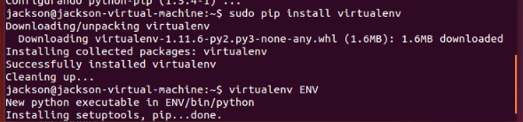

#Ejercicio 2
Ya que en el ejercicio 3 nos pide crear una aplicación en OpenShift, en este ejercicio me voy a dar de alta en esta misma plataforma para poder usarla posteriormente en el siguiente ejercicio.

Lo primero que tenemos que hacer es darnos de alta y para ello nos vamos a la web: [OpenShift](https://www.openshift.com/)

Arriba a la derecha nos registramos si somos nuevos en este sitio web (sign up), y tras rellenar los campos que nos piden,

confirmamos nuestra cuenta con el enlace que nos enviarán a la dirección de correo electrónico que hayamos indicado al registrarnos.

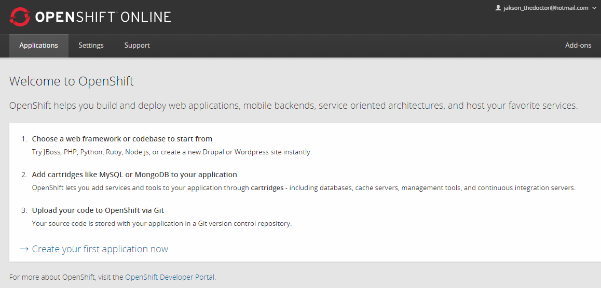

#Ejercicio 3
Una vez que nos hemos dado de alta en OpenShift, para crear una aplicación e instalar WordPress clicamos en "Create your first application now" como se ve a continuación:

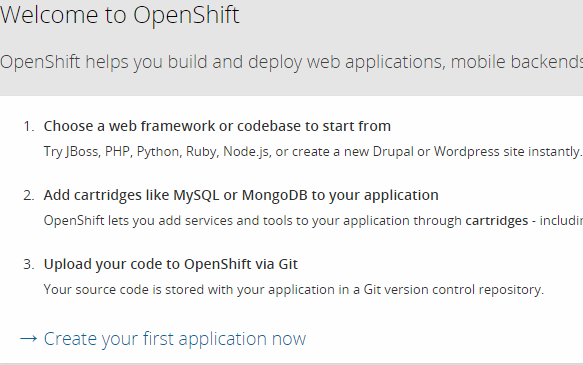

Una vez hecho esto seleccionamos WordPress 4, que es la que queremos usar, de entre la serie de aplicaciones que hay:

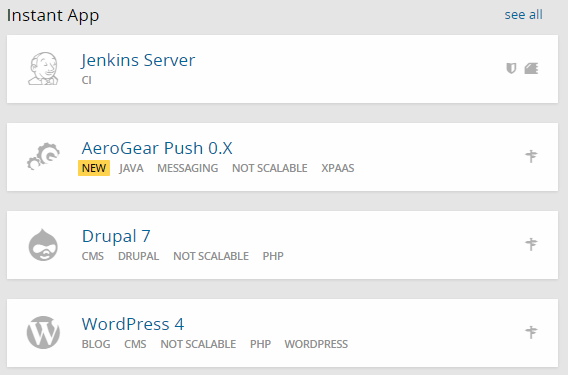

Y seguidamente configuramos la aplicación que vamos a realizar:

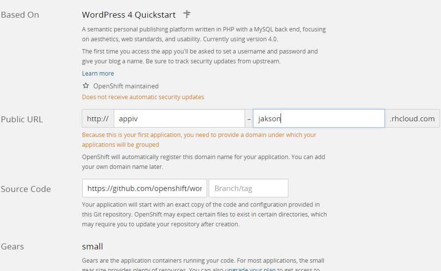

Una vez configurada pulsamos en "Create Application" para continuar y ya tenemos nuestra aplicación creada:

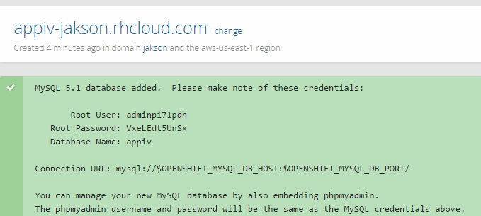

Finalmente si pinchamos en el enlace de nuestra aplicación, nos saldrá el instalador de WordPress:

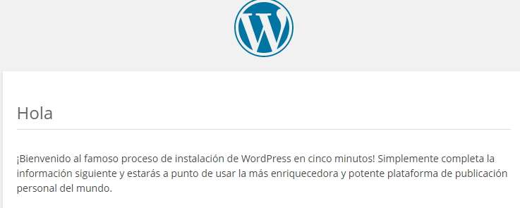

#Ejercicio 4
Para crear el script en google drive nos vamos al [sitio web](http://www.google.com/script/start/) de google y pulsamos la opción Start Scripting y elegimos un proyecto en blanco para crear el script:

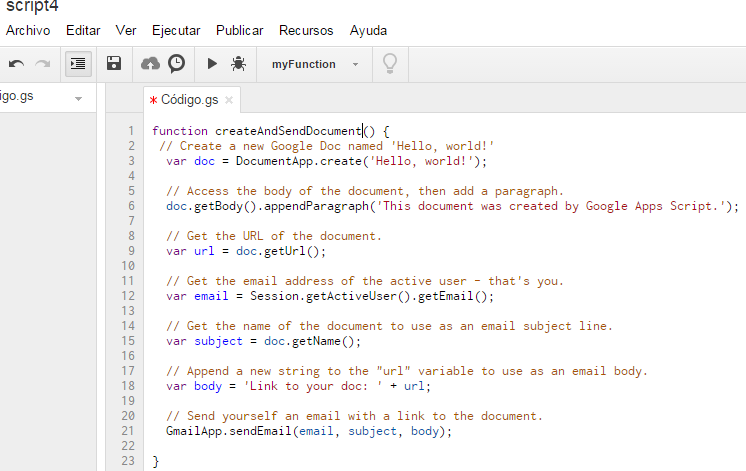

Al darle a ejecutar nos pedirá autorización para continuar, aceptamos y nos aparece lo siguiente:

Aceptamos y abrimos el script:

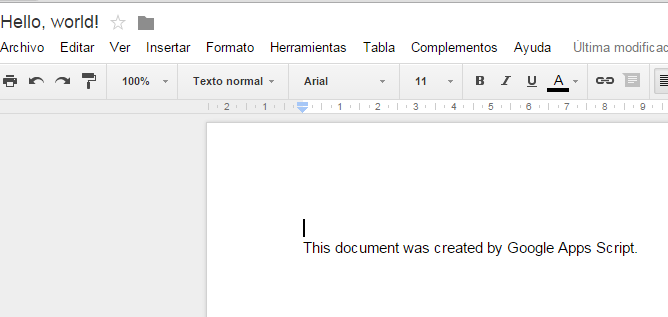

Y ahora realizamos los cambios para que se modifique el nombre y la función:

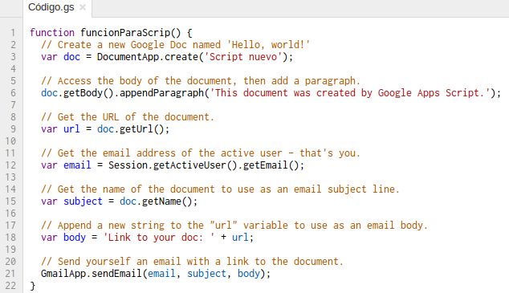

Y ya al abrirlo está modificado:

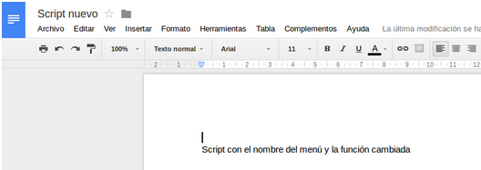

#Ejercicio 5
Un sistema de automatización es Buildr para java. Para más información [clic aquí](http://en.wikipedia.org/wiki/Apache_Buildr)

#Ejercicio 6

Como antes hemos utilizado OpenShift, para realizar este ejercicio vamos a utilizar también esta plataforma. Para poder automatizar las tareas he encontrado las siguientes formas:

1) Usando Jenkins: Jenkins es un servidor que proporciona integración continua para el desarrollo de software. Puede ejecutar, construir, testear y programar tareas que se integran con las aplicaciones de OpenShift.

2) Usando hot deployment: Con este servicio se pueden aplicar los cambios que realicemos al código de la aplicación sin necesidad de reiniciar la aplicación, con lo que aumentamos la velocidad de despliegue y minimizamos el tiempo de inactividad de la aplicación.

#Ejercicio 7
Dos entornos de pruebas para testear Python son: [nose](http://pythontesting.net/framework/nose/nose-introduction/) y [tox](https://pypi.python.org/pypi/tox)