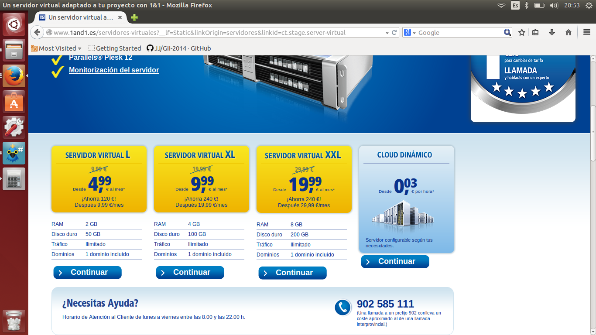
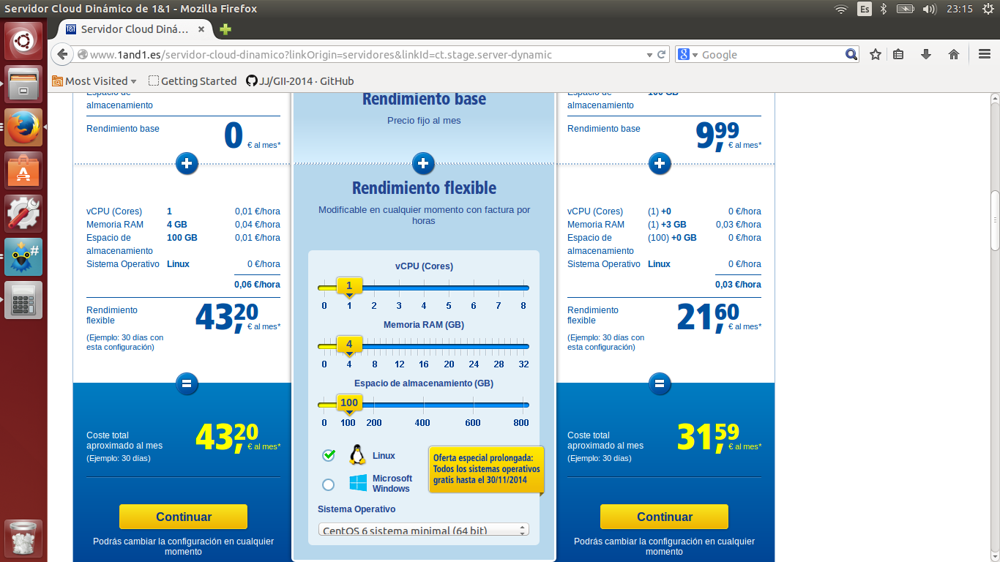

#Ejercicio 2

####Usando las tablas de precios de servicios de alojamiento en Internet y de proveedores de servicios en la nube, Comparar el coste durante un año de un ordenador con un procesador estándar (escogerlo de forma que sea el mismo tipo de procesador en los dos vendedores) y con el resto de las características similares (tamaño de disco duro equivalente a transferencia de disco duro) si la infraestructura comprada se usa sólo el 1% o el 10% del tiempo.

COnsultamos el sitio http://www.1and1.es en busca de uno de sus servidores virtuales. En la imagen, vemos algunas de sus tarifas para estos servidores virtuales. Nos quedamos con la primera de todas, que vale 20€ al mes (y no 9.99 como aparece en la imagen, ya que ese precio es si se contrata un mínimo de 24 meses)

EL coste total sería en 6 meses de 120 €.

Ahora, comparamos el precio que nos costaría contratar una máquina ddicada de similares características. Tal y como se aprecia en la imagen, el coste es mucho superior, ya que asciende a más de 43 euros:

Sin embargo, si calculamos lo que nos cuesta usarla un 1% y un 10%, vemos que si sale a cuenta contratar este servicio:

	4320h(6meses) /100 = 43.20 h
    43.20 horas * 0.06 € / h = 2.59€
    
   	4320 * 10 / 100 = 432 h
    432 horas * 0.06 € / h =25.92€
    
Estos precios son claramente inferiores a los 120€ que nos cuesta contratarlo las 24 horas durante los 6 meses, así que deberíamos de sopesar nuestras necesidades y contratar un tipo de servicio u otro.