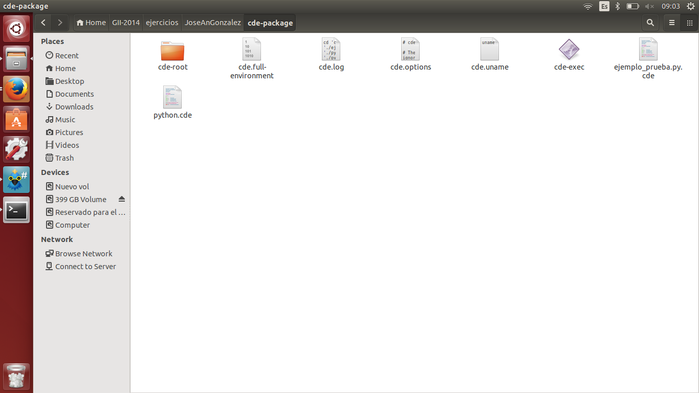

#Ejercicio 3

#### 1. ¿Qué tipo de virtualización usarías en cada caso? Comentar en el foro

-Para varios clientes en un sólo servidor: Usaría una virtualización a nivel de SO, ya que cada usuario comparte el mismo sistema (el servidor), pero todos quedan independientes los unos de los otros, por lo que no hay problemas de seguridad y los cleintes tendrán la sensación final de que tienen un sistema dedicado

-Para crear sistema eficiente web + middleware + bd: Usaría una virtualización total. Primero, tomaría una imagen del sistema operativo y programas exclusivamente necesarios, y haría una imagen de instalación. Esa instalación la pondría en una máquina virtual, ya que así el servidor queda montado rápidamente (y repuesto en caso de pérdidas de datos, ya que tenemos la imagen de instalación). Utilizar una virtualización a nivel de aplicación necesitaría ejecutar "los emuladores" (como WINE), por lo que tenemos corriendo el SO + emulador + aplicación, gastando más recursos.

Para crear un sistema de pruebas software e integración: Yo pondría un sistema de virtualización de entornos de desarrollo, ya que será el que más representa la realidad mientras estamos haciendo los programas / scripts, y tendremos (en teoría) menos problemas a la hora de pasarlo a producción.

#### 2. Crear un programa simple en cualquier lenguaje interpretado para Linux, empaquetarlo con CDE y probarlo en diferentes distribuciones.

El código de ejemplo está en el directorio, como "ejemplo_prueba.py". Lo empaquetamos con CDE con la siguiente orden:
	
    cde python ejemplo_prueba.py
    
En la primera ejecución falla por que falta el módulo webpy. Lo instalamos mediante la orden:

	sudo apt-get install python-webpy
    
Después, reintentamos la orden, y ahora que si que se pued ejecutar, CDE lo empaqueta todo en un directorio, tal y como se muestra en la imagen.

