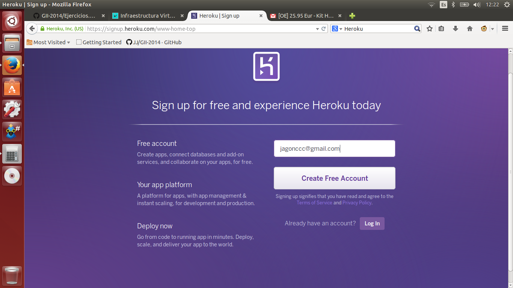
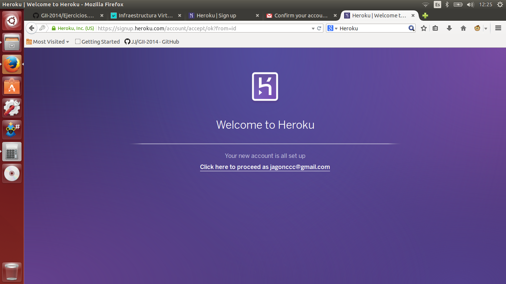
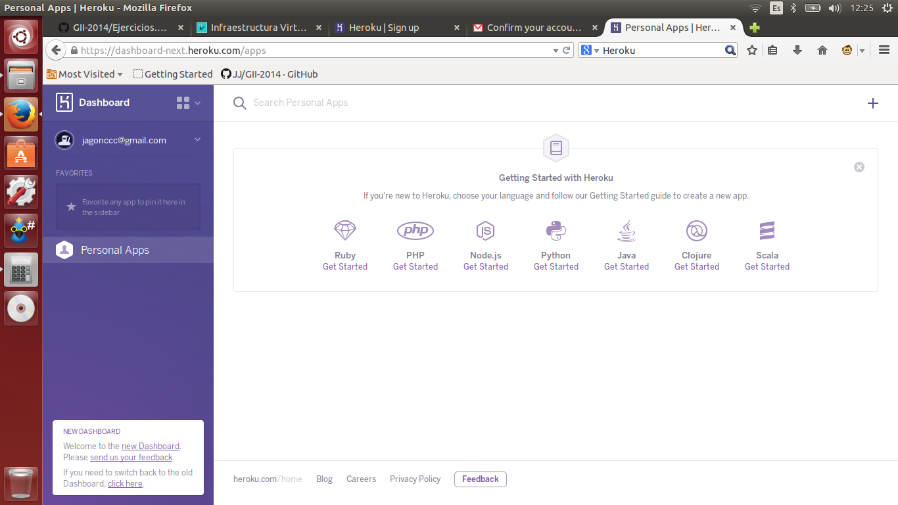

# Ejercicio 2

#### Darse de alta en algún servicio PaaS tal como Heroku, Nodejitsu u OpenShift.

Nos daremos de alta en [Heroku](https://www.heroku.com), yendo a su página principal. Dentro pulsamos en sign up para ir a la siguiente ventana:

Después de rellenar el formulario con el email, nos saldrá la siguiente ventana:

Nos metemos en nuestro correo, y seguimos el enlace de activación. Tras hacerlo, nos pedirá que guardemos una contraseña, y nos aparecerá el menú principal de Heroku:

