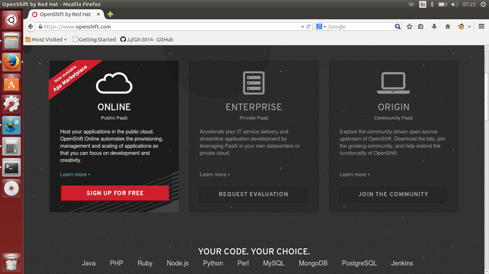

#Ejercicio 3

#### Crear una aplicación en OpenShift y dentro de ella instalar WordPress.

Nos vamos a la página de [OpenShift](https://www.openshift.com/), y si no tenemos cuenta, nos hacemos una pulsando en el boton Sign up for free.

UNa vez creada y desde el menú de nuestra cuenta, pinchamos en el botón de ADd Application, seleccionando WordPress 4, y pulsamos en Create application. Después de esto, OpenShift se encargará de prepararnos todos los recursos que necesitemos