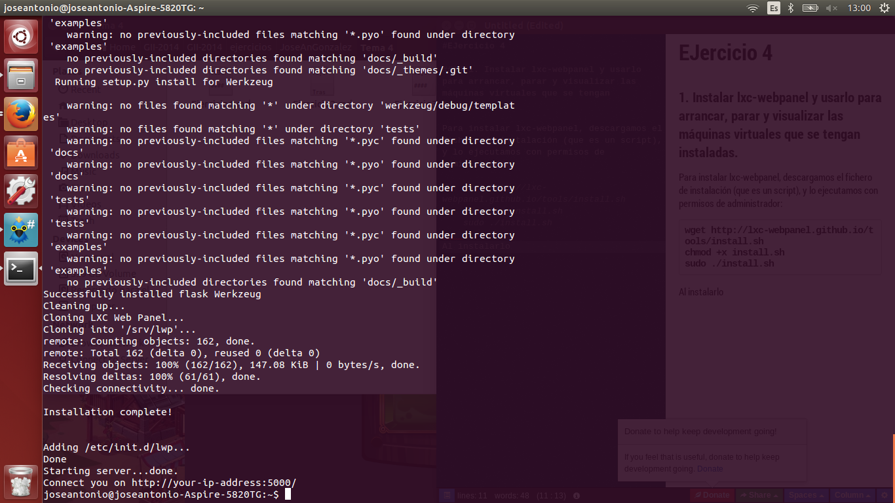

#EJercicio 4

#### 1. Instalar lxc-webpanel y usarlo para arrancar, parar y visualizar las máquinas virtuales que se tengan instaladas.

Para instalar lxc-webpanel, descargamos el fichero de instalación (que es un script), y lo ejecutamos con permisos de administrador:

	wget http://lxc-webpanel.github.io/tools/install.sh
    chmod +x install.sh
    sudo ./install.sh
    
Al instalarlo, nos dice como vemos en la imagen, que accedamos desde el navegador al panel de administración (localhost:5000):

##### 2.  Desde el panel restringir los recursos que pueden usar: CPU shares, CPUs que se pueden usar (en sistemas multinúcleo) o cantidad de memoria.

En la lista de contenedores que hay dentro de la interfaz web, seleccionamos uno de ellos. Una vez seleccionado,vemos todas las opciones, entre las cuales se encuentran unos deslizadores para poder controlar la memoria utilizada, el total de CPU's compartidas, etc.
