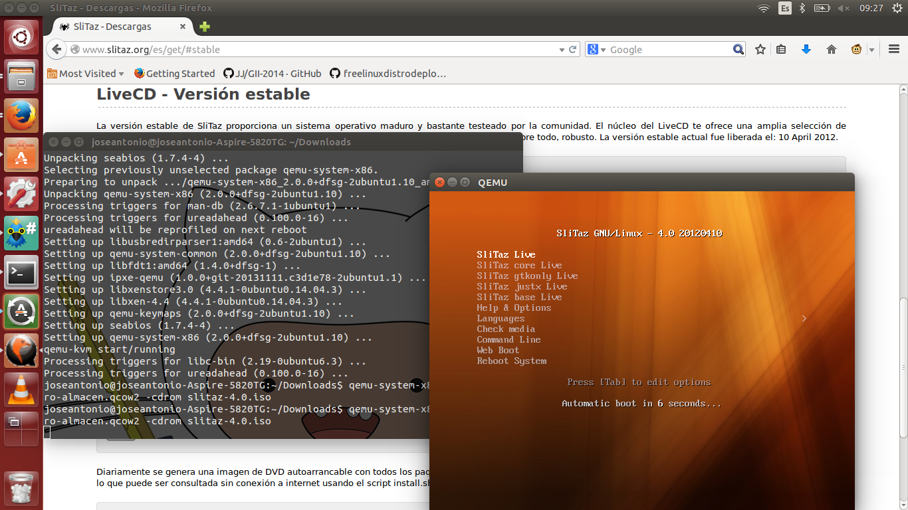

#Ejercicio 2

#### 1. Crear varias máquinas virtuales con algún sistema operativo libre tal como Linux o BSD. Si se quieren distribuciones que ocupen poco espacio con el objetivo principalmente de hacer pruebas se puede usar CoreOS (que sirve como soporte para Docker) GALPon Minino, hecha en Galicia para el mundo, Damn Small Linux, SliTaz (que cabe en 35 megas) y ttylinux (basado en línea de órdenes solo).

Debido a problemas de almacenamiento (tengo disponibles alrededor de 500MB), vamos a descargar la imagen de [SliTaz](http://www.slitaz.org/es/get/#stable).  Una vz descargado, creamos el disco_

	qemu-img create -f qcow2 fichero-almacen.qcow2 10000M
Instalamos la utilidad qemu-system:

	sudo apt-get install qemu-system-x86
Una vez instalado, arrancamos la máquina virtual con el fichero que hemos creado:

	qemu-system-x86_64 -hda fichero-almacen.qcow2 -cdrom slitaz-4.0.iso

Y se abrirá una ventana, tal y como muestra la imagen:

#### 2. Hacer un ejercicio equivalente usando otro hipervisor como Xen, VirtualBox o Parallels.

Utilizaremos VMWare para ello. Lo descargamos de [su página](https://my.vmware.com/web/vmware/free#desktop_end_user_computing/vmware_player/7_0)

Lo instalamos mediante la orden:

	sudo sh VMware-Player.bundle

Después lo abrimos y seguimos el asistente de la creación de la máquina virtal.