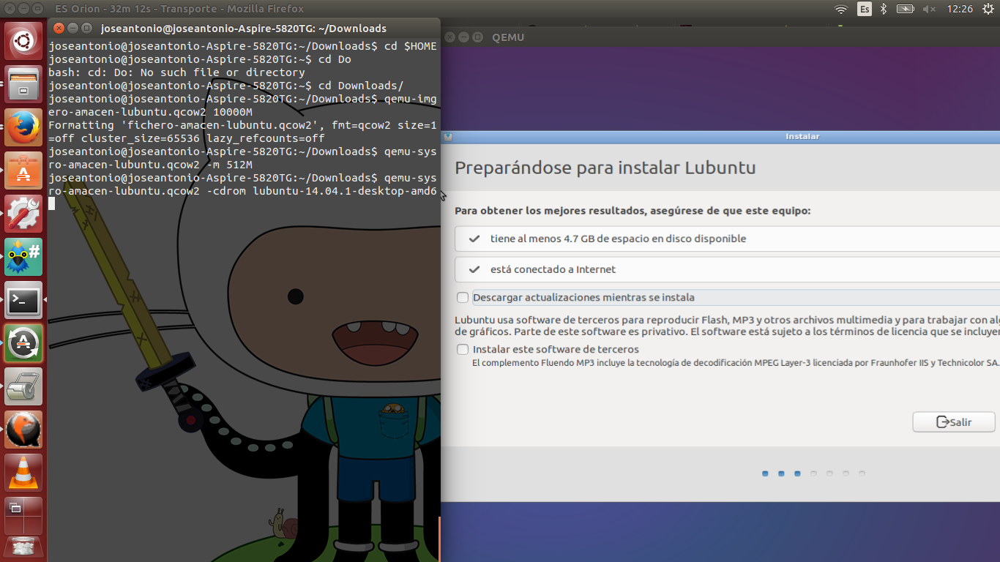

#Ejercicio 4

 #### Crear una máquina virtual Linux con 512 megas de RAM y entorno gráfico LXDE a la que se pueda acceder mediante VNC y ssh.
 
Al igual que en el anterior ejercicio, debemos crear un fichero que sirva de "almacén" para instalar el SO. En este caso, vamos a utilizar [LUbuntu](http://cdimage.ubuntu.com/lubuntu/releases/14.10/release/)

Hacemos dicho fichero con 10.000 MB con la siguiente orden:

	qemu-img create -f qcow2 fichero-almacen-lubuntu.qcow2 10000M

Ahora, análogamente al ejercicio anterior, instalamos la imagen del SO, pero especificando que creamos esa máquina con 512 MB de ram:

	qemu-system-x86_64 -hda fichero-almacen-lubuntu.qcow2 -cdrom $HOME/Downloads/lubuntu-14.04.1-desktop-amd64.iso -m 512M

Después de un tiempo de instalación (en el que no hay mensaje alguno en la consola) se instala LUbuntu. La instalación continua desde la interfaz gráfica, tal y como se aprecia en la imagen:

Una vez instalado, cerramos la máquina y la configuramos con la siguiente orden:

	qemu-system-x86_64 -boot order=c -drive file=fichero-almacen-lubuntu.qcow2,if=virtio -m 512M -name debian -vnc :1

De esta forma, iniciamos la máquina sin entorno gráfico. Ahora, mediante la orden "ifconfig", sabremos la IP de la máquina virtual (interfaz virbr0). Tan solo nos queda conectar a ella mediante ssh.

	ssh prueba@172.17.42.1

Donde prueba es el nombre de usuario que hemos introducido y 172.17.42.1 su IP