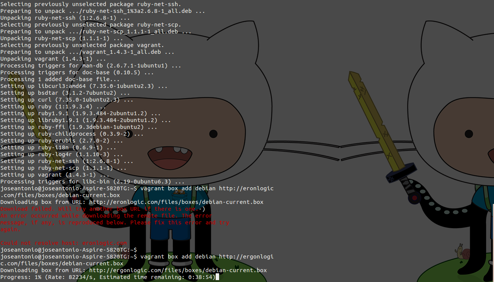

# Ejercicio 7

#### Instalar una máquina virtual Debian usando Vagrant y conectar con ella.

PRimero instalamos Vagrant:

	sudo apt-get install Vagrant

Acto seguido, instalamos una máquina basada en Debian.

	vagrant box add debian http://ergonlogic.com/files/boxes/debian-current.box

Tal y como se muestra en la imagen, comenzará la descarga:

Una vez descargada e instalada, creamos el fichero Vagrantfile mediante la órden:

	vagrant init debian

Esto ya ha preparado la máquina para su funcionamiento. Tan sólo nos queda conectarnos introduciendo:

	vagrant up

