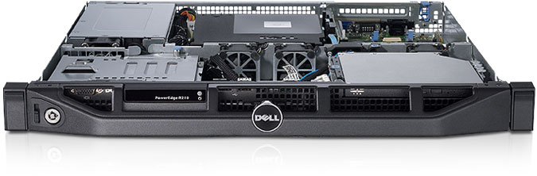

###Ejercicio 1: Consultar en el catálogo de alguna tienda de informática el precio de un ordenador tipo servidor y calcular su coste de amortización a cuatro y siete años.

El servidor elegido ha sido un Dell PowerEdge R415 (http://www.dell.com/es/empresas/p/poweredge-r415/pd?~ck=anav).
El precio de la máquina con la siguiente configuración es de 2509€:

* 2 x AMD Opteron 4332HE, 6C, 3.0GHz, 6M L2/8M L3 Cache, Turbo CORE, 65W TDP, DDR3-1600MHz

* 4 x 4GB Memory for 2 CPUs, DDR3, 1333MHz (4x4GB Dual Ranked LV RDIMMs)

Su coste de amortización a cuatro años es de:

	2509 € / 4 años = 627,5 €/año

mientras que a siete años es:

    2509 € / 7 años = 358,42 €/año

