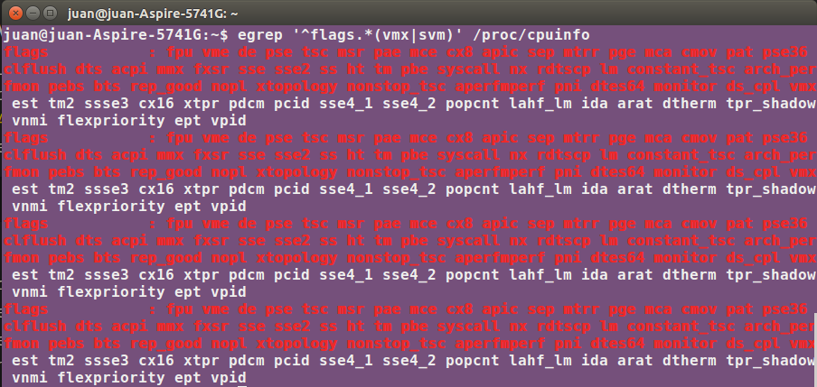
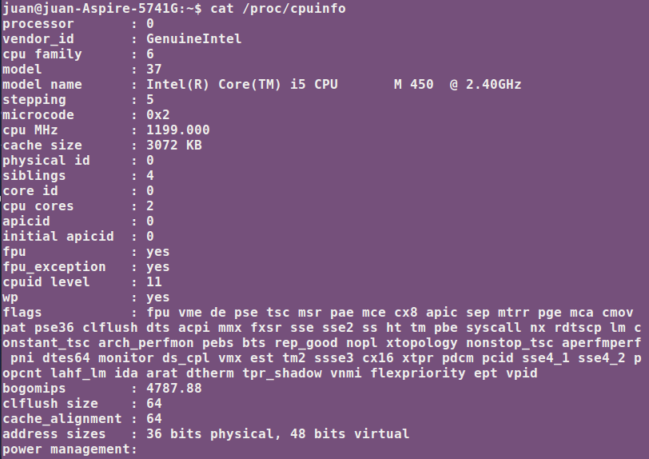

### Ejercicio 10: Comprobar si el procesador o procesadores instalados tienen estos flags. ¿Qué modelo de procesador es? ¿Qué aparece como salida de esa orden?.

Comprobamos que el procesador tenga instalados los flags:

	egrep '^flags.*(vmx|svm)' /proc/cpuinfo

El modelo del procesador es:

	Intel(R) Core(TM) i5 CPU M450 @2.4GHz

El fichero /proc/cpuinfo contiene lo siguiente:

