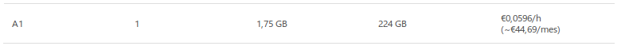
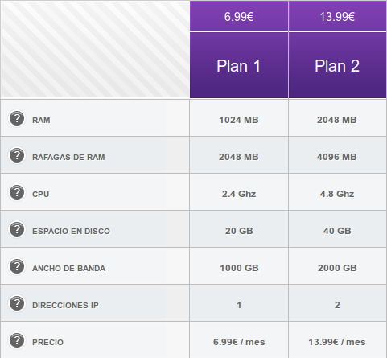

###Ejercicio 2: Usando las tablas de precios de servicios de alojamiento en Internet y de proveedores de servicios en la nube, Comparar el coste durante un año de un ordenador con un procesador estándar (escogerlo de forma que sea el mismo tipo de procesador en los dos vendedores) y con el resto de las características similares (tamaño de disco duro equivalente a transferencia de disco duro) si la infraestructura comprada se usa sólo el 1% o el 10% del tiempo

Tarifa de un proveedor de servicios en la nube (Azure):

Cálculo del coste del servicio durante un año:

Si se usa el 1% del tiempo:

	44,69€/mes x 12 meses * 0,01 = 5,36€ anuales

Si se usa el 10% del tiempo:

    44,69€/mes x 12 meses * 0,1 = 53,6€ anuales

Tarifa de un servicio de alojamiento en Internet (hostinger):

En este caso supone un coste anual de:

    13.99€/mes * 12 meses = 167,88€ anuales.

Se llega a la conclusión, para un porcentaje bajo de uso es recomendable elegir un proveedor de servicios en la nube.

