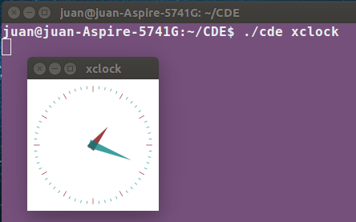
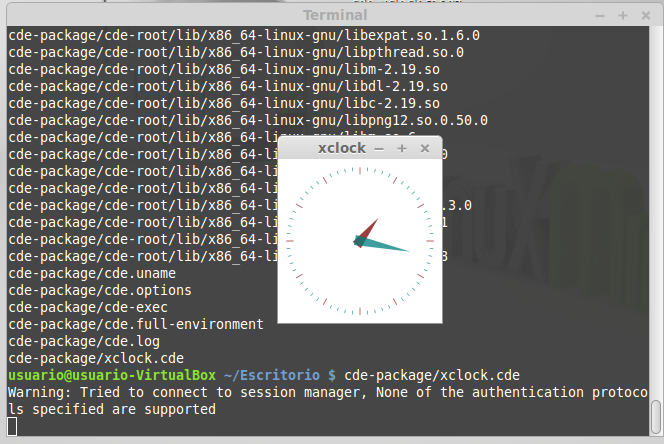

###Ejercicio 3:
##### 1.¿Qué tipo de virtualización usarías en cada caso? Comentar en el foro.
##### 2.Crear un programa simple en cualquier lenguaje interpretado para Linux, empaquetarlo con CDE y probarlo en diferentess distribuciones.

Vamos a crear un paquete portable de la aplicación xclock, situándonos en la carpeta del programa CDE, ejecutamos:

    ./cde xclock

A partir de ahora, en la carpeta cde-package se encuentran todas las dependencias necesarias para ejecutar xclock. Para llevarlo a otra distribución y probar que funciona, comprimimos la carpeta:

	tar -cvf cde-xclock.tar cde-package/
    gzip cde-xclock.tar

Una vez hecho esto lo probamos en Linux Mint 17,  descomprimimos y ejecutamos:

	tar -zxvf cde-xclock.tar.gz
	cde-package/xclock.cde

