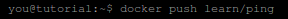

###Ejercicio 4: Hacer el tutorial de línea de órdenes de docker para comprender cómo funciona. Avanzado: Instalarlo y crear una aplicación contenedorizada

######Paso 0
Argumentos que acepta Docker

######Paso 1
Buscar una imagen disponible

######Paso 2
Descargar la imagen

######Paso 3
Probar que la imagen funciona haciendo un simple echo "Hello World"

######Paso 4
Instalar una aplicación sobre la imagen(por ej: ping)

######Paso 5
Salvar los cambios realizados

######Paso 6
Probar la nueva aplicación instalada en la imagen

######Paso 7
Comprobar que nuestra imagen está corriendo

###### Paso 8
Hacer push de nuestra imagen

